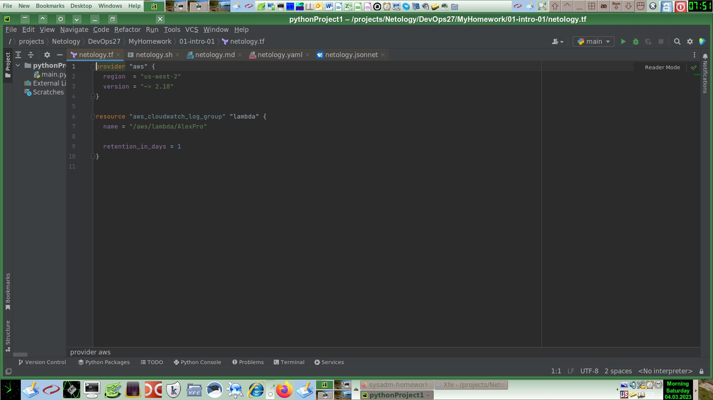
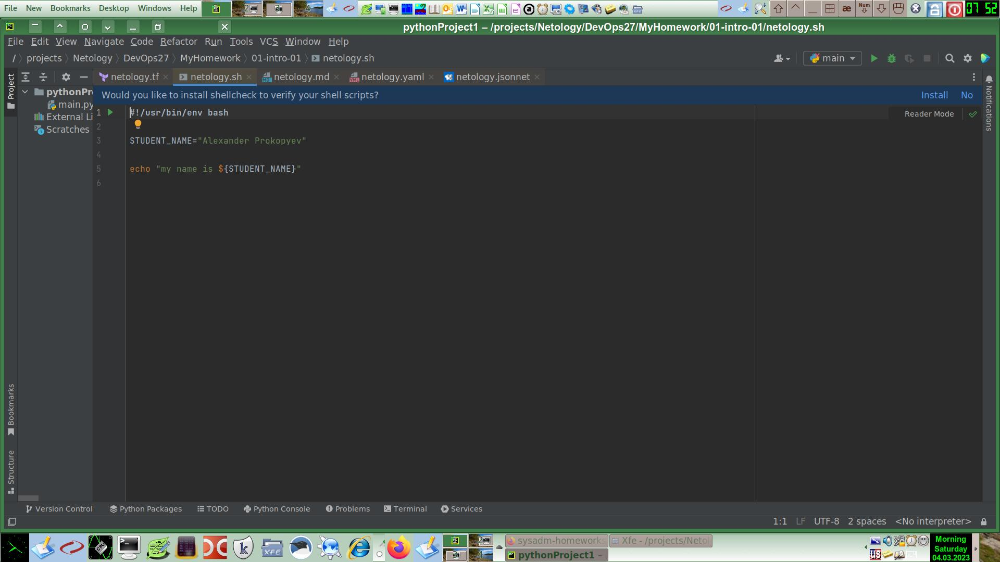
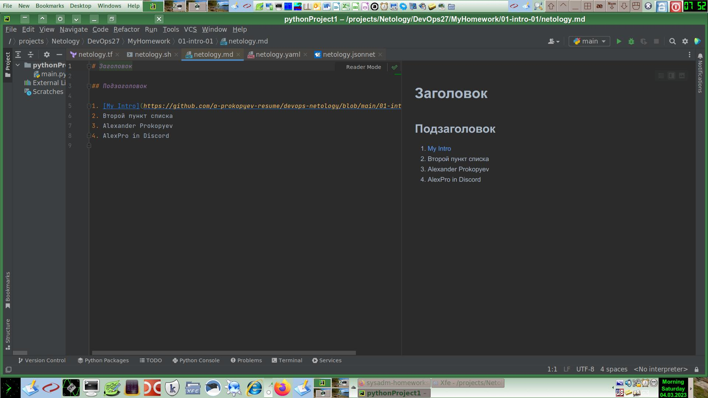
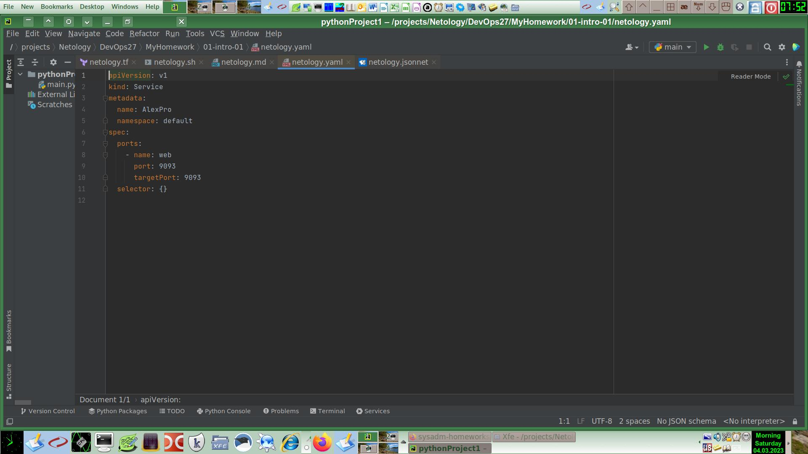
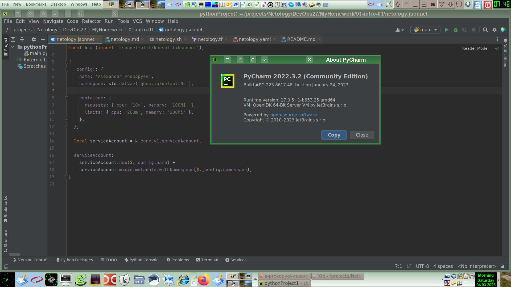

Задание выполнил студент Нетологии курса DevOps-27: Прокопьев Александр.

# [Домашнее задание](https://github.com/a-prokopyev-resume/sysadm-homeworks/tree/devsys10/01-intro-01) к занятию [«Введение в DevOps»](https://netology.ru/profile/program/git-dev-27/lessons/241715/lesson_items/1283967)

### Цель задания

В результате выполнения задания вы:

* научитесь настраивать окружение для работы;
* опишите процесс решения задачи в соответствии с жизненным циклом разработки ПО.
 
----     
     
## Задание 1. Подготовка рабочей среды

Вы пришли на новое место работы или приобрели новый компьютер. Сначала надо настроить окружение для дальнейшей работы. 

**Что нужно сделать**

**Шаг 1.** Установить [PyCharm Community Edition](https://www.jetbrains.com/ru-ru/pycharm/download/). Это бесплатная версия IDE.   В качестве альтернативы можно установить [Visual Studio Code](https://code.visualstudio.com/Download) и дальнейшие шаги проделать в нём. Так вы сможете выбрать более удобный инструмент для себя.

**Шаг 2.** Установить плагины.

**Шаг 3.** Склонировать текущий репозиторий (команда `git clone`) или просто создать файлы для проверки плагинов:

**Шаг 4**. Убедитесь, что работает подсветка синтаксиса. Файлы должны выглядеть так:

*В качестве выполненного задания загрузите скриншоты установленной IDE с плагинами в файле README.md собственного репозитория в GitHub или в Google Doc.*

---

## Решение задания 1.

1. Установил Pycharm Community Edition.
2. Установил упомянутые в задании плагины (часть уже были в комплекте IDE).
3. Склонировал репозиторий [netology-code/sysadm-homeworks](https://github.com/netology-code/sysadm-homeworks.git) и скопировал из него файлы, необходимые для решения этого задания.
4. Убедился, что подсветка синтаксиса работает, добавил свое имя в каждый
файл. Далее предоставлены снимки экрана с IDE для каждого вида файла:
   - Terraform: 
   - Bash: 
   - Markdown: 
   - Yaml: 
   - Jsonnet: 

## Задание 2. Описание жизненного цикла задачи (разработки нового функционала)

Чтобы лучше понимать предназначение инструментов, с которыми вам предстоит работать, составим схему жизненного цикла задачи в идеальном для вас случае.

### Описание истории

Представьте, что вы работаете в стартапе, который запустил интернет-магазин. Он достаточно успешно развивался, и пришло время налаживать процессы: у вас стало больше конечных клиентов, менеджеров и разработчиков.
Сейчас от клиентов вам приходят задачи, связанные с разработкой нового функционала. Задач много, и все они требуют выкладки на тестовые среды, одобрения тестировщика, проверки менеджером перед показом клиенту. В некоторых случаях вам будет необходим откат изменений. 

### Решение задачи

Вам нужно описать процесс решения задачи в соответствии с жизненным циклом разработки программного обеспечения. Использование конкретного метода разработки необязательно. 
Для решения главное — прописать по пунктам шаги решения задачи (релизации в конечный результат) с участием менеджера, разработчика (или команды разработчиков), тестировщика (или команды тестировщиков) и себя как DevOps-инженера. 

---

## Решение задания 2.

Основные задачи DevOps инженера - это внедрение на проекте CI/CD для максимизации эффективности операционных процессов и сокращения 
времени выхода новых релизов продукта на рынок. Методология DevOps совместима с Agile, очень удобно и полезно использовать их вместе. 

Мои задачи в роли DevOps инженера:
1. Необходимо наладить взаимодействие, установить соглашения по поддержке изменений продукта, лицензированию и т.п.
   - Между заказчиками и менеджерами.  Как поступают задачи на разработку.
   - Между менеджерами. Каждый менеджер отвечает за определенный круг задач, не может быть задачи без ответственного за нее менеджера.
   - Между менеджером и разработчиками. Поступление задач в работу к разработчикам под контролем PM.  
   - Между разработчиками. Должны быть общие инструменты и подходы к разработке.
2. Разработка. Нужно добиться следующего от разработчиков:
   - Оказания взаимопомощи в команде разработчиков по освоению новых инструментов и технологий.
   - Заменяемости разработчиков аналогично обеспечению резервирования в инфре (незаменимых нет, это только вопрос цены, которая не должна уходить слишком выше рынка) за счет написания читаемого кода с использованием правильных паттернов программирования, хороших комментариев, проведения code review, использования парного XP, использования одинаковой среды разработки у всех (или почти всех) разработчиков.
   - Изменения, вносимые разработчиками, должны быть предсказуемыми, не ухудшать безопасность продукта, быть готовыми к внесению дальнейших изменений.
   - Разработчики должны писать тесты (юнит, функциональные, приемочные) и быстро получать результаты сложных тестов.
3. Настроить инфраструктуру для обеспечения отказоустойчивости используемых сервисов:
    - Выбрать оптимальное решение.
    - Осуществить развертывание на нескольких площадках.
    - Обеспечить надежные регулярные бэкапы и восстановление с нуля в случае полной утери инфры (кроме локальных бэкапов).
4. Каждое изменение кода должно быть протестировано:
    - Весь код, включая новый, должен быть покрыт тестами.
    - Автоматическое тестирование.
    - В основную ветку должен попадать только протестированный код за счет применения подхода типа GitFlow.
5. Выкладка в прод:
   - Выкладка в продакшн происходит только после успешного прохождения тестов.
   - Должна быть возможность отката изменений.
   - Выкладка и откат изменений автоматизированны.
6. Мониторинг:
    - Обеспечить логирование всех сред, включая stage и prod и доступ участников команды к таким логам.
    - Обеспечить автоматическое оповещение обо всех критически важных ошибках, произошедших в логируемых средах.
7. Автоматизация.
    - Автоматизировано должно быть все, что делается более двух раз.
