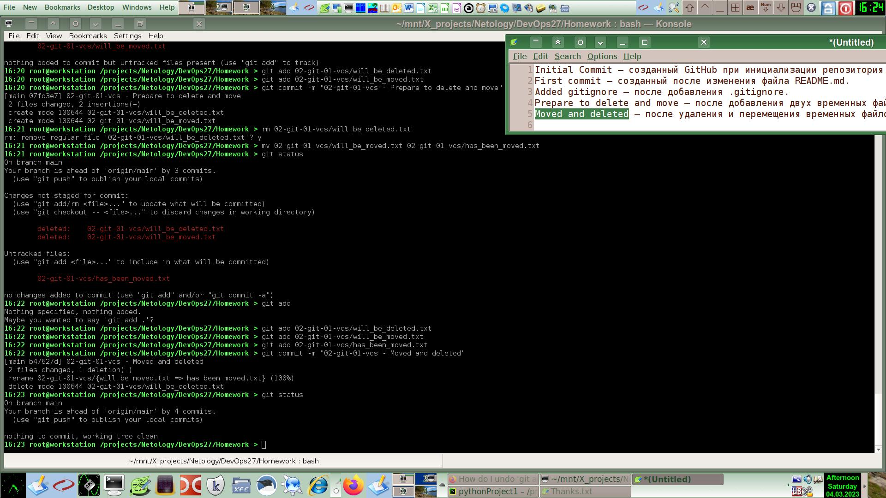
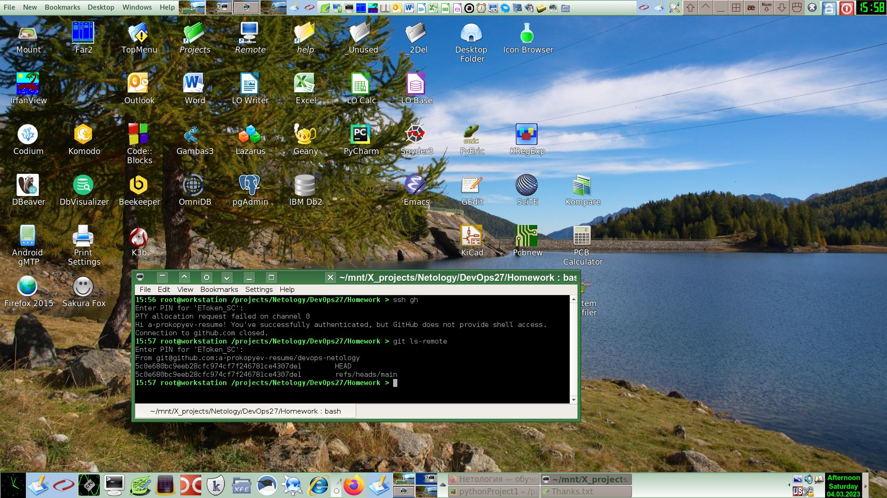

# [Домашнее задание](https://github.com/a-prokopyev-resume/sysadm-homeworks/tree/devsys10/02-git-01-vcs) к занятию [«Системы контроля версий»](https://netology.ru/profile/program/git-dev-27/lessons/241716/lesson_items/1283972)

### Цель задания

В результате выполнения задания вы: 

* научитесь подготоваливать новый репозиторий к работе;
* сохранять, перемещать и удалять файлы в системе контроля версий.  
   
------

В результате предыдущих шагов в репозитории должно быть как минимум пять коммитов (если вы сделали ещё промежуточные — нет проблем):

    * `Initial Commit` — созданный GitHub при инициализации репозитория. 
    * `First commit` — созданный после изменения файла `README.md`.
    * `Added gitignore` — после добавления `.gitignore`.
    * `Prepare to delete and move` — после добавления двух временных файлов.
    * `Moved and deleted` — после удаления и перемещения временных файлов. 

## Решение задания 1.

### Описание строк в файле .gitignore
 
1. ***/.terraform/* -- игнорировать вложенные скрытые папки ".terraform" и их содержимое
2. *.tfstate -- игнорировать все файлы с расширением ".tfstate"
3. *.tfstate.* -- игнорировать все файлы, содержащие в своем имени строку ".tfstate."
4. *.tfvars -- игнорировать все файлы с расширением ".tfvars"
5. override.tf -- игнорировать файл "override.tf"
6. override.tf.json -- игнорировать файл "override.tf.json"
7. *_override.tf -- игнорировать все файлы, имя которых заканчивается строкой "_override.tf"
8. *_override.tf.json -- игнорировать все файлы, имя которых заканчивается строкой "_override.tf.json"
9. .terraformrc -- игнорировать скрытый файл ".terraformrc"
10. terraform.rc -- игнорировать файл "terraform.rc"

Выполнение остальных шагов данной задачи видно в логе изменений репозитория git.
И еще скриншот:

Замечание: лучше было бы использовать `git add --all`:
https://stackoverflow.com/questions/572549/difference-between-git-add-a-and-git-add

## Задание 2. Знакомство с документаций

Один из основных навыков хорошего специалиста — уметь самостоятельно находить ответы на возникшие вопросы.  
Чтобы начать знакомиться с документацией, выполните в консоли команды `git --help`, `git add --help` и изучите их вывод.  

## Решение задания 2.

### Почитал документацию, сделал небольшой конспект для себя:
  - Просмотр истории коммитов: git log
  - Отмена последнего коммита:    
    - Локально с сохранением незакоммиченных исходников: git reset --soft HEAD~1
    - Локально с удалением незакоммиченных исходников: git reset --hard HEAD~1
  - Удаленно: git revert HEAD
  - Создание новой ветки: git checkout -b BranchName 
  - Создание нового тэга: git tag -a Version -m "Message"
  - Исключение файла из индексирования: список исключаемых (игнорируемых) командой `git add` файлов указывается в файле .gitignore
  - Разрешение конфликта при слиянии веток
    - Нахождение конфликта: git status 
    - Разрешение конфликата в текстовом редакторе: joe, nano, etc.
    - Коммит: git commit -am "conflict resolution description"
    - Push: git push
  - Pre-commit и post-commit hooks предназначены для обработки событий перед и после коммита для кастомных автоматизаций позволяющих настроить тестирование и оповещение.
  - Изменение последнего коммита без создания нового коммита: git commit --amend

### Полезные ссылки:
  * Often Used Commands:
    * [GitLab Git Cheat Sheet](https://about.gitlab.com/images/press/git-cheat-sheet.pdf)
    * [Selectel](https://selectel.ru/blog/tutorials/git-setup-and-common-commands/)     
    * [Push & commit](https://stackoverflow.com/questions/6143285/git-add-vs-push-vs-commit/74632221#74632221)
  * Authentication:
    * [Personal access token](https://docs.github.com/en/authentication/keeping-your-account-and-data-secure/creating-a-personal-access-token)
    * [Git push via ssh](https://github.com/JinnaBalu/GitCheatSheet/blob/master/use-cases/git-push-with-ssh.md)
  * Undo methods:
    * [How to undo](https://stackoverflow.com/questions/348170/how-do-i-undo-git-add-before-commit)
    * [How to undo almost anything](https://github.blog/2015-06-08-how-to-undo-almost-anything-with-git/)
    * [How to remove a commit on Github](https://stackoverflow.com/questions/448919/how-can-i-remove-a-commit-on-github)
  * Books:
    * [GIT Book](https://git-scm.com/book/ru/v2)
     
### Настроил работу git push через ssh с использованием аппаратного крипто на смарткарте:

Фрагмент конфига для ssh клиента: 
    
    Host gh github github.com
        Hostname github.com
        User git
    #   User a-prokopyev-resume
        Compression yes
        CompressionLevel 9
        PKCS11Provider /secret_path_xxx/pkcs11_xxx.so

Содержимое скрипта настройки git: `cat config_git.sh`:
    
    cd /projects/Netology/DevOps27/Homework;
    git config --global user.name "Alexander Prokopyev";
    git config --global user.email "a.prokopyev.resume@gmail.com";
    #
    #Save old origin: 
    #  remote.origin.url=https://github.com/a-prokopyev-resume/devops-netology
    #Convert HTTPS origin to SSH one:
    #  echo $(git remote show origin | grep "Fetch URL" | sed 's/ *Fetch URL: //' | sed 's/https:\/\/github.com\//git@github.com:/')
    git remote set-url origin git@github.com:a-prokopyev-resume/devops-netology;
    #    
    git config -l;

Вывод команды `git config -l` после запуска конфигурационного скрипта:

    user.name=Alexander Prokopyev
    user.email=a.prokopyev.resume@gmail.com
    core.repositoryformatversion=0
    core.filemode=true
    core.bare=false
    core.logallrefupdates=true
    remote.origin.url=git@github.com:a-prokopyev-resume/devops-netology
    remote.origin.fetch=+refs/heads/*:refs/remotes/origin/*
    branch.main.remote=origin
    branch.main.merge=refs/heads/main

Пример логина с использованием смарткарты для аутентификации:

