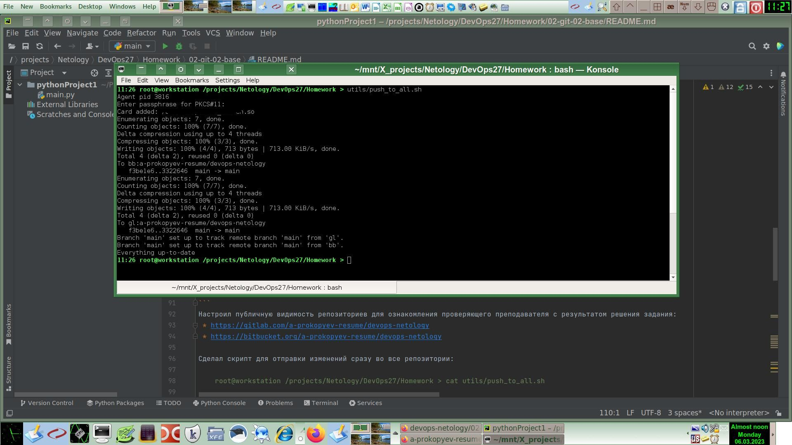
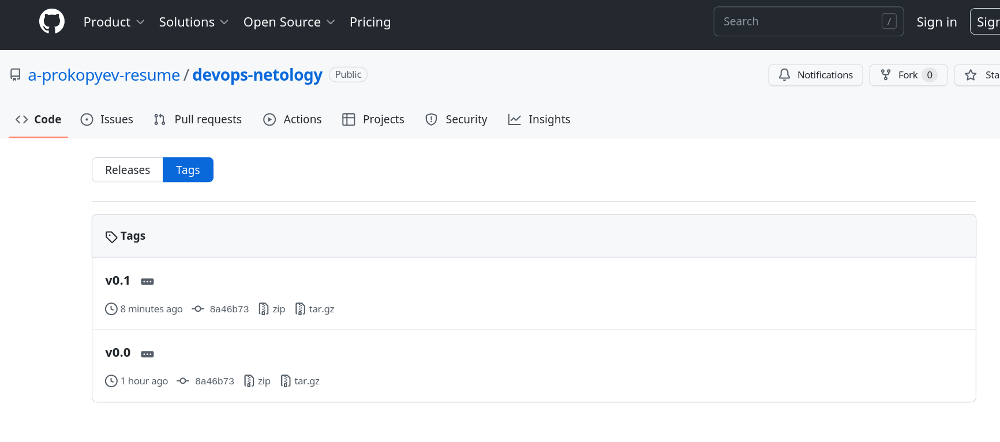
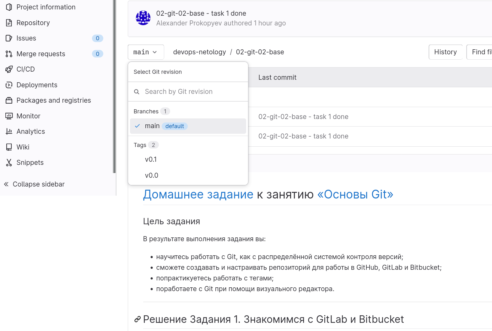
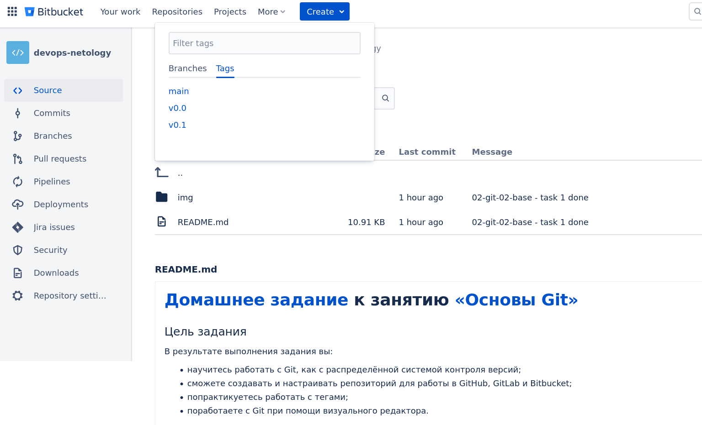
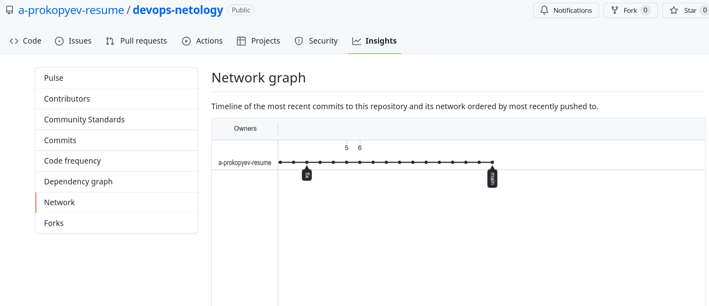
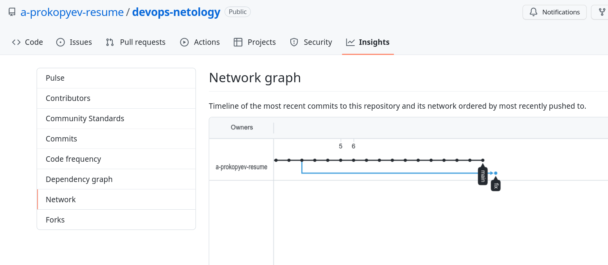
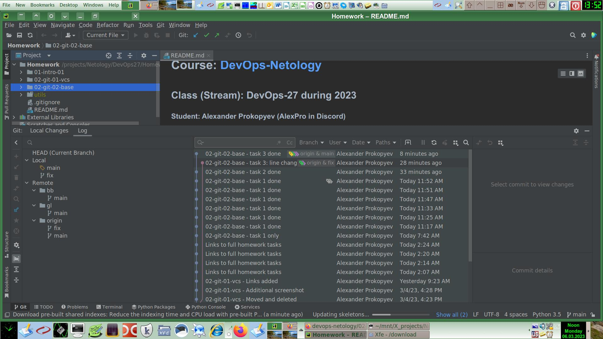

# [Домашнее задание](https://github.com/a-prokopyev-resume/sysadm-homeworks/tree/devsys10/02-git-02-base) к занятию [«Основы Git»](https://netology.ru/profile/program/git-dev-27/lessons/241717/lesson_items/1283980)

### Цель задания

В результате выполнения задания вы:

* научитесь работать с Git, как с распределённой системой контроля версий; 
* сможете создавать и настраивать репозиторий для работы в GitHub, GitLab и Bitbucket; 
* попрактикуетесь работать с тегами;
* поработаете с Git при помощи визуального редактора.

------

## Решение Задания 1. Знакомимся с GitLab и Bitbucket 

Создал учетные записи:
 * GitLab: https://gitlab.com/a-prokopyev-resume
 * Bitbucket: https://bitbucket.org/a-prokopyev-resume/

Зарегистрировал в обоих сервисах свой открытый ключ SSH. 

GitLab понравился тем, что в нем можно аутентифицироваться с помощью учетной записи Gmail, вход в которую защищен вторым фактором [WebAuthn](https://en.wikipedia.org/wiki/WebAuthn) U2F.
Кроме того сам GitLab тоже позволяет настроить свой второй фактор, тоже привязанный к ключу WebAuthn U2F, что делает его наиболее защищенным от несанкционированного использования из рассматриваемых сервисов.
Bitbucket не позволяет добавлять ключ WebAuthn U2F к своей учетной записи напрямую, но хотя бы позволяет аутентифицироваться с помощью учетной записи Gmail, где доступно использование ключей WebAuthn U2F.
Хуже всего с безопасностью в РФ обстоят дела при использовании новых учетных записей Github, потому что Github не работает через SSO аутентификацию учеткой Gmail, а для включения дополнительной аутентификации со встроенной в Github поддержкой WebAuthn U2F требуется сначала пройти проверку телефонного номера, отличного от +7.
Поэтому новые учетные записи Github являются наименее защищенными для пользователей из РФ.

На своем компьютере для работы с удаленными Git репозиториями я использую только SSH, поэтому добавлял только соответствующие remotes:

    git remote add gl git@gl:a-prokopyev-resume/devops-netology
    git remote add bb git@bb:a-prokopyev-resume/devops-netology

Файл .ssh/config у меня выглядит следующим образом:
``` 
    Host github.com github gh       gitlab.com gitlab gl    bitbucket.org bitbucket bb
           User git
   #       User a-prokopyev-resume
           Compression yes
           CompressionLevel 9
           PKCS11Provider /xxx/pkcs11_xxx.so

    Host github.com github gh
           Hostname github.com
   
    Host gitlab.com gitlab gl
           Hostname gitlab.com
   
    Host bitbucket.org bitbucket bb
           Hostname bitbucket.org
```
Поэтому полностью имена хостов при использовании ssh писать необязательно, достаточно указывать короткие имена хостов. 
Причем прописывать их в /etc/hosts в таком случае тоже ненужно, если использование ограничено только ssh библиотеками.

Команда `git remote -v` выводит у меня следующее:

    bb      git@bb:a-prokopyev-resume/devops-netology (fetch)
    bb      git@bb:a-prokopyev-resume/devops-netology (push)
    gl      git@gl:a-prokopyev-resume/devops-netology (fetch)
    gl      git@gl:a-prokopyev-resume/devops-netology (push)
    origin  git@github.com:a-prokopyev-resume/devops-netology (fetch)
    origin  git@github.com:a-prokopyev-resume/devops-netology (push)
    
Для origin репозитория Github у меня осталось длинное имя хоста: `github.com`

Выполнил push локальной ветки main в новые репозитории: 
```
    git push -u gl main 
    Enter PIN for 'EToken_SC': 
    Enumerating objects: 74, done.
    Counting objects: 100% (74/74), done.
    Delta compression using up to 4 threads
    Compressing objects: 100% (68/68), done.
    Writing objects: 100% (74/74), 1.15 MiB | 15.23 MiB/s, done.
    Total 74 (delta 19), reused 0 (delta 0)
    To gitlab.com:a-prokopyev-resume/devops-netology
     * [new branch]      main -> main
    Branch 'main' set up to track remote branch 'main' from 'gl'.

    git push -u bb main
    Warning: Permanently added the RSA host key for IP address '18.234.32.155' to the list of known hosts.
    Enter PIN for 'EToken_SC': 
    Enumerating objects: 74, done.
    Counting objects: 100% (74/74), done.
    Delta compression using up to 4 threads
    Compressing objects: 100% (68/68), done.
    Writing objects: 100% (74/74), 1.15 MiB | 15.43 MiB/s, done.
    Total 74 (delta 19), reused 0 (delta 0)
    To bitbucket.org:a-prokopyev-resume/devops-netology
     * [new branch]      main -> main
    Branch 'main' set up to track remote branch 'main' from 'bb'.
```
Настроил публичную видимость репозиториев для ознакомления проверяющего преподавателя с результатом решения задания:
 * https://gitlab.com/a-prokopyev-resume/devops-netology
 * https://bitbucket.org/a-prokopyev-resume/devops-netology

Сделал скрипт для отправки изменений сразу во все репозитории:

    root@workstation /projects/Netology/DevOps27/Homework > cat utils/push_to_all.sh

    source /utils/ssh/sc/agent.sh;
    ssh _agent etoken add;
    cd /projects/Netology/DevOps27/Homework;
    git push -u origin main;
    git push -u gl main;
    git push -u bb main; 

Каталог /projects/Netology/DevOps27/Homework/utils добавлен в файл .gitignore

Результат выполнения скрипта видно на скриншоте:



## Решение задания 2. Теги

Находим в логе hash HEAD:
```12:44 root@workstation /projects/Netology/DevOps27/Homework > git log --oneline
   8a46b73 (HEAD -> main, origin/main, origin/HEAD, gl/main, bb/main) 02-git-02-base - task 1 done                                                                                             
   2967b9a 02-git-02-base - task 1 done                                                                                                                                                        
   8baceb3 02-git-02-base - task 1 done                                                                                                                                                        
   779da77 02-git-02-base - task 1 done                                                                                                                                                        
   3322646 02-git-02-base - task 1 done                                                                                                                                                        
   f3be1e6 02-git-02-base - task 1 done
   eb2f815 02-git-02-base - task 1 only
   4a9377f Links to full homework tasks
   1d6980b Links to full homework tasks
   568e2fb Links to full homework tasks
   09f9920 Links to full homework tasks
   8ed020c 02-git-01-vcs - Links added
   8ec0fec 02-git-01-vcs - Additional screenshot
   b47627d 02-git-01-vcs - Moved and deleted
```

Создаем тэги:
```
   12:45 root@workstation /projects/Netology/DevOps27/Homework > git tag v0.0 8a46b73
   12:45 root@workstation /projects/Netology/DevOps27/Homework > git tag -a v0.1 8a46b73
```

Отправляем созданные тэги во все подключенные репозитории:
```
   12:46 root@workstation /projects/Netology/DevOps27/Homework > git push origin --tags
   Enter PIN for 'EToken_SC': 
   Enumerating objects: 1, done.
   Counting objects: 100% (1/1), done.
   Writing objects: 100% (1/1), 170 bytes | 170.00 KiB/s, done.
   Total 1 (delta 0), reused 0 (delta 0)
   To github.com:a-prokopyev-resume/devops-netology
    * [new tag]         v0.0 -> v0.0
    * [new tag]         v0.1 -> v0.1

   12:47 root@workstation /projects/Netology/DevOps27/Homework > git push gl --tags
   Enter PIN for 'EToken_SC':                                                                                                                                                                  
   Enumerating objects: 1, done.                                                                                                                                                               
   Counting objects: 100% (1/1), done.                                                                                                                                                         
   Writing objects: 100% (1/1), 170 bytes | 170.00 KiB/s, done.                                                                                                                                
   Total 1 (delta 0), reused 0 (delta 0)                                                                                                                                                       
   To gl:a-prokopyev-resume/devops-netology                                                                                                                                                    
    * [new tag]         v0.0 -> v0.0                                                                                                                                                           
    * [new tag]         v0.1 -> v0.1                                                                                                                                                           
   
   12:47 root@workstation /projects/Netology/DevOps27/Homework > git push bb --tags                                                                                                          
   Enter PIN for 'EToken_SC':                                                                                                                                                                  
   Enumerating objects: 1, done.                                                                                                                                                               
   Counting objects: 100% (1/1), done.
   Writing objects: 100% (1/1), 170 bytes | 170.00 KiB/s, done.
   Total 1 (delta 0), reused 0 (delta 0)
   To bb:a-prokopyev-resume/devops-netology
    * [new tag]         v0.0 -> v0.0                                                                                                                                                           
    * [new tag]         v0.1 -> v0.1 
```
Скриншоты созданных тэгов на соответствующих сервисах:





## Решение задания 3. Ветки 

История набранных мной команд для решения этой задачи:
```    
    git branch --set-upstream-to origin/main main
    git status
    git commit -a -m "02-git-02-base - task 2 done"
    git log -S "delete"
    git checkout 07fd3e791491c26232b7784ca55ffccdcff0422e
    git checkout -b fix
    cd ..
    git checkout -b fix
    git push -u origin fix
    echo "Hello from the fix!" >> README.md 
    git commit -a -m "02-git-02-base - task 3: line changed"
    git push -u origin 
    git log
    git checkout main
    git log
    git status
    cd 02-git-02-base/img/
    mv /download/Screenshot\ 2023-03-06\ at\ 13-25-41\ Network\ Graph\ ·\ a-prokopyev-resume\ devops-netology.png before_fix.png
    mv /download/Screenshot\ 2023-03-06\ at\ 13-26-15\ Network\ Graph\ ·\ a-prokopyev-resume\ devops-netology\ ·\ GitHub.png after_fix.png
```  

Результат видим на скриншотах:




## Решение задания 4. Упрощаем себе жизнь

Скриншот, на котором видно интеграцию JetBrains Pycharm и Git:

