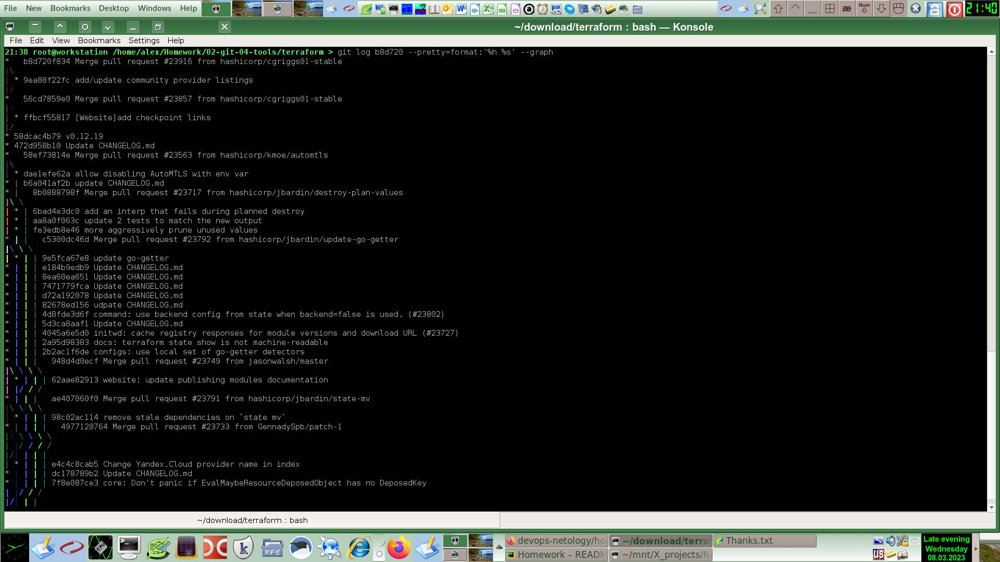

# [Домашнее задание](https://github.com/a-prokopyev-resume/sysadm-homeworks/tree/devsys10/02-git-04-tools) к занятию [«Инструменты Git»](https://netology.ru/profile/program/git-dev-27/lessons/241719/lesson_items/1283996)

### Цель задания

В результате выполнения задания вы:

* научитесь работать с утилитами Git;
* потренируетесь решать типовые задачи, возникающие при работе в команде. 

------

## Решение

Клонируем репозиторий Terraform:
```commandline
    cd /download
    git clone https://github.com/hashicorp/terraform
    cd /home/alex/Homework/02-git-04-tools
    ln -s /download/terraform .
```

### 1. Найдите полный хеш и комментарий коммита, хеш которого начинается на aefea. ###

Выводим информацию о коммите с хэшем aefea следующей командой: `git show aefea | head -n 5`

Видим следующий результат:
```commandline    
    commit aefead2207ef7e2aa5dc81a34aedf0cad4c32545
    Author: Alisdair McDiarmid <alisdair@users.noreply.github.com>
    Date:   Thu Jun 18 10:29:58 2020 -0400
    
        Update CHANGELOG.md
```


### 2. Какому тегу соответствует коммит `85024d3`? ###

Команда: `git show --oneline --no-patch 85024d3`

Ответ: v0.12.23


### 3. Сколько родителей у коммита `b8d720`? Напишите их хеши. ###

Команда: `git log b8d720 --pretty=format:'%h %s' --graph`

Результат видим на скриншоте:


Ответ: коммиты 56cd7859e0 и 9ea88f22fc

### 4. Перечислите хеши и комментарии всех коммитов, которые были сделаны между тегами  v0.12.23 и v0.12.24. ###

Команда: `git log v0.12.23...v0.12.24 --pretty=oneline`

Видим следующий результат:
```
    33ff1c03bb960b332be3af2e333462dde88b279e (tag: v0.12.24) v0.12.24
    b14b74c4939dcab573326f4e3ee2a62e23e12f89 [Website] vmc provider links
    3f235065b9347a758efadc92295b540ee0a5e26e Update CHANGELOG.md
    6ae64e247b332925b872447e9ce869657281c2bf registry: Fix panic when server is unreachable
    5c619ca1baf2e21a155fcdb4c264cc9e24a2a353 website: Remove links to the getting started guide's old location
    06275647e2b53d97d4f0a19a0fec11f6d69820b5 Update CHANGELOG.md
    d5f9411f5108260320064349b757f55c09bc4b80 command: Fix bug when using terraform login on Windows
    4b6d06cc5dcb78af637bbb19c198faff37a066ed Update CHANGELOG.md
    dd01a35078f040ca984cdd349f18d0b67e486c35 Update CHANGELOG.md
    225466bc3e5f35baa5d07197bbc079345b77525e Cleanup after v0.12.23 release
```


### 5. Найдите коммит, в котором была создана функция `func providerSource`, её определение в коде выглядит так: `func providerSource(...)` (вместо троеточия перечислены аргументы). ###

Команда1: `git log -S "func providerSource" --oneline`
```
5af1e6234a main: Honor explicit provider_installation CLI config when present
8c928e8358 main: Consult local directories as potential mirrors of providers
```
Команда2: `git show 5af1e6234a; git show 8c928e8358;`

Видим, что определение функции было в коммите 5af1e6234a, а в следующем коммите 8c928e8358 был добавлен закомментированный код.  

### 6. Найдите все коммиты, в которых была изменена функция `globalPluginDirs`. ###

Сначала находим файл с исходником искомой функции: `git grep -p "globalPluginDirs"`

Далее находим изменения в логе: `git log --no-patch --oneline -L:globalPluginDirs:plugins.go`

Ответ:
```
78b1220558 Remove config.go and update things using its aliases
52dbf94834 keep .terraform.d/plugins for discovery
41ab0aef7a Add missing OS_ARCH dir to global plugin paths
66ebff90cd move some more plugin search path logic to command
8364383c35 Push plugin discovery down into command package
```
 
### 7. Кто автор функции `synchronizedWriters`? ###

Команда: `git log -S synchronizedWriters --pretty=format:'%an %ad'`                                                                     

Выдает следующий результат:
```
James Bardin Mon Nov 30 18:02:04 2020 -0500                                                                                                                                                                      
James Bardin Wed Oct 21 13:06:23 2020 -0400                                                                                                                                                                      
Martin Atkins Wed May 3 16:25:41 2017 -0700                                        
```
Ответ: Martin Atkins - автор, James Bardin позднее вносил свои правки.

