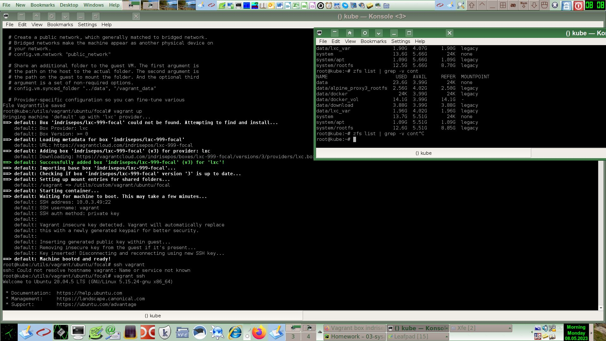

# [Домашнее задание](https://github.com/a-prokopyev-resume/sysadm-homeworks/tree/devsys10/03-sysadmin-01-terminal) к занятию [«Работа в терминале. Лекция 1»](https://netology.ru/profile/program/sys-dev-27/lessons/242276/lesson_items/1286585)

### Цель задания

В результате выполнения задания вы:

* научитесь работать с базовым функционалом инструмента VirtualBox, который помогает с быстрой развёрткой виртуальных машин;
* научитесь работать с документацией в формате man, чтобы ориентироваться в этом полезном и мощном инструменте документации;
* познакомитесь с функциями Bash (PATH, HISTORY, batch/at), которые помогут комфортно работать с оболочкой командной строки (шеллом) и понять некоторые его ограничения.

------

## Решение

1. Использую для экспериментов виртуальную машину в Linode, в ней нет nested virtualization, поэтому работают только контейнерные провайдеры.
Docker не очень подходит для полновесных виртуалок с инитом, поэтому использую провайдер LXC.
Ищу образ контейнера с Ubuntu нужной версии: https://app.vagrantup.com/boxes/search?order=desc&page=1&provider=lxc&q=ubuntu+20.04&sort=downloads&utf8=%E2%9C%93
Попробовал по убыванию популярности, рабочим оказался только образ: indrisepos/lxc-999-focal

```commandline
	vagrant init
	joe Vagrantfile
```
Содержимое Vagrantfile:
```
Vagrant.configure("2") do |config|
   	config.vm.box = "indrisepos/lxc-999-focal"
end
```

```commandline
vagrant up
```



2. VirtualBox я изучал ранее еще лет 15 назад.

3. Пока изучал настройки Vagrantfile: https://github.com/fgrehm/vagrant-lxc
, изучил отличия синтаксиса Ruby от других знакомых мне языков программирования, особенно для создания анонимных функций:
[Подробнее о замыканиях](https://ru.wikibooks.org/wiki/Ruby/%D0%9F%D0%BE%D0%B4%D1%80%D0%BE%D0%B1%D0%BD%D0%B5%D0%B5_%D0%BE_%D0%BC%D0%B5%D1%82%D0%BE%D0%B4%D0%B0%D1%85#%D0%9F%D0%BE%D0%B4%D1%80%D0%BE%D0%B1%D0%BD%D0%B5%D0%B5_%D0%BE_%D0%B7%D0%B0%D0%BC%D1%8B%D0%BA%D0%B0%D0%BD%D0%B8%D1%8F%D1%85)
```
Vagrant.configure("2") do |config|
  config.vm.box = "indrisepos/lxc-999-focal"
  config.vm.provider :lxc do |lxc|
    # Same effect as 'customize ["modifyvm", :id, "--memory", "1024"]' for VirtualBox
    lxc.customize 'cgroup.memory.limit_in_bytes', '1024M'
  end
end
```
Больше параметров настроек можно найти на странице: https://manpages.ubuntu.com/manpages/kinetic/en/man5/lxc.conf.5.html

4. Вход в LXC контейнер через ssh показан на скриншоте выше в решении задачи 1.  

5. HISTFILESIZE и ignoreboth
```
 man bash | grep -n HISTFILESIZE -A 3 -B 1
601-              The name of the file in which command history is saved (see HISTORY below).  The default value is ~/.bash_history.  If unset, the command history is not saved when a shell exits.
602:       HISTFILESIZE
603-              The maximum number of lines contained in the history file.  When this variable is assigned a value, the history file is truncated, if necessary, to contain no more than that number of lines
604-              by  removing  the oldest entries.  The history file is also truncated to this size after writing it when a shell exits.  If the value is 0, the history file is truncated to zero size.  Non-
605-              numeric values and numeric values less than zero inhibit truncation.  The shell sets the default value to the value of HISTSIZE after reading any startup files.
--
2191-       On startup, the history is initialized from the file named by the variable HISTFILE (default ~/.bash_history).  The file named by the value of HISTFILE is truncated, if necessary,  to  contain  no
2192:       more  than  the  number  of lines specified by the value of HISTFILESIZE.  If HISTFILESIZE is unset, or set to null, a non-numeric value, or a numeric value less than zero, the history file is not
2193-       truncated.  When the history file is read, lines beginning with the history comment character followed immediately by a digit are interpreted as timestamps for the preceding history  line.   These
2194-       timestamps  are  optionally  displayed depending on the value of the HISTTIMEFORMAT variable.  When a shell with history enabled exits, the last $HISTSIZE lines are copied from the history list to
2195-       $HISTFILE.  If the histappend shell option is enabled (see the description of shopt under SHELL BUILTIN COMMANDS below), the lines are appended to the history file, otherwise the history  file  is
--
2197-       the history comment character, so they may be preserved across shell sessions.  This uses the history comment character to distinguish timestamps from other history lines.  After saving  the  his‐
2198:       tory,  the history file is truncated to contain no more than HISTFILESIZE lines.  If HISTFILESIZE is unset, or set to null, a non-numeric value, or a numeric value less than zero, the history file
2199-       is not truncated.
2200-
2201-       The builtin command fc (see SHELL BUILTIN COMMANDS below) may be used to list or edit and re-execute a portion of the history list.  The history builtin may be used to display or modify  the  his‐
```

```
09:17 root@workstation /download > man bash | grep -n ignoreboth -B 2
594-       HISTCONTROL
595-              A colon-separated list of values controlling how commands are saved on the history list.  If the list of values includes ignorespace, lines which begin with a space character are not  saved
596:              in the history list.  A value of ignoredups causes lines matching the previous history entry to not be saved.  A value of ignoreboth is shorthand for ignorespace and ignoredups. 
```
ignoreboth - это одно из возможных значений переменной HISTCONTROL.
ignoreboth - это сокращенная запись двух других значений ignorespace и ignoredups. 
ignoreboth предписывает bash исключить из записи в историю команд те команды, которые начинаются с пробела или совпадают с предыдущей записью в истории.

6. Блок {} 
```
man bash | grep -n '{ list; }' -B 0 -A 3
202:       { list; }
203-              list  is  simply executed in the current shell environment.  list must be terminated with a newline or semicolon.  This is known as a group command.  The return status is the exit status of
204-              list.  Note that unlike the metacharacters ( and ), { and } are reserved words and must occur where a reserved word is permitted to be recognized.  Since they do not  cause  a  word  break,
205-              they must be separated from list by whitespace or another shell metacharacter.
```
Позволяет сгруппировать несколько команд в один блок, что может быть удобно для операций перенаправления потоков и т.п.
https://unix.stackexchange.com/questions/366572/how-to-run-a-command-block-in-the-main-shell
Блок в фигурных скобках (в отличие например от круглых скобок) выполняется в том же инстансе, что и основной shell:
```
09:37 root@workstation /download > echo $BASHPID; { echo $BASHPID; }; ( echo $BASHPID; )
11138
11138
13003
```

Другой вариант использования фигурных скобок:
```root@workstation /download > man bash | grep -n --color -A 15 -m 1 'Brace Expansion' 
768:   Brace Expansion
769-       Brace expansion is a mechanism by which arbitrary strings may be generated.  This mechanism is similar to pathname expansion, but the filenames generated need not  exist.   Patterns  to  be  brace
770-       expanded  take  the form of an optional preamble, followed by either a series of comma-separated strings or a sequence expression between a pair of braces, followed by an optional postscript.  The
771-       preamble is prefixed to each string contained within the braces, and the postscript is then appended to each resulting string, expanding left to right.
772-
773-       Brace expansions may be nested.  The results of each expanded string are not sorted; left to right order is preserved.  For example, a{d,c,b}e expands into `ade ace abe'.
774-
775-       A sequence expression takes the form {x..y[..incr]}, where x and y are either integers or single characters, and incr, an optional increment, is  an  integer.   When  integers  are  supplied,  the
776-       expression expands to each number between x and y, inclusive.  Supplied integers may be prefixed with 0 to force each term to have the same width.  When either x or y begins with a zero, the shell
777-       attempts to force all generated terms to contain the same number of digits, zero-padding where necessary.  When characters are supplied, the expression expands to each character  lexicographically
778-       between  x  and  y,  inclusive,  using the default C locale.  Note that both x and y must be of the same type.  When the increment is supplied, it is used as the difference between each term.  The
779-       default increment is 1 or -1 as appropriate.
780-
781-       Brace expansion is performed before any other expansions, and any characters special to other expansions are preserved in the result.  It is strictly textual.  Bash does not  apply  any  syntactic
782-       interpretation to the context of the expansion or the text between the braces.
```
В данном случае такой блок позволяет сгенерировать последовательность значений, как описано выше.

7. Создание большого количества файлов
100 тысяч файлов: `touch {1..100000}`
```
alex@workstation: 
    cd /tmp
    mkdir test
    cd test/
    touch {1..100000}
    ls | wc -l
    100000
    touch {1..300000}
    bash: /usr/bin/touch: Argument list too long
```
Создать 300 тысяч файлов не получилось потому что не хватило памяти, выделяемой для аргументов командной строки,
определяемой параметром ARG_MAX: 
``` getconf ARG_MAX
    2097152
```

8. Что делает конструкция `[[ -d /tmp ]]`?

```
man bash | grep -n --color -A 33  '\[\[ exp'
211:       [[ expression ]]
212-              Return a status of 0 or 1 depending on the evaluation of the conditional expression expression.  Expressions are composed of the primaries described  below  under  CONDITIONAL  EXPRESSIONS.
213-              Word  splitting  and  pathname expansion are not performed on the words between the [[ and ]]; tilde expansion, parameter and variable expansion, arithmetic expansion, command substitution,
214-              process substitution, and quote removal are performed.  Conditional operators such as -f must be unquoted to be recognized as primaries.
215-
216-              When used with [[, the < and > operators sort lexicographically using the current locale.
217-
218-       See the description of the test builtin command (section SHELL BUILTIN COMMANDS below) for the handling of parameters (i.e.  missing parameters).
219-
220-       When the == and != operators are used, the string to the right of the operator is considered a pattern and matched according to the rules described below under Pattern Matching, as if the  extglob
221-       shell option were enabled.  The = operator is equivalent to ==.  If the nocasematch shell option is enabled, the match is performed without regard to the case of alphabetic characters.  The return
222-       value is 0 if the string matches (==) or does not match (!=) the pattern, and 1 otherwise.  Any part of the pattern may be quoted to force the quoted portion to be matched as a string.
223-
224-       An additional binary operator, =~, is available, with the same precedence as == and !=.  When it is used, the string to the right of the operator is considered an extended regular  expression  and
225-       matched accordingly (as in regex(3)).  The return value is 0 if the string matches the pattern, and 1 otherwise.  If the regular expression is syntactically incorrect, the conditional expression's
226-       return value is 2.  If the nocasematch shell option is enabled, the match is performed without regard to the case of alphabetic characters.  Any part of the pattern may  be  quoted  to  force  the
227-       quoted  portion to be matched as a string.  Bracket expressions in regular expressions must be treated carefully, since normal quoting characters lose their meanings between brackets.  If the pat‐
228-       tern is stored in a shell variable, quoting the variable expansion forces the entire pattern to be matched as a string.  Substrings matched  by  parenthesized  subexpressions  within  the  regular
229-       expression are saved in the array variable BASH_REMATCH.  The element of BASH_REMATCH with index 0 is the portion of the string matching the entire regular expression.  The element of BASH_REMATCH
230-       with index n is the portion of the string matching the nth parenthesized subexpression.
231-
232-       Expressions may be combined using the following operators, listed in decreasing order of precedence:
233-
234-              ( expression )
235-                     Returns the value of expression.  This may be used to override the normal precedence of operators.
236-              ! expression
237-                     True if expression is false.
238-              expression1 && expression2
239-                     True if both expression1 and expression2 are true.
240-              expression1 || expression2
241-                     True if either expression1 or expression2 is true.
242-
243-              The && and || operators do not evaluate expression2 if the value of expression1 is sufficient to determine the return value of the entire conditional expression.
```
Посмотрим опцию -d в описании команды test:
```
10:10 root@workstation /download > help test | grep '\-d'
      -d FILE        True if file is a directory.
```
Таким образом конструкция `[[ -d /tmp ]]` проверяет существование директории.
Пример: `if [[ -d /dev/zvol/ ]]; then echo "ZFS volumes may be available"; fi`
 
9. Эксперименты с переменной среды PATH
```
root@kube:/utils/vagrant/netology/ubuntu# vagrant up
Bringing machine 'default' up with 'lxc' provider...
==> default: Checking if box 'indrisepos/lxc-999-focal' version '3' is up to date...
==> default: Setting up mount entries for shared folders...
    default: /vagrant => /utils/custom/vagrant/ubuntu/focal
==> default: Starting container...
==> default: Waiting for machine to boot. This may take a few minutes...
    default: SSH address: 10.0.3.62:22
    default: SSH username: vagrant
    default: SSH auth method: private key
==> default: Machine booted and ready!
==> default: Machine already provisioned. Run `vagrant provision` or use the `--provision`
==> default: flag to force provisioning. Provisioners marked to run always will still run.
root@kube:/utils/vagrant/netology/ubuntu# vagrant ssh
Welcome to Ubuntu 20.04.5 LTS (GNU/Linux 5.15.24-gnu x86_64)

 * Documentation:  https://help.ubuntu.com
 * Management:     https://landscape.canonical.com
 * Support:        https://ubuntu.com/advantage
Last login: Mon May  8 03:20:31 2023 from 10.0.3.1

 * vagrant@focal-base:~$ sudo su

root@focal-base:/tmp# cd /tmp
root@focal-base:/tmp# mkdir new_patch_directory
root@focal-base:/tmp# cd new_patch_directory
root@focal-base:/tmp/new_patch_directory# ln -s /bin/bash .
root@focal-base:/tmp/new_patch_directory# type -a bash
bash is /usr/bin/bash
bash is /bin/bash
root@focal-base:/tmp/new_patch_directory# PATH=/tmp/new_patch_directory/:$PATH
root@focal-base:/tmp/new_patch_directory# type -a bash
bash is /tmp/new_patch_directory/bash
bash is /usr/bin/bash
bash is /bin/bash
```

10. Отличия команд at и batch

    Команда at запускает команду в предопределенное время, а batch запускает команду при определенном уровне загрузки системы.


11. Завершаю работу контейнера:
```
root@kube:/utils/vagrant/netology/ubuntu# vagrant halt
==> default: Attempting graceful shutdown of VM...

root@kube:/utils/vagrant/netology/ubuntu# vagrant status
Current machine states:

default                   stopped (lxc)

The container is currently stopped. Run `vagrant up` to bring it up again.
```
	