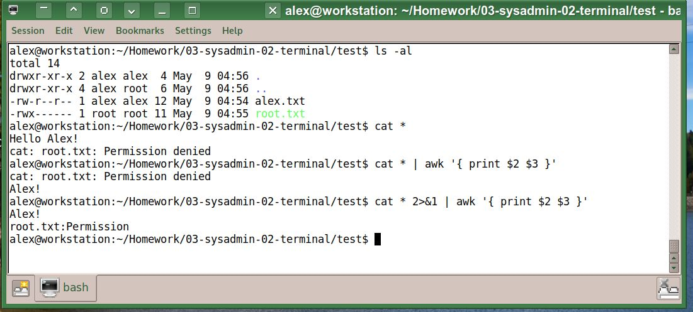

# [Домашнее задание](https://github.com/a-prokopyev-resume/sysadm-homeworks/tree/devsys10/03-sysadmin-02-terminal) к занятию [«Работа в терминале. Лекция 2»](https://netology.ru/profile/program/sys-dev-27/lessons/242277/lesson_items/1286589)

### Цель задания

В результате выполнения задания вы:

* познакомитесь с возможностями некоторых команд (grep, wc), чтобы в дальнейшем обращать внимание на схожие особенности команд;
* попрактикуетесь с перенаправлением потоков ввода, вывода, ошибок, что поможет грамотно использовать функционал в скриптах;
* поработаете с файловой системой /proc как примером размещения информации о процессах.

------
### Дополнительные материалы для выполнения задания
1. [Статья с примерами перенаправлений в Bash и работы с файловыми дескрипторами(копия из веб кэща)](BashRedirection.html).
------

## Решение

Ответьте на вопросы:

1. Какого типа команда `cd`?

Ответ: Это встроенная команда:
```
00:55 root@workstation ~ > type cd
cd is a shell builtin
```

2. Какая альтернатива без pipe для команды `grep <some_string> <some_file> | wc -l`?   

```
01:03 root@workstation ~ > grep --help | grep count
  -m, --max-count=NUM       stop after NUM selected lines
  -c, --count               print only a count of selected lines per FILE
```
Ответ: Можно использовать опцию -c (--count):
```
01:04 root@workstation ~ > grep model /proc/cpuinfo 
model           : 23
model name      : Intel(R) Core(TM)2 Quad CPU    Q9500  @ 2.83GHz
model           : 23
model name      : Intel(R) Core(TM)2 Quad CPU    Q9500  @ 2.83GHz
model           : 23
model name      : Intel(R) Core(TM)2 Quad CPU    Q9500  @ 2.83GHz
model           : 23
model name      : Intel(R) Core(TM)2 Quad CPU    Q9500  @ 2.83GHz
01:02 root@workstation ~ > grep model /proc/cpuinfo -c 
8
```
Заметки: [Примеры неэффективного и/или некорректного использования конвейера bash](http://www.smallo.ruhr.de/award.html)

3. Какой процесс с PID `1` является родителем для всех процессов в вашей виртуальной машине Ubuntu 20.04?
```
root@focal-base:/home/vagrant# uname -a
Linux focal-base 5.15.24-gnu #1.0 SMP Tue Sep 27 12:35:59 EST 1983 x86_64 x86_64 x86_64 GNU/Linux

root@focal-base:/home/vagrant# pstree -p | head -n 1
systemd(1)-+-agetty(106)
```
Ответ: процесс systemd с PID=1.

4. Как будет выглядеть команда, которая перенаправит вывод stderr `ls` на другую сессию терминала?

Ответ: определяем номер N pts в другой сессии командой `tty`, далее выполняем команду `ls -al /root/ 1>/dev/pts/N 2>&1`,
где сначала перенаправляем в stdout, который пененаправляем в нужный нам /dev/pts/N .

5. Получится ли одновременно передать команде файл на stdin и вывести её stdout в другой файл?

Ответ: получится.
```
vagrant@focal-base:~$ cat < /proc/cmdline > cmdline.txt; cat cmdline.txt
edd=off root=system/rootfs  boot=zfs ro framebuffer=false selinux=0          zswap.enabled=1 zswap.max_pool_percent=25 zswap.compressor=lz4 console=ttyS0    ipv6.disable=1
```
6. Получится ли, находясь в графическом режиме, вывести данные из PTY в какой-либо из эмуляторов TTY? Сможете ли вы наблюдать выводимые данные?

Ответ: да получится. `echo "Hello from Trinity PTY (konsole)" > /dev/tty1`, переключаемся в tty1 нажатием Ctrl+Alt+F1 и видим переданную строку.

7. Выполните команду `bash 5>&1`. К чему она приведёт? Что будет, если вы выполните `echo netology > /proc/$$/fd/5`? Почему так происходит?

Ответ: Команда `xxx 5>&1` запускает программу xxx с перенаправлением потока 5 в поток 1 (stdin), в данном случае в качестве программы xxx выступает bash.
Если выполнить команду `echo netology > /proc/$$/fd/5` в вновь запущенной сессии bash, то строка "netology" будет выведена на экран (в поток stdout), 
потому что поток 5 ранее был перенаправлен в stdout.

8. Получится ли в качестве входного потока для pipe использовать только stderr команды, не потеряв отображение stdout на pty?  

Ответ: Получится, но для этого нужно сначала перенаправить поток stderr в stdout следующим образом: `2>&1`

Пример:


9. Что выведет команда `cat /proc/$$/environ`? Как ещё можно получить аналогичный по содержанию вывод?

 Ответ: эта команда выведет переменные окружения. Примерно то же самое можно увидеть в выводе команды `env`.

10. Используя `man`, опишите, что доступно по адресам `/proc/<PID>/cmdline`, `/proc/<PID>/exe`.

```
05:24 root@workstation /download > man proc | grep '/proc/\[pid\]/exe' -A 8 -n
216:       /proc/[pid]/exe
217-              Under Linux 2.2 and later, this file is a symbolic link containing the actual pathname of the  executed  command.   This
218-              symbolic  link  can  be  dereferenced  normally;  attempting  to  open  it  will open the executable.  You can even type
219:              /proc/[pid]/exe to run another copy of the same executable that is being run by process [pid].  If the pathname has been
220-              unlinked,  the  symbolic link will contain the string '(deleted)' appended to the original pathname.  In a multithreaded
221-              process, the contents of this symbolic link are not available if the main thread has already  terminated  (typically  by
222-              calling pthread_exit(3)).
223-
224-              Permission   to   dereference   or  read  (readlink(2))  this  symbolic  link  is  governed  by  a  ptrace  access  mode
225-              PTRACE_MODE_READ_FSCREDS check; see ptrace(2).
226-
227:              Under Linux 2.0 and earlier, /proc/[pid]/exe is a pointer to the binary which was executed, and appears  as  a  symbolic
228-              link.  A readlink(2) call on this file under Linux 2.0 returns a string in the format:
229-
230-                  [device]:inode
231-
232-              For example, [0301]:1502 would be inode 1502 on device major 03 (IDE, MFM, etc. drives) minor 01 (first partition on the
233-              first drive).
234-
235-              find(1) with the -inum option can be used to locate the file.

05:25 root@workstation /download > man proc | grep '/proc/\[pid\]/cmdline' -n -A 3 | tail -n 4
139:       /proc/[pid]/cmdline
140-              This  read-only  file  holds the complete command line for the process, unless the process is a zombie.  In the latter case, there is nothing in this file: that is, a read on this file will
141-              return 0 characters.  The command-line arguments appear in this file as a set of strings separated by null bytes ('\0'), with a further null byte after the last string.
142-
```
exe - символическая ссылка на бинарный executable процесса на диске, из которого он был запущен.  
cmdline - полная командная строка процесса.

11. Узнайте, какую наиболее старшую версию набора инструкций SSE поддерживает ваш процессор с помощью `/proc/cpuinfo`.

Ответ:
```
05:36 root@workstation /download > cat /proc/cpuinfo | head
processor       : 0
vendor_id       : GenuineIntel
cpu family      : 6
model           : 23
model name      : Intel(R) Core(TM)2 Quad CPU    Q9500  @ 2.83GHz
stepping        : 10
microcode       : 0xa07
cpu MHz         : 2554.350
cache size      : 3072 KB
physical id     : 0

05:36 root@workstation /download > cat /proc/cpuinfo | grep sse -m 1 | perl -ne 'print join ("\n", split (" ", $_) );' | grep sse
sse
sse2
ssse3
sse4_1

05:36 root@workstation /download > cat /proc/cpuinfo | grep sse -m 1 | perl -ne 'print join ("\n", split (" ", $_) );' | grep sse | tail -n 1
sse4_1
```

12. При открытии нового окна терминала и `vagrant ssh` создаётся новая сессия и выделяется pty.  
	Это можно подтвердить командой `tty`, которая упоминалась в лекции 3.2.  
	Однако:

    ```bash
	vagrant@netology1:~$ ssh localhost 'tty'
	not a tty
    ```
	Почитайте, почему так происходит и как изменить поведение.

Ответ: По умолчанию при запуске ssh с командой (в отличии от интерактивного входа) ssh подключается без терминала, чтобы в сессии ssh появился терминал, нужно указать опцию `-t`.
Пример:
```
vagrant@focal-base:~$ ssh  -t localhost tty
vagrant@localhost's password: 
/dev/pts/5
Connection to localhost closed.
```
13. Бывает, что есть необходимость переместить запущенный процесс из одной сессии в другую. Попробуйте сделать это, воспользовавшись `reptyr`. Например, так можно перенести в `screen` процесс, который вы запустили по ошибке в обычной SSH-сессии.
Ответ (пример): Запускаем htop в одном терминале, далее останавливает его через Ctrl+Z и делаем disown:  
```
14. 06:05 root@workstation /download > htop
[1]+  Stopped                 htop
06:06 root@workstation /download > jobs
[1]+  Stopped                 htop
06:06 root@workstation /download > disown -a
bash: warning: deleting stopped job 1 with process group 11897
06:06 root@workstation /download > jobs
06:06 root@workstation /download > ps aux | grep htop
root     11897  0.2  0.0   8912  3604 pts/16   T    06:06   0:00 htop
root     12191  0.0  0.0   8128  1572 pts/16   S+   06:06   0:00 grep htop
```
теперь в другом терминале запускаем команду: `screen -m  bash -lc "reptyr $(pgrep htop)"`, в результате htop переместится во вновь открытый screen на другом терминале.
	
14. `sudo echo string > /root/new_file` не даст выполнить перенаправление под обычным пользователем,
так как перенаправлением занимается процесс shell, который запущен без `sudo` под вашим пользователем. 
Для решения этой проблемы можно использовать конструкцию `echo string | sudo tee /root/new_file`. 
Узнайте, что делает команда `tee` и почему в отличие от `sudo echo` команда с `sudo tee` будет работать.

Ответ: команда tee перенаправляет входной поток одновременно в файл и в stdout.  
Но необязательно использовать tee, достаточно просто запустить перенаправление под рутом, например, так:
`sudo bash -lc "echo string > /root/new_file"`

