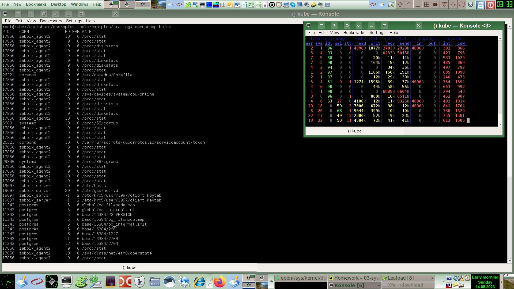

# [Домашнее задание](https://github.com/a-prokopyev-resume/sysadm-homeworks/tree/devsys10/03-sysadmin-03-os) к занятию [«Операционные системы. Лекция 1»](https://netology.ru/profile/program/sys-dev-27/lessons/242278/lesson_items/1286593)

### Цель задания

В результате выполнения задания вы:

* познакомитесь с инструментом strace, который помогает отслеживать системные вызовы процессов и является необходимым для отладки и расследований при возникновении ошибок в работе программ;
* рассмотрите различные режимы работы скриптов, настраиваемые командой set. Один и тот же код в скриптах в разных режимах работы ведёт себя по-разному.

### Чеклист готовности к домашнему заданию

1. Убедитесь, что у вас установлен инструмент `strace`, выполнив команду `strace -V` для проверки версии. В Ubuntu 20.04 strace установлен, но в других дистрибутивах его может не быть в коплекте «из коробки». Обратитесь к документации дистрибутива, чтобы понять, как установить инструмент strace.
2. Убедитесь, что у вас установлен пакет `bpfcc-tools`, информация по установке [по ссылке](https://github.com/iovisor/bcc/blob/master/INSTALL.md).

### Дополнительные материалы для выполнения задания

1. Изучите документацию lsof — `man lsof`. Та же информация есть [в сети](https://linux.die.net/man/8/lsof).
2. Документация по режимам работы bash находится в `help set` или [в сети](https://www.gnu.org/software/bash/manual/html_node/The-Set-Builtin.html).

------

## Задание

1. Какой системный вызов делает команда `cd`? 
```
strace -P /tmp bash -c 'cd /tmp'
stat("/tmp", {st_mode=S_IFDIR|S_ISVTX|0777, st_size=740, ...}) = 0
chdir("/tmp")                           = 0
+++ exited with 0 +++
```
Ответ: встроенная команда `cd` использует системный вызов `chdir`.  

2. Используя `strace`, выясните, где находится база данных `file`, на основании которой она делает свои догадки.
```
02:32 root@workstation /download > strace file /dev/tty 2>&1 | grep open
openat(AT_FDCWD, "/etc/ld.so.cache", O_RDONLY|O_CLOEXEC) = 3
openat(AT_FDCWD, "/usr/lib/x86_64-linux-gnu/libmagic.so.1", O_RDONLY|O_CLOEXEC) = 3
openat(AT_FDCWD, "/lib/x86_64-linux-gnu/libz.so.1", O_RDONLY|O_CLOEXEC) = 3
openat(AT_FDCWD, "/lib/x86_64-linux-gnu/libc.so.6", O_RDONLY|O_CLOEXEC) = 3
openat(AT_FDCWD, "/usr/lib/locale/locale-archive", O_RDONLY|O_CLOEXEC) = 3
openat(AT_FDCWD, "/etc/magic.mgc", O_RDONLY) = -1 ENOENT (No such file or directory)
openat(AT_FDCWD, "/etc/magic", O_RDONLY) = 3
openat(AT_FDCWD, "/usr/share/misc/magic.mgc", O_RDONLY) = 3
openat(AT_FDCWD, "/usr/lib/x86_64-linux-gnu/gconv/gconv-modules.cache", O_RDONLY) = 3

02:32 root@workstation /download > strace file /dev/tty 2>&1 | grep magic
openat(AT_FDCWD, "/usr/lib/x86_64-linux-gnu/libmagic.so.1", O_RDONLY|O_CLOEXEC) = 3
stat("/root/.magic.mgc", 0x7ffd97c52610) = -1 ENOENT (No such file or directory)
stat("/root/.magic", 0x7ffd97c52610)    = -1 ENOENT (No such file or directory)
openat(AT_FDCWD, "/etc/magic.mgc", O_RDONLY) = -1 ENOENT (No such file or directory)
stat("/etc/magic", {st_mode=S_IFREG|0644, st_size=111, ...}) = 0
openat(AT_FDCWD, "/etc/magic", O_RDONLY) = 3
openat(AT_FDCWD, "/usr/share/misc/magic.mgc", O_RDONLY) = 3
```
Ответ: 

file пытается найти и/или открыть следующие файлы:
```
/root/.magic.mgc
/root/.magic
/etc/magic.mgc
/etc/magic
/usr/share/misc/magic.mgc
```
Значит в каких то из них. На моем компьютере существуют только такие файлы из этого списка:
```
/etc/magic
/usr/share/misc/magic.mgc
```

3. Основываясь на знаниях о перенаправлении потоков, предложите способ обнуления открытого удалённого файла, чтобы освободить место на файловой системе.

Ответ: Это можно сделать с помощью записи в файловый дескриптор ранее удаленного файла. Дескриптор можно найти в свойствах процесса, который пишет в такой файл.
Пример:
```
   ping ya.ru > ping.log & CmdPID=$!; rm -f ping.log;
   lsof -p $CmdPID | grep '(deleted)' | awk '{ ptint $4; }' # Optional, because we already know fd N=1 for stdout
   cat /proc/$CmdPID/fd/1 | wc -l; # Before cleaning log
   33
   echo > /proc/$CmdPID/fd/1;
   cat /proc/$CmdPID/fd/1 | wc -l; # After cleaning log
   3
```

4. Занимают ли зомби-процессы ресурсы в ОС (CPU, RAM, IO)?

Ответ: Они занимают только по одной записи на процесс в таблице процессов и номер дескриптора процесса (количество которых ограничено),
никаких других ресурсов они не потребляют, потому что zombie процесс уже завершился, но его родительский процесс не вызвал wait для порожденного процесса.  
[Более подробное описание zombie процессов](https://en.wikipedia.org/wiki/Zombie_process)

5. IO Visor BCC есть утилита `opensnoop` из пакета `bpfcc-tools`. На какие файлы вы увидели вызовы группы `open` за первую секунду работы утилиты? 
Устанавливаем и настраиваем утилиты из пакета `bpfcc-tools`:
```
apt-get install bpfcc-tools
```
[Монтируем debugfs](https://chetnachaudhari.github.io/2016-05-08/how-to-enable-debugfs/)
```
#echo "#debugfs  /sys/kernel/debug  debugfs  defaults  0 0" >> /etc/fstab
mount -t debugfs none /sys/kernel/debug
```
Ответ:


6. Какой системный вызов использует `uname -a`? Приведите цитату из man по этому системному вызову, где описывается альтернативное местоположение в `/proc` и где можно узнать версию ядра и релиз ОС.

Ответ:
```
man 2 uname | grep osr -B 11  -n
40-       This  is  a system call, and the operating system presumably knows its name, release and version.  It also knows what hardware it runs on.  So, four of the fields of the struct are meaningful.  On
41-       the other hand, the field nodename is meaningless: it gives the name of the present machine in some undefined network, but typically machines are in more than one network and have  several  names.
42-       Moreover, the kernel has no way of knowing about such things, so it has to be told what to answer here.  The same holds for the additional domainname field.
43-
44-       To  this  end, Linux uses the system calls sethostname(2) and setdomainname(2).  Note that there is no standard that says that the hostname set by sethostname(2) is the same string as the nodename
45-       field of the struct returned by uname() (indeed, some systems allow a 256-byte hostname and an 8-byte nodename), but this is true on Linux.  The same holds for setdomainname(2) and the  domainname
46-       field.
47-
48-       The  length  of  the  fields in the struct varies.  Some operating systems or libraries use a hardcoded 9 or 33 or 65 or 257.  Other systems use SYS_NMLN or _SYS_NMLN or UTSLEN or _UTSNAME_LENGTH.
49-       Clearly, it is a bad idea to use any of these constants; just use sizeof(...).  Often 257 is chosen in order to have room for an internet hostname.
50-
51:       Part of the utsname information is also accessible via /proc/sys/kernel/{ostype, hostname, osrelease, version, domainname}.
```
Еще можно посмотреть исходный код и более подробное описание:  
Исходный код утилиты `uname`: https://github.com/wertarbyte/coreutils/blob/master/src/uname.c  
Исходный код библиотечной функции `uname`: https://codebrowser.dev/glibc/glibc/posix/uname.c.html  
Описание `uname`: https://en.wikipedia.org/wiki/Uname

7. Чем отличается последовательность команд через `;` и через `&&` в bash? Есть ли смысл использовать в bash `&&`, если применить `set -e`?

Ответ:

Разделитель `;` указывает на безусловное последовательное выполнение команд, причем если предварительно задать опцию `set -e`, 
то в случае возврата ошибки одной из таких команд выполнение скрипта прерывается.

`&&` - символ операции логического "И" над результатами выполнения команд, для вычисления которого команда - второй операнд выполняется, 
только в случае успешного выполнения первого операнда, потому что логические операции в Bash ленивые, т.е. команды-операнды выполняются только тогда,
когда остается неопределенность по результирующему значению вычисления логической операции над командами - операндами.

`||` - символ операции логического "ИЛИ" над результатами выполнения команд, для вычисления которого команда - второй операнд выполняется, 
только в случае ошибки (логическая ложь), возвращенной первым операндом. Эта операция вычисляется лениво так же как и операция `&&`   

Ложный результат вычисления логического выражения в Bash имеет код возврата как у команды false (равен 1):
```
false; echo $?
1
```
с другой стороны это ошибка из-за ненулевого кода возврата выражения в целом.

Скрипт [test_logic.sh](test_logic.sh) может продемонстрировать ленивое вычисление логических операций в Bash,
его запуск выдает следующие результаты:
```
===>: false || false:     left false called.    right false called.     Exit code: 1
===>: false || true:      left false called.    right true called.      Exit code: 0
===>: true || false:      left true called.                             Exit code: 0
===>: true || true:       left true called.                             Exit code: 0
===>: false && false:     left false called.                            Exit code: 1
===>: false && true:      left false called.                            Exit code: 1
===>: true && false:      left true called.     right false called.     Exit code: 1
===>: true && true:       left true called.     right true called.      Exit code: 0
```
Как видим, с учетом того, что код возврата false=1, а true=0, коды возврата операций `||` и `&&` соответствуют обычным значениям аналогичных операций в булевой алгебре.

Вопрос про прерывание выполнения команд после другой последовательности команд, объединенных логическими операторами, при использовании команды `set -e;`

Посмотрим описание команды `set -x`:

```
root@kube:~# man bash | grep 'set \[+ab' -A 20 | grep '\-e' -A 1
              -e      Exit immediately if a pipeline (which may consist of a single simple command), a list, or a compound command (see SHELL GRAMMAR above), exits with a non-zero status.  The shell does
                      not exit if the command that fails is part of the command list immediately following a while or until keyword, part of the test following the if or elif reserved words, part of  any
--
                      !.  If a compound command other than a subshell returns a non-zero status because a command failed while -e was being ignored, the shell does not exit.  A trap on ERR,  if  set,  is
                      executed before the shell exits.  This option applies to the shell environment and each subshell environment separately (see COMMAND EXECUTION ENVIRONMENT above), and may cause sub‐
--
                      If a compound command or shell function executes in a context where -e is being ignored, none of the commands executed within the compound command or function body will be  affected
                      by  the -e setting, even if -e is set and a command returns a failure status.  If a compound command or shell function sets -e while executing in a context where -e is ignored, that
                      setting will not have any effect until the compound command or the command containing the function call completes.
```

Вариант описания на русском языке можно найти на странице:

https://www.opennet.ru/man.shtml?topic=bash&category=1
```
-e

    Немедленно завершать работу, если простая команда

    (см. раздел "СИНТАКСИС КОМАНД" ранее)

    завершает работу с ненулевым статусом выхода. Работа командного интерпретатора не

    завершается, если закончившаяся неудачно команда является частью

    цикла until или while,

    частью оператора if, частью списка && или ||, или

    если к статусу выхода команды применяется отрицание с помощью оператора !. 
```

Таким образом, `set -e` прерывает последовательность команд, объединенных безусловным разделителем `;`, если одна из команд возвращает ненулевой код возврата. Примеры:
```
bash -lc "set -e; false; echo Second Command" # Вторая команда не выполнилась
# Команда false с точки зрения set -e выдает ошибку из-за своего ненулевого кода возврата.

bash -lc "set -e; true; echo Second Command" # А в данном случае вторая команда выполнилась нормально.
Second Command 
```

И не прерывает команды после цепочки команд, объединенных логическими операторами `||` и `&&` кроме случаев, 
когда ошибка возникла при выполнении последней команды в такой цепочке, но только при условии, что она была выполнена с учетом ленивого вычисления. 

Пример для оператора логического "ИЛИ" (`||`):
```
bash -lc "set -e; false || false; echo 'Execution continued'" # <===
#Прервалось, потому что при вычислении последнего после || значения произошла ошибка.  
bash -lc "set -e; true || false; echo 'Execution continued'"
Execution continued # Последний falsе не выполнился из-за ленивого вычисления
bash -lc "set -e; false || true; echo 'Execution continued'"
Execution continued # последняя команда после || true выполняется без ошибки
```

Для логического "И" (`&&`) `set -e` работает точно также как и для логического "ИЛИ" (`||`), 
но с учетом другой таблицы истенности для этой функции и соответственно других комбинаций ленивого вычисления.  

Нашел объяснения на сайтах:  
  https://stackoverflow.com/questions/25794905/why-does-set-e-true-false-true-not-exit  
  https://unix.stackexchange.com/questions/647179/bash-e-and-evaluation-inside-functions  
И так же пояснил ваш преподаватель Булат Замилов.

Много интересного про нюансы использования Bash и в частности `set -x`: https://mywiki.wooledge.org/BashPitfalls#errexit

8. Из каких опций состоит режим bash `set -euxo pipefail`, и почему его хорошо было бы использовать в сценариях?

Ответ: по команде `help set` можно увидеть следующие описания опций команды `set`: 
```
-u  Treat unset variables as an error when substituting.
-x  Print commands and their arguments as they are executed.
-e  Exit immediately if a command exits with a non-zero status.
-o option-name
pipefail     the return value of a pipeline is the status of the last command to exit with a non-zero status, or zero if no command exited with a non-zero status
```
В некоторых случаях иногда полезно использовать ту или иную опцию, но не во всех случаях, для чего их и сделали включаемо отключаемыми.
Например, для отладки фрагмента скрипта полезно включать `set -x`. 

9. Используя `-o stat` для `ps`, определите, какой наиболее часто встречающийся статус у процессов в системе. 
В `man ps` изучите (`/PROCESS STATE CODES`), что значат дополнительные к основной заглавной букве статуса процессов. 
Его можно не учитывать при расчёте (считать S, Ss или Ssl равнозначными).

Ответ:
```
man ps | grep 'PROCESS STATE CODES' -A 21 -m 1 -n
366:PROCESS STATE CODES
367-       Here are the different values that the s, stat and state output specifiers (header "STAT" or "S") will display to describe the state of a process:
368-
369-               D    uninterruptible sleep (usually IO)
370-               I    Idle kernel thread
371-               R    running or runnable (on run queue)
372-               S    interruptible sleep (waiting for an event to complete)
373-               T    stopped by job control signal
374-               t    stopped by debugger during the tracing
375-               W    paging (not valid since the 2.6.xx kernel)
376-               X    dead (should never be seen)
377-               Z    defunct ("zombie") process, terminated but not reaped by its parent
378-
379-       For BSD formats and when the stat keyword is used, additional characters may be displayed:
380-
381-               <    high-priority (not nice to other users)
382-               N    low-priority (nice to other users)
383-               L    has pages locked into memory (for real-time and custom IO)
384-               s    is a session leader
385-               l    is multi-threaded (using CLONE_THREAD, like NPTL pthreads do)
386-               +    is in the foreground process group
387-

ps -eo stat | sort | uniq -c | sort -nr
    135 S<
    106 S
     51 I<
     33 SN
     22 Sl
     20 Ss
     15 S+
     14 I
      8 SNl
      5 SLl
      3 Ss+
      2 SLl+
      2 D
      1 STAT
      1 Ssl+
      1 Ssl
      1 Sl+
      1 R+

ps -eo stat |  awk '{print substr($1,1,1)}' | sort | uniq -c | sort -nr
    354 S
     65 I
      2 R
      2 D
```