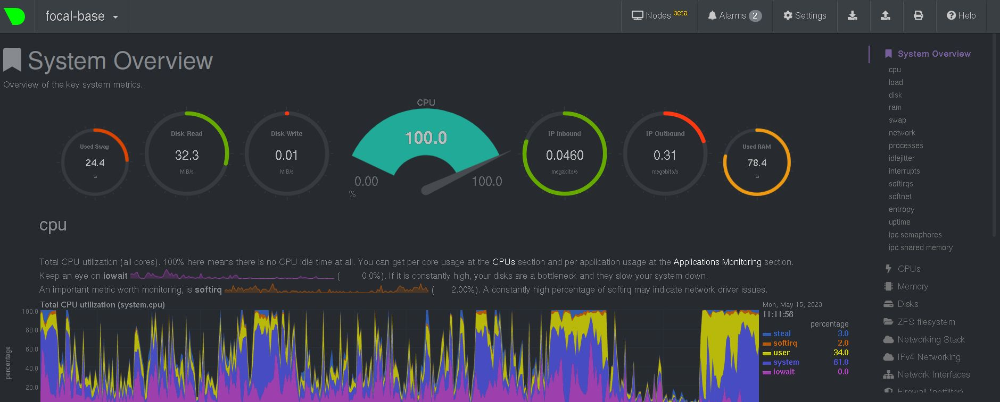

# [Домашнее задание](https://github.com/a-prokopyev-resume/sysadm-homeworks/tree/devsys10/03-sysadmin-04-os) к занятию [«Операционные системы. Лекция 2»](https://netology.ru/profile/program/sys-dev-27/lessons/242279/lesson_items/1286597)


### Цель задания

В результате выполнения задания вы:

* познакомитесь со средством сбора метрик node_exporter и средством сбора и визуализации метрик NetData. Такие инструменты позволяют выстроить систему мониторинга сервисов для своевременного выявления проблем в их работе;
* построите простой systemd unit-файл для создания долгоживущих процессов, которые стартуют вместе со стартом системы автоматически;
* проанализируете dmesg, а именно часть лога старта виртуальной машины, чтобы понять, какая полезная информация может там находиться;
* поработаете с unshare и nsenter для понимания, как создать отдельный namespace для процесса (частичная контейнеризация).

### Чеклист готовности к домашнему заданию

1. Убедитесь, что у вас установлен [Netdata](https://github.com/netdata/netdata) c ресурса с предподготовленными [пакетами](https://packagecloud.io/netdata/netdata/install) или `sudo apt install -y netdata`.


### Дополнительные материалы для выполнения задания

1. [Документация](https://www.freedesktop.org/software/systemd/man/systemd.service.html) по systemd unit-файлам.
2. [Документация](https://www.kernel.org/doc/Documentation/sysctl/) по параметрам sysctl.

------

## Задание

1. На лекции вы познакомились с node_exporter. Используя знания из лекции по systemd, создайте самостоятельно простой unit-файл для node_exporter:
    * поместите его в автозагрузку;
    * предусмотрите возможность добавления опций к запускаемому процессу через внешний файл (посмотрите, например, на `systemctl cat cron`);
    * удостоверьтесь, что с помощью systemctl процесс корректно стартует, завершается, а после перезагрузки автоматически поднимается.

Решение:
systemctl cat node-exporter.service
```
useradd node_exporter -s /sbin/nologin;
joe  /etc/systemd/system/node-exporter.service
```
Новый systemd Unit:
```
[Unit]
Description=Node Exporter

[Service]
Restart=always
User=node_exporter
EnvironmentFile=/etc/default/node-exporter
ExecStart=/usr/bin/prometheus-node-exporter $Options
ExecReload=/bin/kill -HUP $MAINPID
TimeoutStopSec=20s
SendSIGKILL=no

[Install]
WantedBy=multi-user.target
```
Запускаем новый сервис:
```
systemctl daemon-reload;
systemctl enable node-exporter
systemctl start node-exporter;
systemctl status node-exporter;
● node-exporter.service - Node Exporter
     Loaded: loaded (/etc/systemd/system/node-exporter.service; enabled; vendor preset: enabled)
     Active: active (running) since Mon 2023-05-15 04:43:58 UTC; 2s ago
   Main PID: 6624 (prometheus-node)
      Tasks: 5 (limit: 1118)
     Memory: 1.6M
     CGroup: /system.slice/node-exporter.service
             └─6624 /usr/bin/prometheus-node-exporter

May 15 04:43:58 focal-base prometheus-node-exporter[6624]: time="2023-05-15T04:43:58Z" level=info msg=" - stat" source="node_exporter.go:104"
May 15 04:43:58 focal-base prometheus-node-exporter[6624]: time="2023-05-15T04:43:58Z" level=info msg=" - systemd" source="node_exporter.go:104"
May 15 04:43:58 focal-base prometheus-node-exporter[6624]: time="2023-05-15T04:43:58Z" level=info msg=" - textfile" source="node_exporter.go:104"
May 15 04:43:58 focal-base prometheus-node-exporter[6624]: time="2023-05-15T04:43:58Z" level=info msg=" - time" source="node_exporter.go:104"
May 15 04:43:58 focal-base prometheus-node-exporter[6624]: time="2023-05-15T04:43:58Z" level=info msg=" - timex" source="node_exporter.go:104"
May 15 04:43:58 focal-base prometheus-node-exporter[6624]: time="2023-05-15T04:43:58Z" level=info msg=" - uname" source="node_exporter.go:104"
May 15 04:43:58 focal-base prometheus-node-exporter[6624]: time="2023-05-15T04:43:58Z" level=info msg=" - vmstat" source="node_exporter.go:104"
May 15 04:43:58 focal-base prometheus-node-exporter[6624]: time="2023-05-15T04:43:58Z" level=info msg=" - xfs" source="node_exporter.go:104"
May 15 04:43:58 focal-base prometheus-node-exporter[6624]: time="2023-05-15T04:43:58Z" level=info msg=" - zfs" source="node_exporter.go:104"
May 15 04:43:58 focal-base prometheus-node-exporter[6624]: time="2023-05-15T04:43:58Z" level=info msg="Listening on :9100" source="node_exporter.go:170"
root@focal-base:/etc/systemd/system# ps aux | grep node
node_ex+  6624  0.0  0.5 410676  5912 ?        Ssl  04:43   0:00 /usr/bin/prometheus-node-exporter
root      6632  0.0  0.0  11784   556 pts/4    S+   04:44   0:00 grep --color=auto node
```
Останавливаем:
```
root@focal-base:/etc/systemd/system# systemctl stop node-exporter
root@focal-base:/etc/systemd/system# systemctl status node-exporter.service
● node-exporter.service - Node Exporter
     Loaded: loaded (/etc/systemd/system/node-exporter.service; enabled; vendor preset: enabled)
     Active: inactive (dead) since Mon 2023-05-15 04:45:44 UTC; 3s ago
    Process: 6624 ExecStart=/usr/bin/prometheus-node-exporter $Options (code=killed, signal=TERM)
   Main PID: 6624 (code=killed, signal=TERM)

May 15 04:43:58 focal-base prometheus-node-exporter[6624]: time="2023-05-15T04:43:58Z" level=info msg=" - time" source="node_exporter.go:104"
May 15 04:43:58 focal-base prometheus-node-exporter[6624]: time="2023-05-15T04:43:58Z" level=info msg=" - timex" source="node_exporter.go:104"
May 15 04:43:58 focal-base prometheus-node-exporter[6624]: time="2023-05-15T04:43:58Z" level=info msg=" - uname" source="node_exporter.go:104"
May 15 04:43:58 focal-base prometheus-node-exporter[6624]: time="2023-05-15T04:43:58Z" level=info msg=" - vmstat" source="node_exporter.go:104"
May 15 04:43:58 focal-base prometheus-node-exporter[6624]: time="2023-05-15T04:43:58Z" level=info msg=" - xfs" source="node_exporter.go:104"
May 15 04:43:58 focal-base prometheus-node-exporter[6624]: time="2023-05-15T04:43:58Z" level=info msg=" - zfs" source="node_exporter.go:104"
May 15 04:43:58 focal-base prometheus-node-exporter[6624]: time="2023-05-15T04:43:58Z" level=info msg="Listening on :9100" source="node_exporter.go:170"
May 15 04:45:44 focal-base systemd[1]: Stopping Node Exporter...
May 15 04:45:44 focal-base systemd[1]: node-exporter.service: Succeeded.
May 15 04:45:44 focal-base systemd[1]: Stopped Node Exporter.
```

2. Изучите опции node_exporter и вывод `/metrics` по умолчанию. Приведите несколько опций, которые вы бы выбрали для базового мониторинга хоста по CPU, памяти, диску и сети.

Решение:

Включаем коллекторы:
```
joe /etc/default/node-exporter
head /etc/default/node-exporter -n 1
Options="--collector.cpu --collector.diskstats --collector.netstat --collector.meminfo"
```
Запускаем `curl` для получения страницы по адресу `http://127.0.0.1:9100/metrics`:    
`root@focal-base:/# curl http://127.0.0.1:9100/metrics | grep -i -E "cpu|diskstats|netstat|meminfo"`

Получаем следующий вывод: [Task2](task2.md)

3. Установите в свою виртуальную машину Netdata.
   После успешной установки:
    * в конфигурационном файле `/etc/netdata/netdata.conf` в секции [web] замените значение с localhost на `bind to = 0.0.0.0`;
    * добавьте в Vagrantfile проброс порта Netdata на свой локальный компьютер и сделайте `vagrant reload`:

Решение:
```
  config.vm.network "forwarded_port", guest: 19999, host: 19999
```
Сделал проброс порта, перезапустил сервис.
```
root@focal-base:/# joe /etc/netdata/netdata.conf
File netdata.conf saved
root@focal-base:/# cat /etc/netdata/netdata.conf | grep bind
bind socket to IP = 0.0.0.0

root@focal-base:/# systemctl restart netdata
root@focal-base:/# systemctl status netdata
● netdata.service - netdata - Real-time performance monitoring
     Loaded: loaded (/lib/systemd/system/netdata.service; enabled; vendor preset: enabled)
     Active: active (running) since Mon 2023-05-15 05:33:11 UTC; 9s ago
       Docs: man:netdata
             file:///usr/share/doc/netdata/html/index.html
             https://github.com/netdata/netdata
   Main PID: 23890 (netdata)
      Tasks: 22 (limit: 1118)
     Memory: 19.8M
     CGroup: /system.slice/netdata.service
             ├─23890 /usr/sbin/netdata -D
             ├─23921 bash /usr/lib/netdata/plugins.d/tc-qos-helper.sh 1
             ├─23928 /usr/lib/netdata/plugins.d/apps.plugin 1
             └─23933 /usr/lib/netdata/plugins.d/nfacct.plugin 1
focal-base systemd[1]: Started netdata - Real-time performance monitoring.

root@focal-base:/# netstat -anp4 | grep -i netdata
tcp        0      0 0.0.0.0:19999           0.0.0.0:*               LISTEN      23890/netdata       
tcp        0      0 127.0.0.1:8125          0.0.0.0:*               LISTEN      23890/netdata       
udp        0      0 127.0.0.1:8125          0.0.0.0:*                           23890/netdata       
```
Открыл в браузере на локальном компьютере через SSH forward на процес `redir` хоста, где уже дальше идет редирект внутрь LXC контейнера:
```
root@kube:/# netstat -anp4 | grep redir
tcp        0      0 127.0.0.1:19999         0.0.0.0:*               LISTEN      6593/redir          
tcp        0      0 127.0.0.1:19999         127.0.0.1:43348         ESTABLISHED 6593/redir          
tcp        0      0 10.0.3.1:46582          10.0.3.234:19999        ESTABLISHED 6593/redir 
```


Так выглядит потребление ресурсов при запуске, остановке и опять запуске `k0s` на хосте, где расположен LXC контейнер с netdata внутри него.
`k0s` установлен на хосте, в контейнере его нет, но при этом контейнер все равно видит часть доступных и потребляемых ресурсов всего хоста. 
Пролистал страницу с метриками netdata, очень удобно и информативно.
  
4. Можно ли по выводу `dmesg` понять, осознаёт ли ОС, что загружена не на настоящем оборудовании, а на системе виртуализации?

Ответ: можно попытаться определить по следующим подстрокам:
```
root@chimaera:~# dmesg | grep -i virt
[    0.276638] Booting paravirtualized kernel on KVM                                                                                                                                                             
[    6.804519] virtio_blk virtio1: 1/0/0 default/read/poll queues                                                                                                                                                
[    6.810832] virtio_blk virtio1: [vda] 115343360 512-byte logical blocks (59.1 GB/55.0 GiB)                                                                                                                    
[    6.820754] virtio_blk virtio2: 1/0/0 default/read/poll queues                                                                                                                                                
[    6.821803] virtio_blk virtio2: [vdb] 7929856 512-byte logical blocks (4.06 GB/3.78 GiB)                                                                                                                      
[    6.833924] virtio_blk virtio3: 1/0/0 default/read/poll queues                                                                                                                                                
[    6.834960] virtio_blk virtio3: [vdc] 41943040 512-byte logical blocks (21.5 GB/20.0 GiB)                                                                                                                     
[    6.839897] input: VirtualPS/2 VMware VMMouse as /devices/platform/i8042/serio1/input/input4
[    6.840455] input: VirtualPS/2 VMware VMMouse as /devices/platform/i8042/serio1/input/input3
```
И для определенного вида гипервизора можно указывать искомой подстрокой название модуля или гипервизора:
```
root@chimaera:~# dmesg | grep -i kvm
[    0.000000] Hypervisor detected: KVM
[    0.000000] kvm-clock: Using msrs 4b564d01 and 4b564d00
[    0.000002] kvm-clock: using sched offset of 2551850223 cycles
[    0.000006] clocksource: kvm-clock: mask: 0xffffffffffffffff max_cycles: 0x1cd42e4dffb, max_idle_ns: 881590591483 ns
[    0.276638] Booting paravirtualized kernel on KVM
[    0.281179] kvm-guest: PV spinlocks disabled, no host support
[    1.287231] clocksource: Switched to clocksource kvm-clock
root@chimaera:~# dmesg | grep -i hyper
[    0.000000] Hypervisor detected: KVM
```
Так же можно было бы попытаться догадаться по загруженным в гостевой машине модулям (типа `virtio` и т.п.) командой `lsmod`:
```
root@kube:~# lsmod | awk '{print $1}' | grep virtio                                                                                                                  
virtio_net                                                                                                                                                           
virtio_scsi 
```

5. Как настроен sysctl `fs.nr_open` на системе по умолчанию? Определите, что означает этот параметр. Какой другой существующий лимит не позволит достичь такого числа (`ulimit --help`)?

Решение: почитал:  
https://sysadminium.ru/adm-serv-linux-limit-open-files-sysctl/  
https://ru.stackoverflow.com/questions/475417/

Максимальное количество файлов, которые можно одновременно открыть в системе в целом, третья колонка:
```
cat /proc/sys/fs/file-nr
21152   0       394430
```
Менять это значение можно с помощью `sysctl` параметром `fs.file-max`.

Максимальное количество файлов, которые можно одновременно открыть в отдельно взятом процессе:
```
ulimit --help | grep open
 -n        the maximum number of open file descriptors
ulimit -n
1024                                           
```
Системное значение:
```
cat /proc/sys/fs/nr_open
1048576
```
Менять это значение можно с помощью `sysctl` параметром `fs.nr_open`.

6. Запустите любой долгоживущий процесс (не `ls`, который отработает мгновенно, а, например, `sleep 1h`) в отдельном неймспейсе процессов;
покажите, что ваш процесс работает под PID 1 через `nsenter`. 

Решение:
```
screen -m -d unshare --fork --pid --mount-proc sleep 1h # Executing sleep in a screen session, then detaching screen.
pstree -p | grep sleep ' Looking at screen and its children processes outside of the created namespace.
        |-screen(17629)---unshare(17630)---sleep(17631)
nsenter --target $(pgrep sleep) --pid --mount bash -lc 'pstree -p; ls /proc/ | grep -P "\d\d*"' ' Looking inside the namespace
sleep(1)
1
21
28
29
```

7. Найдите информацию о том, что такое `:(){ :|:& };:`. 

Решение:  
Судя по https://www.cyberciti.biz/faq/understanding-bash-fork-bomb/ , это так называемая "shell fork bomb" - разновидность DDOS атаки на *nix like систему.
По сути это не что иное как Bash функция, которую можно следующим образом разложить на ее составные части:
```bash
:(){ # Название функции ":"
 :|:& # Рекурсивный вызов функции ":" слева и справа от пайпа конвейера внутри тела самой этой функции.
};: Первоначальный вызов функции ":", - т.е. это точка запуска всей цепочки вызовов этой функции.
```
Bash при организации pipe между двумя командами, в т.ч. функциями делает fork оболочки, в которой запускает эти команды.
Фрагмент `:|:&` как раз эксплуатирует эту особенность Bash, кроме того убирая команду в целом в background предотвращает ее death. 
Правильно настроенная система не должна зависать от запуска на ней такого скрипта.
Можно, например, установить лимит на количество запущенных процессов: `ulimit -Su 50 -Hu 50`. 
Постоянные лимиты можно также настроить в файле `/etc/security/limits.conf`.
`vagrant         hard    nproc           50`
