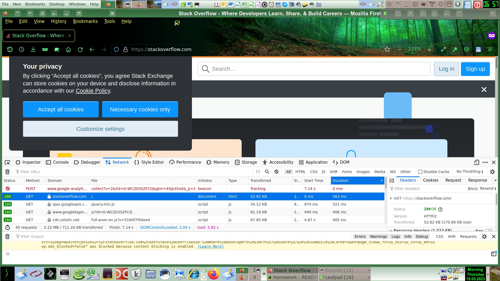
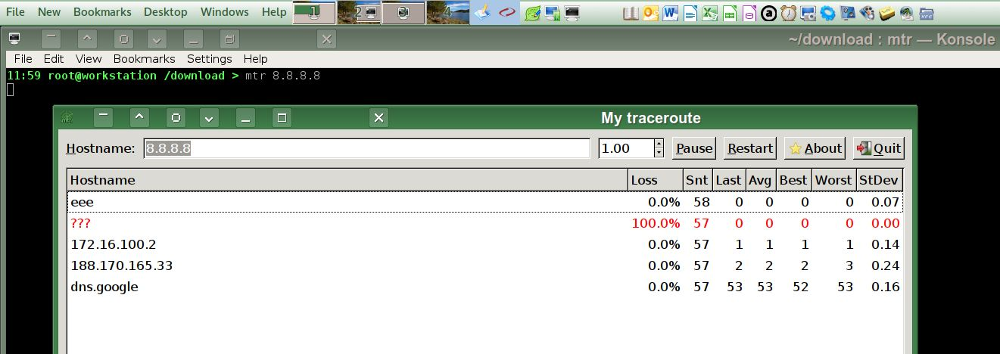

# [Домашнее задание](https://github.com/a-prokopyev-resume/sysadm-homeworks/tree/devsys10/03-sysadmin-06-net) к занятию [«Компьютерные сети. Лекция 1»](https://netology.ru/profile/program/sys-dev-27/lessons/242281/lesson_items/1286605)

### Цель задания

В результате выполнения задания вы: 

* научитесь работать с HTTP-запросами, чтобы увидеть, как клиенты взаимодействуют с серверами по этому протоколу;
* поработаете с сетевыми утилитами, чтобы разобраться, как их можно использовать для отладки сетевых запросов, соединений.

### Чеклист готовности к домашнему заданию

1. Убедитесь, что у вас установлены необходимые сетевые утилиты — dig, traceroute, mtr, telnet.
2. Используйте `apt install` для установки пакетов.

### Дополнительные материалы для выполнения задания

1. Полезным дополнением к обозначенным выше утилитам будет пакет net-tools. Установить его можно с помощью команды `apt install net-tools`.
2. RFC протокола HTTP/1.0, в частности [страница с кодами ответа](https://www.rfc-editor.org/rfc/rfc1945#page-32).
3. [Ссылки на другие RFC для HTTP](https://blog.cloudflare.com/cloudflare-view-http3-usage/).

------

## Задание и решение

Задача 1. Работа c HTTP через telnet. Подключитесь утилитой telnet к сайту stackoverflow.com.

```
06:31 root@workstation /download > telnet stackoverflow.com 80
Trying 151.101.1.69...
Connected to stackoverflow.com.
Escape character is '^]'.
GET /questions HTTP/1.0
HOST: stackoverflow.com

HTTP/1.1 403 Forbidden
```
HTTP 403 Forbidden — стандартный код ответа HTTP, означающий, что доступ к запрошенному ресурсу запрещен.
Можно предположить, что серверу не нравится софт, которым мы подключаемся.
Попробуем замаскироваться под браузер, добавив `User-Agent: Mozilla`: 
```
telnet stackoverflow.com 80
Trying 151.101.1.69...                                                                                           
Connected to stackoverflow.com.
Escape character is '^]'.
GET /questions HTTP/1.0
HOST: stackoverflow.com
User-Agent: Mozilla

HTTP/1.1 301 Moved Permanently
```
Теперь получили другой код, который предлагает нам перейти на другую страницу. Код 301 означает, что страница была перемещена на другой URL.

Задача 2. Повторите задание 1 в браузере, используя консоль разработчика F12.
 
Ответ:
Код первого ответа сервера: 200. Дольше всего загружается ответ на первый запрос, что видно на скриншоте, где ответы отсортированы по длительности:


Задача 3. Какой IP-адрес у вас в интернете?
```
ssh kube netstat -anp4 grep ssh | grep EST
Enter PIN for 'EToken_SC': 
tcp        0     72 192.155.94.xx:62454    xx.96.82.yy:40180     ESTABLISHED 10855/sshd: root@no 
tcp        0      0 192.155.94.xx:62454    xx.96.82.yy:40152     ESTABLISHED 10606/sshd: root@pt 
```

Задача 4. Какому провайдеру принадлежит ваш IP-адрес? Какой автономной системе AS? Воспользуйтесь утилитой `whois`.

Решение: 

Хороший материал для чтения: [Как по IP узнать Autonomous system](https://hackware.ru/?p=9245)
Возьмем IP адрес другого запасного провайдера: 31.135.244.15 
```
whois --host whois.radb.net 31.135.244.15 | grep -E "origin|desc" | grep -v remarks
descr:          Kurgan-telecom, LLC
origin:         AS210109
```
Видим, что это провайдер Kurgan-telecom, его AS:  AS210109

Задача 5. Через какие сети проходит пакет, отправленный с вашего компьютера на адрес 8.8.8.8? Через какие AS? Воспользуйтесь утилитой `traceroute`.

Решение:
```
traceroute --as-path-lookups -n 8.8.8.8 | awk 'NR>1 { if ($3 != "*" && $3 != "[*]" ) print $3}' | sed 's/\[//; s/\]//;'  | xargs -I X whois -h whois.radb.net X | grep -E "aut-num|as-name" 
```
Ответ:
```
aut-num:    AS63949
as-name:    LINODE
aut-num:    AS63949
as-name:    AKAMAI-LINODE-AP
aut-num:    AS63949
as-name:    LINODE
aut-num:    AS63949
as-name:    AKAMAI-LINODE-AP
aut-num:    AS15169
as-name:    Google
aut-num:    AS15169
as-name:    Google
aut-num:    AS15169
as-name:    Google
```

Задача 6. Повторите задание 5 в утилите `mtr`. На каком участке наибольшая задержка — delay?

Решение:

Наибольшая задержка на участке: dns.google, это AS15169.

Другой вариант решения:  `mtr 8.8.8.8 -znrc 1`

Задача 7. Какие DNS-сервера отвечают за доменное имя dns.google? Какие A-записи? Воспользуйтесь утилитой `dig`.

Решение:

Не совсем понятен вопрос, нужны сервера, которые сами хостят DNS записи доменного имени dns.google или нужны сервера (дальше по итеративной цепочке), на которые указывает эта запись. Поэтому я предоставлю два варианта решения.

7.1 Записи доменного имени google, которые указывают на сервера, которые хостят доменную запись dns.google:
```
root@workstation / > dig  -t NS google  | grep "IN\s*NS" | grep -v ";"
google.                 21600   IN      NS      ns-tld4.charlestonroadregistry.com.
google.                 21600   IN      NS      ns-tld2.charlestonroadregistry.com.
google.                 21600   IN      NS      ns-tld1.charlestonroadregistry.com.
google.                 21600   IN      NS      ns-tld5.charlestonroadregistry.com.
google.                 21600   IN      NS      ns-tld3.charlestonroadregistry.com.
```

7.2 Записи доменного имени dns.google, которые указывают на другие сервера:
```
root@workstation / > dig  -t NS dns.google  | grep "IN\s*NS" | grep -v ";"
dns.google.             21600   IN      NS      ns2.zdns.google.
dns.google.             21600   IN      NS      ns1.zdns.google.
dns.google.             21600   IN      NS      ns4.zdns.google.
dns.google.             21600   IN      NS      ns3.zdns.google.
root@workstation / > dig  -t A dns.google  | grep "IN\s*A" | grep -v ";"
dns.google.             302     IN      A       8.8.8.8
dns.google.             302     IN      A       8.8.4.4
```

Задача 8. Проверьте PTR записи для IP-адресов из задания 7. Какое доменное имя привязано к IP? Воспользуйтесь утилитой `dig`.

Решение:
```
root@workstation /download > for IP in $(dig  -t A dns.google  | grep "IN\s*A" | grep -v ";" | awk '{ print $5 }'); do dig -x $IP | grep "IN\s*PTR" | grep -v ";"; done
8.8.8.8.in-addr.arpa.   4001    IN      PTR     dns.google.
4.4.8.8.in-addr.arpa.   8663    IN      PTR     dns.google.
```
Ответ: dns.google.
