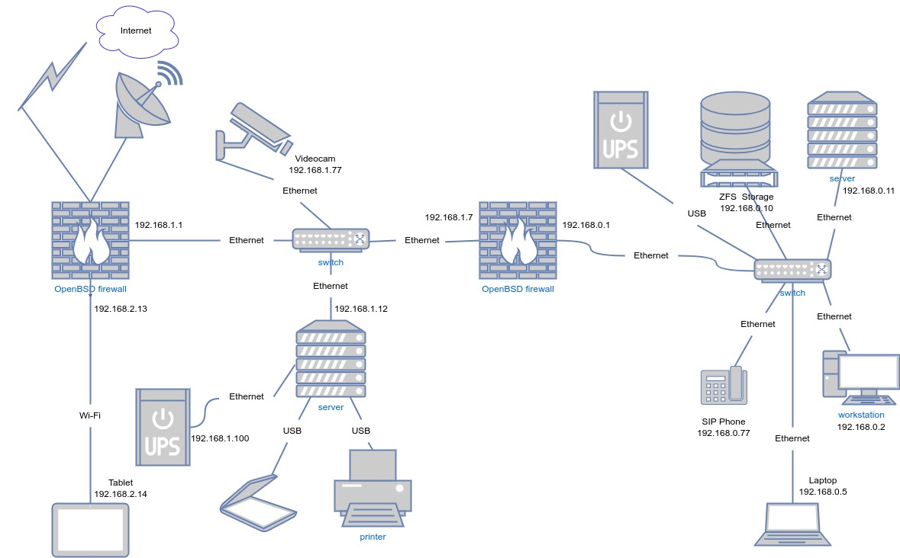

# [Домашнее задание](https://github.com/a-prokopyev-resume/sysadm-homeworks/tree/devsys10/03-sysadmin-08-net) к занятию [«Компьютерные сети. Лекция 3»](https://netology.ru/profile/program/sys-dev-27/lessons/242283/lesson_items/1286613)

### Цель задания

В результате выполнения задания вы:

* на практике познакомитесь с маршрутизацией в сетях, что позволит понять устройство больших корпоративных сетей и интернета;
* проверите TCP/UDP соединения на хосте — это обычный этап отладки сетевых проблем;
* построите сетевую диаграмму.

------

## Решения задач

1. Подключитесь к публичному маршрутизатору в интернет. Найдите маршрут к вашему публичному IP.

Возьмем адрес 72.14.191.202 в хостинге Linode.  
Решение:
```
telnet route-views.routeviews.org
Username: rviews

route-views>show ip route 72.14.191.202

Routing entry for 72.14.176.0/20
  Known via "bgp 6447", distance 20, metric 0
  Tag 6939, type external
  Last update from 64.71.137.241 2d17h ago
  Routing Descriptor Blocks:
  * 64.71.137.241, from 64.71.137.241, 2d17h ago
      Route metric is 0, traffic share count is 1
      AS Hops 2
      Route tag 6939
      MPLS label: none


route-views>show bgp 72.14.191.202

BGP routing table entry for 72.14.176.0/20, version 20216374
Paths: (20 available, best #3, table default)
  Not advertised to any peer
  Refresh Epoch 1
  8283 1299 20940 63949
    94.142.247.3 from 94.142.247.3 (94.142.247.3)
      Origin IGP, metric 0, localpref 100, valid, external
      Community: 1299:35000 8283:1 8283:101 8283:102
      unknown transitive attribute: flag 0xE0 type 0x20 length 0x24
        value 0000 205B 0000 0000 0000 0001 0000 205B
              0000 0005 0000 0001 0000 205B 0000 0005
              0000 0002 
      path 7F2BD05CF888 RPKI State valid
      rx pathid: 0, tx pathid: 0
  Refresh Epoch 1
  3267 1299 20940 63949
    194.85.40.15 from 194.85.40.15 (185.141.126.1)
      Origin IGP, metric 0, localpref 100, valid, external
      path 7F2BC0B13530 RPKI State valid
      rx pathid: 0, tx pathid: 0
  Refresh Epoch 1
  6939 63949
    64.71.137.241 from 64.71.137.241 (216.218.253.53)
      Origin IGP, localpref 100, valid, external, best
      path 7F2C6E428DC8 RPKI State valid
      rx pathid: 0, tx pathid: 0x0
  Refresh Epoch 1
  49788 1299 20940 63949
    91.218.184.60 from 91.218.184.60 (91.218.184.60)
      Origin IGP, localpref 100, valid, external
      Community: 1299:35000
      Extended Community: 0x43:100:0
      path 7F2C12F2CC60 RPKI State valid
      rx pathid: 0, tx pathid: 0
  Refresh Epoch 1
  3549 3356 20940 63949
    208.51.134.254 from 208.51.134.254 (67.16.168.191)
      Origin IGP, metric 5702, localpref 100, valid, external
      Community: 3356:3 3356:22 3356:100 3356:123 3356:575 3356:901 3356:2056 3549:2017 3549:30840 20940:50 20940:60 20940:10501 65002:63949
      path 7F2B7EF74940 RPKI State valid
      rx pathid: 0, tx pathid: 0
  Refresh Epoch 1
  3333 1257 1299 20940 63949
    193.0.0.56 from 193.0.0.56 (193.0.0.56)
      Origin IGP, localpref 100, valid, external
      Community: 1257:50 1257:51 1257:999 1257:3752 1257:4103
      path 7F2BB52D3980 RPKI State valid
      rx pathid: 0, tx pathid: 0
```

2. Создайте dummy-интерфейс в Ubuntu. Добавьте несколько статических маршрутов. Проверьте таблицу маршрутизации.

Решение:
```
root@workstation /download 3:# > lsmod | grep dummy

root@workstation /download 4:# > modprobe dummy

root@workstation /download 5:# > lsmod | grep dummy
dummy                  16384  0

root@workstation /download 8:# > ip link add type dummy

root@workstation /download 12:# > ip l
1: lo: <LOOPBACK,UP,LOWER_UP> mtu 65536 qdisc noqueue state UNKNOWN mode DEFAULT group default qlen 1000
    link/loopback 00:00:00:00:00:00 brd 00:00:00:00:00:00
2: eth2: <BROADCAST,MULTICAST,UP,LOWER_UP> mtu 1500 qdisc pfifo_fast state UP mode DEFAULT group default qlen 1000
    link/ether xx:f0:49:xx:xx:xx brd ff:ff:ff:ff:ff:ff
3: dummy0: <BROADCAST,NOARP> mtu 1500 qdisc noop state DOWN mode DEFAULT group default qlen 1000
    link/ether 0a:34:93:8b:d4:9b brd ff:ff:ff:ff:ff:ff

root@workstation /download 13:# > ip r
default via 192.168.0.x dev eth2 
192.168.0.0/24 dev eth2 proto kernel scope link src 192.168.0.2 
192.168.1.0/24 dev eth2 proto kernel scope link src 192.168.1.2 

root@workstation /download 21:# > ip addr add 192.168.1.3/24 dev dummy0
root@workstation /download 23:# > ip link set dev dummy0 up
root@workstation /download 27:# > ip a | grep dummy0 -A 3
3: dummy0: <BROADCAST,NOARP,UP,LOWER_UP> mtu 1500 qdisc noqueue state UNKNOWN group default qlen 1000
    link/ether 0a:34:93:8b:d4:9b brd ff:ff:ff:ff:ff:ff
    inet 192.168.1.3/24 scope global dummy0
       valid_lft forever preferred_lft forever

root@workstation /download 35:# > ip route add 192.168.1.123 dev dummy0 proto static
root@workstation /download 35:# > ip route add 192.168.1.234 dev dummy0 proto static

root@workstation /download 39:# > ip r | grep dummy0
192.168.1.0/24 dev dummy0 proto kernel scope link src 192.168.1.3 
192.168.1.123 dev dummy0 proto static scope link 
192.168.1.234 dev dummy0 proto static scope link 
```

3. Проверьте открытые TCP-порты в Ubuntu. Какие протоколы и приложения используют эти порты? Приведите несколько примеров.

Решение (разными способами):
```
root@focal-base:/home/vagrant# lsof -a -i4 -i6 -itcp -sTCP:LISTEN
COMMAND     PID            USER   FD   TYPE   DEVICE SIZE/OFF NODE NAME
systemd-r    80 systemd-resolve   13u  IPv4  4731794      0t0  TCP localhost:domain (LISTEN)
prometheu    93   node_exporter    3u  IPv4  4731648      0t0  TCP *:9100 (LISTEN)
container   136            root   14u  IPv4  4734651      0t0  TCP localhost:44551 (LISTEN)
sshd        148            root    3u  IPv4  4732422      0t0  TCP *:ssh (LISTEN)
netdata     151         netdata    4u  IPv4  4732945      0t0  TCP *:19999 (LISTEN)
netdata     151         netdata   35u  IPv4  4735038      0t0  TCP localhost:8125 (LISTEN)

root@focal-base:/home/vagrant# ss -tnlp
State               Recv-Q              Send-Q                             Local Address:Port                              Peer Address:Port              Process                                                
LISTEN              0                   4096                                     0.0.0.0:9100                                   0.0.0.0:*                  users:(("prometheus-node",pid=93,fd=3))               
LISTEN              0                   4096                               127.0.0.53%lo:53                                     0.0.0.0:*                  users:(("systemd-resolve",pid=80,fd=13))              
LISTEN              0                   128                                      0.0.0.0:22                                     0.0.0.0:*                  users:(("sshd",pid=148,fd=3))                         
LISTEN              0                   4096                                   127.0.0.1:8125                                   0.0.0.0:*                  users:(("netdata",pid=151,fd=35))                     
LISTEN              0                   4096                                     0.0.0.0:19999                                  0.0.0.0:*                  users:(("netdata",pid=151,fd=4))                      
LISTEN              0                   4096                                   127.0.0.1:44551                                  0.0.0.0:*                  users:(("containerd",pid=136,fd=14))      

root@focal-base:/home/vagrant# netstat -nptl46
Active Internet connections (servers and established)
Proto Recv-Q Send-Q Local Address           Foreign Address         State       PID/Program name    
tcp        0      0 127.0.0.1:44551         0.0.0.0:*               LISTEN      136/containerd      
tcp        0      0 0.0.0.0:19999           0.0.0.0:*               LISTEN      151/netdata         
tcp        0      0 0.0.0.0:22              0.0.0.0:*               LISTEN      148/sshd: /usr/sbin 
tcp        0      0 127.0.0.53:53           0.0.0.0:*               LISTEN      80/systemd-resolved 
tcp        0      0 0.0.0.0:9100            0.0.0.0:*               LISTEN      93/prometheus-node- 
tcp        0      0 127.0.0.1:8125          0.0.0.0:*               LISTEN      151/netdata         
```
Ответ: containerd 44551, netdata 19999 HTTP, sshd 22 SSH, systemd-resolved 53 DNS, prometheus-node 9100 HTTP, netdata 8125 statsd

4. Проверьте используемые UDP-сокеты в Ubuntu. Какие протоколы и приложения используют эти порты?

Решение (разными способами):
```
root@focal-base:/home/vagrant# lsof -a -i4 -i6 -iudp
COMMAND     PID            USER   FD   TYPE   DEVICE SIZE/OFF NODE NAME
systemd-r    80 systemd-resolve   12u  IPv4  4731793      0t0  UDP localhost:domain 
netdata     151         netdata   32u  IPv4  4735037      0t0  UDP localhost:8125 
systemd-n 28290 systemd-network   19u  IPv4 10522441      0t0  UDP focal-base:bootpc 

root@focal-base:/home/vagrant# ss -unlp
State               Recv-Q              Send-Q                              Local Address:Port                             Peer Address:Port              Process                                                
UNCONN              0                   0                                       127.0.0.1:8125                                  0.0.0.0:*                  users:(("netdata",pid=151,fd=32))                     
UNCONN              0                   0                                   127.0.0.53%lo:53                                    0.0.0.0:*                  users:(("systemd-resolve",pid=80,fd=12))              
UNCONN              0                   0                                 10.0.3.186%eth0:68                                    0.0.0.0:*                  users:(("systemd-network",pid=28290,fd=19))           

root@focal-base:/home/vagrant# netstat -anpu46
Active Internet connections (servers and established)
Proto Recv-Q Send-Q Local Address           Foreign Address         State       PID/Program name    
udp        0      0 127.0.0.1:8125          0.0.0.0:*                           151/netdata         
udp        0      0 127.0.0.53:53           0.0.0.0:*                           80/systemd-resolved 
udp        0      0 10.0.3.186:68           0.0.0.0:*                           28290/systemd-netwo 
```

Ответ: netdata 8125 statsd, systemd-resolved 53 DNS, systemd-networkd 68 DHCP.

5. Используя diagrams.net, создайте L3-диаграмму вашей домашней сети или любой другой сети, с которой вы работали. 

Ответ:

