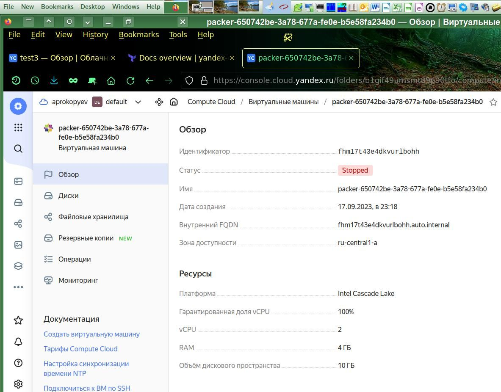
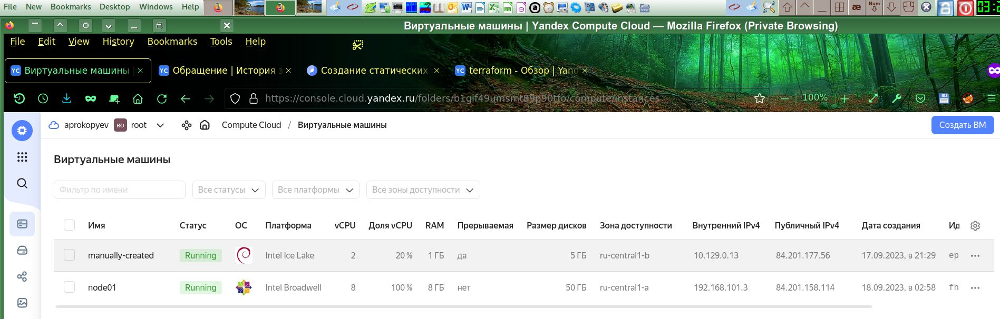
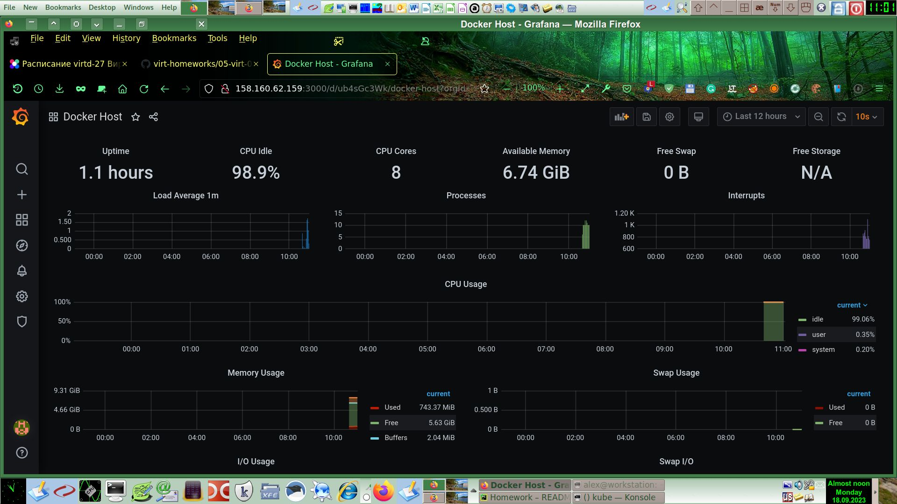

# [Домашнее задание](https://github.com/a-prokopyev-resume/virt-homeworks/tree/virt-11/05-virt-04-docker-compose) к занятию 4. [«Оркестрация группой Docker-контейнеров на примере Docker Compose»](https://netology.ru/profile/program/virtd-27/lessons/274658/lesson_items/1471808)

## Задача 1

Доустановил `Packer` в свой образ инструментального контейнера: 
```
01:09 root@workstation /utils/iac 8:# > docker ps
CONTAINER ID   IMAGE                                      COMMAND   CREATED       STATUS       PORTS     NAMES
2e97f4254d34   devopsinfra/terragrunt-ansible-packer:v2   "bash"    2 hours ago   Up 2 hours             iac_tools
```
Сделал вспомогательный скрипт `/utils/iac/packer.sh` для удобного запуска packer в контейнере.

Запустил `/utils/iac/packer.sh build centos-7-base.json`:

<details>
<summary>

```
01:30 root@workstation /mnt/X_projects/Netology/DevOps27/Homework/05-virt-04-docker-compose/src/packer 27:# /utils/iac/packer.sh build centos-7-base.json> 
yandex: output will be in this color.
==> yandex: Creating temporary RSA SSH key for instance...
==> yandex: Using as source image: fd85qh2iveusn11jcup6 (name: "centos-7-v20230911", family: "centos-7")
==> yandex: Use provided subnet id e9bu7h2367aoqgrkmu50
==> yandex: Creating disk...
==> yandex: Creating instance...
==> yandex: Waiting for instance with id fhm17t43e4dkvurlbohh to become active...
    yandex: Detected instance IP: 51.250.94.1
==> yandex: Using SSH communicator to connect: 51.250.94.1
==> yandex: Waiting for SSH to become available...
==> yandex: Connected to SSH!
==> yandex: Provisioning with shell script: /tmp/packer-shell3554535581
```

</summary>


```
    yandex: Loaded plugins: fastestmirror
    yandex: Loading mirror speeds from cached hostfile
    yandex:  * base: mirror.yandex.ru
    yandex:  * extras: mirror.docker.ru
    yandex:  * updates: mirror.docker.ru
    yandex: No packages marked for update
    yandex: Loaded plugins: fastestmirror
    yandex: Loading mirror speeds from cached hostfile
    yandex:  * base: mirror.yandex.ru
    yandex:  * extras: mirror.docker.ru
    yandex:  * updates: mirror.docker.ru
    yandex: Package iptables-1.4.21-35.el7.x86_64 already installed and latest version
    yandex: Package curl-7.29.0-59.el7_9.1.x86_64 already installed and latest version
    yandex: Package net-tools-2.0-0.25.20131004git.el7.x86_64 already installed and latest version
    yandex: Package rsync-3.1.2-12.el7_9.x86_64 already installed and latest version
    yandex: Package openssh-server-7.4p1-23.el7_9.x86_64 already installed and latest version
    yandex: Resolving Dependencies
    yandex: --> Running transaction check
    yandex: ---> Package bind-utils.x86_64 32:9.11.4-26.P2.el7_9.14 will be installed
    yandex: --> Processing Dependency: bind-libs-lite(x86-64) = 32:9.11.4-26.P2.el7_9.14 for package: 32:bind-utils-9.11.4-26.P2.el7_9.14.x86_64
    yandex: --> Processing Dependency: bind-libs(x86-64) = 32:9.11.4-26.P2.el7_9.14 for package: 32:bind-utils-9.11.4-26.P2.el7_9.14.x86_64
    yandex: --> Processing Dependency: liblwres.so.160()(64bit) for package: 32:bind-utils-9.11.4-26.P2.el7_9.14.x86_64
    yandex: --> Processing Dependency: libisccfg.so.160()(64bit) for package: 32:bind-utils-9.11.4-26.P2.el7_9.14.x86_64
    yandex: --> Processing Dependency: libisc.so.169()(64bit) for package: 32:bind-utils-9.11.4-26.P2.el7_9.14.x86_64
    yandex: --> Processing Dependency: libirs.so.160()(64bit) for package: 32:bind-utils-9.11.4-26.P2.el7_9.14.x86_64
    yandex: --> Processing Dependency: libdns.so.1102()(64bit) for package: 32:bind-utils-9.11.4-26.P2.el7_9.14.x86_64
    yandex: --> Processing Dependency: libbind9.so.160()(64bit) for package: 32:bind-utils-9.11.4-26.P2.el7_9.14.x86_64
    yandex: --> Processing Dependency: libGeoIP.so.1()(64bit) for package: 32:bind-utils-9.11.4-26.P2.el7_9.14.x86_64
    yandex: ---> Package bridge-utils.x86_64 0:1.5-9.el7 will be installed
    yandex: ---> Package tcpdump.x86_64 14:4.9.2-4.el7_7.1 will be installed
    yandex: --> Processing Dependency: libpcap >= 14:1.5.3-10 for package: 14:tcpdump-4.9.2-4.el7_7.1.x86_64
    yandex: --> Processing Dependency: libpcap.so.1()(64bit) for package: 14:tcpdump-4.9.2-4.el7_7.1.x86_64
    yandex: ---> Package telnet.x86_64 1:0.17-66.el7 will be installed
    yandex: --> Running transaction check
    yandex: ---> Package GeoIP.x86_64 0:1.5.0-14.el7 will be installed
    yandex: --> Processing Dependency: geoipupdate for package: GeoIP-1.5.0-14.el7.x86_64
    yandex: ---> Package bind-libs.x86_64 32:9.11.4-26.P2.el7_9.14 will be installed
    yandex: --> Processing Dependency: bind-license = 32:9.11.4-26.P2.el7_9.14 for package: 32:bind-libs-9.11.4-26.P2.el7_9.14.x86_64
    yandex: ---> Package bind-libs-lite.x86_64 32:9.11.4-26.P2.el7_9.14 will be installed
    yandex: ---> Package libpcap.x86_64 14:1.5.3-13.el7_9 will be installed
    yandex: --> Running transaction check
    yandex: ---> Package bind-license.noarch 32:9.11.4-26.P2.el7_9.14 will be installed
    yandex: ---> Package geoipupdate.x86_64 0:2.5.0-2.el7 will be installed
    yandex: --> Finished Dependency Resolution
    yandex:
    yandex: Dependencies Resolved
    yandex:
    yandex: ================================================================================
    yandex:  Package            Arch       Version                        Repository   Size
    yandex: ================================================================================
    yandex: Installing:
    yandex:  bind-utils         x86_64     32:9.11.4-26.P2.el7_9.14       updates     262 k
    yandex:  bridge-utils       x86_64     1.5-9.el7                      base         32 k
    yandex:  tcpdump            x86_64     14:4.9.2-4.el7_7.1             base        422 k
    yandex:  telnet             x86_64     1:0.17-66.el7                  updates      64 k
    yandex: Installing for dependencies:
    yandex:  GeoIP              x86_64     1.5.0-14.el7                   base        1.5 M
    yandex:  bind-libs          x86_64     32:9.11.4-26.P2.el7_9.14       updates     158 k
    yandex:  bind-libs-lite     x86_64     32:9.11.4-26.P2.el7_9.14       updates     1.1 M
    yandex:  bind-license       noarch     32:9.11.4-26.P2.el7_9.14       updates      92 k
    yandex:  geoipupdate        x86_64     2.5.0-2.el7                    updates      35 k
    yandex:  libpcap            x86_64     14:1.5.3-13.el7_9              updates     139 k
    yandex:
    yandex: Transaction Summary
    yandex: ================================================================================
    yandex: Install  4 Packages (+6 Dependent packages)
    yandex:
    yandex: Total download size: 3.8 M
    yandex: Installed size: 9.0 M
    yandex: Downloading packages:
    yandex: --------------------------------------------------------------------------------
    yandex: Total                                              7.2 MB/s | 3.8 MB  00:00
    yandex: Running transaction check
    yandex: Running transaction test
    yandex: Transaction test succeeded
    yandex: Running transaction
    yandex:   Installing : 32:bind-license-9.11.4-26.P2.el7_9.14.noarch                1/10
    yandex:   Installing : geoipupdate-2.5.0-2.el7.x86_64                              2/10
    yandex:   Installing : GeoIP-1.5.0-14.el7.x86_64                                   3/10
    yandex:   Installing : 32:bind-libs-lite-9.11.4-26.P2.el7_9.14.x86_64              4/10
    yandex:   Installing : 32:bind-libs-9.11.4-26.P2.el7_9.14.x86_64                   5/10
    yandex:   Installing : 14:libpcap-1.5.3-13.el7_9.x86_64                            6/10
    yandex: pam_tally2: Error opening /var/log/tallylog for update: Permission denied
    yandex: pam_tally2: Authentication error
    yandex: useradd: failed to reset the tallylog entry of user "tcpdump"
    yandex:   Installing : 14:tcpdump-4.9.2-4.el7_7.1.x86_64                           7/10
    yandex:   Installing : 32:bind-utils-9.11.4-26.P2.el7_9.14.x86_64                  8/10
    yandex:   Installing : bridge-utils-1.5-9.el7.x86_64                               9/10
    yandex:   Installing : 1:telnet-0.17-66.el7.x86_64                                10/10
    yandex:   Verifying  : 32:bind-libs-lite-9.11.4-26.P2.el7_9.14.x86_64              1/10
    yandex:   Verifying  : GeoIP-1.5.0-14.el7.x86_64                                   2/10
    yandex:   Verifying  : 32:bind-utils-9.11.4-26.P2.el7_9.14.x86_64                  3/10
    yandex:   Verifying  : 32:bind-license-9.11.4-26.P2.el7_9.14.noarch                4/10
    yandex:   Verifying  : 14:libpcap-1.5.3-13.el7_9.x86_64                            5/10
    yandex:   Verifying  : geoipupdate-2.5.0-2.el7.x86_64                              6/10
    yandex:   Verifying  : 1:telnet-0.17-66.el7.x86_64                                 7/10
    yandex:   Verifying  : 14:tcpdump-4.9.2-4.el7_7.1.x86_64                           8/10
    yandex:   Verifying  : bridge-utils-1.5-9.el7.x86_64                               9/10
    yandex:   Verifying  : 32:bind-libs-9.11.4-26.P2.el7_9.14.x86_64                  10/10
    yandex:
    yandex: Installed:
    yandex:   bind-utils.x86_64 32:9.11.4-26.P2.el7_9.14   bridge-utils.x86_64 0:1.5-9.el7
    yandex:   tcpdump.x86_64 14:4.9.2-4.el7_7.1            telnet.x86_64 1:0.17-66.el7
    yandex:
    yandex: Dependency Installed:
    yandex:   GeoIP.x86_64 0:1.5.0-14.el7
    yandex:   bind-libs.x86_64 32:9.11.4-26.P2.el7_9.14
    yandex:   bind-libs-lite.x86_64 32:9.11.4-26.P2.el7_9.14
    yandex:   bind-license.noarch 32:9.11.4-26.P2.el7_9.14
    yandex:   geoipupdate.x86_64 0:2.5.0-2.el7
    yandex:   libpcap.x86_64 14:1.5.3-13.el7_9
    yandex:
    yandex: Complete!
==> yandex: Stopping instance...
==> yandex: Deleting instance...
    yandex: Instance has been deleted!
==> yandex: Creating image: centos-7-base
==> yandex: Waiting for image to complete...
==> yandex: Success image create...
==> yandex: Destroying boot disk...
    yandex: Disk has been deleted!
Build 'yandex' finished after 2 minutes 56 seconds.

==> Wait completed after 2 minutes 56 seconds
```
</details>

Скриншот виртуалки, запущенной `packer`:



Полезные линки по теме:
* [Инструкция по packer для Yandex Cloud](https://cloud.yandex.ru/docs/tutorials/infrastructure-management/packer-quickstart)
* [Установка Packer](https://developer.hashicorp.com/packer/tutorials/docker-get-started/get-started-install-cli#precompiled-binaries)
* [Использование блоков и переменных Packer](https://devops.stackexchange.com/questions/4312/is-there-an-idiomatic-way-to-create-reusable-packer-templates)

## Задача 2

Пока не удалось установить yandex plugin в локальный Terraform, расположенный в РФ, почему-то не работает даже через зарубежный proxychains.
Возможно это проблема с контейнером Ubuntu, поэтому потом попробую пересобрать инструментальный контейнер полностью самостоятельно из базового контейнера Debian, что при контейнеризации без учета init системы эквивалентно уже проверенному Devuan.
Пока воспользовался зарубежной виртуалкой Linode с дистрибутивом Devuan Chimaera, где установлен Terraform:  
`02:54 root@kube /download/test_tf 13:# > terraform apply`

Команда отработала нормально: 

<details>
<summary>

```
Terraform used the selected providers to generate the following execution plan. Resource actions are indicated with the following symbols:
  + create

Terraform will perform the following actions:

  # yandex_compute_instance.node01 will be created
  + resource "yandex_compute_instance" "node01" {
      + allow_stopping_for_update = true
      + created_at                = (known after apply)
      + folder_id                 = (known after apply)
      + fqdn                      = (known after apply)
      + gpu_cluster_id            = (known after apply)
      + hostname                  = "node01.netology.cloud"
      + id                        = (known after apply)
      + metadata                  = {
          + "ssh-keys" = <<-EOT
                centos:ssh-rsa AAAAB3NzaC1yc2EAAAADAQABAAABgQCwpzhI2BIyOEDrr5e/nNFfDuMHF0JtN35TFyjP8Mn/UO0gsKthKJJ9C8Y1gP5k3+bcSy2kTarQ9w6DJE4a/erge+h/5S3vGOlahZb07ebnUq9W+CQzpMNQ7k72UzocVmylg1UDt77SeQoAiBUdINIof7HR//uDv9dyZP/DB27amlV0oQ/dXUM+eVcXw9n+CQ8Cug2bv3XaH8NJSzTSejNly1ZYAR+yzrh06h70z4hoAFoNIxMVs7Cg2YolEfpP7EthTSv5FVLiHBMOUyEgIxhQGAj5yRNk7u9th1J7soN0Ks3Tv0vUV8mpDx+pnKClanxaSkgtJyaOsMLMA6LQNnBj2/U9wBbYRCchpYLKMC8WAbHnJFOMZNRx855pK1HA3jNRrDRtT4YCgGrR2uzDNy7Q0bOqmEQy0TIMMP5MZmHzBaFm1HJu+UPUdM4x4MMnmQA+yz+9IEqnTdBf+d5G4y2bn9zmn6d8w6/FIT+w2TuRQFD12ZqVaI3Cp+EuWq3sgC0= root@kube
            EOT
        }
      + name                      = "node01"
      + network_acceleration_type = "standard"
      + platform_id               = "standard-v1"
      + service_account_id        = (known after apply)
      + status                    = (known after apply)
      + zone                      = "ru-central1-a"
```

</summary>

```
      + boot_disk {
          + auto_delete = true
          + device_name = (known after apply)
          + disk_id     = (known after apply)
          + mode        = (known after apply)

          + initialize_params {
              + block_size  = (known after apply)
              + description = (known after apply)
              + image_id    = "fd8git2cbmtvppi0m9kl"
              + name        = "root-node01"
              + size        = 50
              + snapshot_id = (known after apply)
              + type        = "network-nvme"
            }
        }

      + network_interface {
          + index              = (known after apply)
          + ip_address         = (known after apply)
          + ipv4               = true
          + ipv6               = (known after apply)
          + ipv6_address       = (known after apply)
          + mac_address        = (known after apply)
          + nat                = true
          + nat_ip_address     = (known after apply)
          + nat_ip_version     = (known after apply)
          + security_group_ids = (known after apply)
          + subnet_id          = (known after apply)
        }

      + resources {
          + core_fraction = 100
          + cores         = 8
          + memory        = 8
        }
    }

  # yandex_vpc_network.default will be created
  + resource "yandex_vpc_network" "default" {
      + created_at                = (known after apply)
      + default_security_group_id = (known after apply)
      + folder_id                 = (known after apply)
      + id                        = (known after apply)
      + labels                    = (known after apply)
      + name                      = "net"
      + subnet_ids                = (known after apply)
    }

  # yandex_vpc_subnet.default will be created
  + resource "yandex_vpc_subnet" "default" {
      + created_at     = (known after apply)
      + folder_id      = (known after apply)
      + id             = (known after apply)
      + labels         = (known after apply)
      + name           = "subnet"
      + network_id     = (known after apply)
      + v4_cidr_blocks = [
          + "192.168.101.0/24",
        ]
      + v6_cidr_blocks = (known after apply)
      + zone           = "ru-central1-a"
    }

Plan: 3 to add, 0 to change, 0 to destroy.

Changes to Outputs:
  + external_ip_address_node01_yandex_cloud = (known after apply)
  + internal_ip_address_node01_yandex_cloud = (known after apply)

Do you want to perform these actions?
  Terraform will perform the actions described above.
  Only 'yes' will be accepted to approve.

  Enter a value: yes

yandex_vpc_network.default: Creating...
yandex_vpc_network.default: Creation complete after 8s [id=enp3sskovk57m3mh7es5]
yandex_vpc_subnet.default: Creating...
yandex_vpc_subnet.default: Creation complete after 4s [id=e9b2i7d940fc10c52ele]
yandex_compute_instance.node01: Creating...
yandex_compute_instance.node01: Still creating... [10s elapsed]
yandex_compute_instance.node01: Still creating... [20s elapsed]
yandex_compute_instance.node01: Still creating... [30s elapsed]
yandex_compute_instance.node01: Still creating... [40s elapsed]
yandex_compute_instance.node01: Still creating... [50s elapsed]
yandex_compute_instance.node01: Still creating... [1m0s elapsed]
yandex_compute_instance.node01: Creation complete after 1m7s [id=fhm3q139qk8tq30v6t1f]

Apply complete! Resources: 3 added, 0 changed, 0 destroyed.

Outputs:

external_ip_address_node01_yandex_cloud = "158.160.62.159"
internal_ip_address_node01_yandex_cloud = "192.168.101.3"
```

</details>

На скриншоте видно две виртуальные машины, одна создана вручную, другая через Terraform:


## Задача 3

Указываем в inventory IP адрес сервера, полученный в решении предыдущей задачи и запускаем play:
```
10:34 root@kube /download/test_ansible 33:# > ansible-playbook provision.yml 

PLAY [nodes] ****************************************************************************************************************************************************************************************************

TASK [Gathering Facts] ******************************************************************************************************************************************************************************************
ok: [node01.netology.cloud]

TASK [Create directory for ssh-keys] ****************************************************************************************************************************************************************************
ok: [node01.netology.cloud]

TASK [Adding rsa-key in /root/.ssh/authorized_keys] *************************************************************************************************************************************************************
changed: [node01.netology.cloud]

TASK [Checking DNS] *********************************************************************************************************************************************************************************************
changed: [node01.netology.cloud]

TASK [Installing tools] *****************************************************************************************************************************************************************************************
changed: [node01.netology.cloud] => (item=['git', 'curl'])

TASK [Add docker repository] ************************************************************************************************************************************************************************************
changed: [node01.netology.cloud]

TASK [Installing docker package] ********************************************************************************************************************************************************************************
changed: [node01.netology.cloud] => (item=['docker-ce', 'docker-ce-cli', 'containerd.io'])
                                                                                                                                                                                                                 
TASK [Enable docker daemon] *************************************************************************************************************************************************************************************
changed: [node01.netology.cloud]                                                                                                                                                                               
                                                                                                                                                                                                                 
TASK [Install docker-compose] ***********************************************************************************************************************************************************************************
changed: [node01.netology.cloud]                                                                                                                                                                                 
                                                                                                                                                                                                                 
TASK [Synchronization] ******************************************************************************************************************************************************************************************
changed: [node01.netology.cloud]                                                                                                                                                                                 
                                                                                                                                                                                                                 
TASK [Pull all images in compose] *******************************************************************************************************************************************************************************
changed: [node01.netology.cloud]                                                                                                                                                                                 
                                                                                                                                                                                                                 
TASK [Up all services in compose] *******************************************************************************************************************************************************************************
changed: [node01.netology.cloud]                                                                                                                                                                                 
                                                                                                                                                                                                                 
PLAY RECAP ******************************************************************************************************************************************************************************************************
node01.netology.cloud      : ok=12   changed=10   unreachable=0    failed=0    skipped=0    rescued=0    ignored=0          
```
Проверяем развернутый стек:
```
10:38 root@kube /download/test_ansible 34:# > ssh centos@158.160.62.159
Last login: Mon Sep 18 05:38:12 2023 from xxx.members.linode.com                                                                                                                                           
[centos@node01 ~]$ sudo su
[root@node01 centos]# docker ps
CONTAINER ID   IMAGE                              COMMAND                  CREATED         STATUS                   PORTS                                                                              NAMES
a03aededb371   grafana/grafana:7.4.2              "/run.sh"                7 minutes ago   Up 7 minutes             3000/tcp                                                                           grafana
9f7d2bc04e93   stefanprodan/caddy                 "/sbin/tini -- caddy…"   7 minutes ago   Up 7 minutes             0.0.0.0:3000->3000/tcp, 0.0.0.0:9090-9091->9090-9091/tcp, 0.0.0.0:9093->9093/tcp   caddy
2c25cb8e84ff   gcr.io/cadvisor/cadvisor:v0.47.0   "/usr/bin/cadvisor -…"   7 minutes ago   Up 7 minutes (healthy)   8080/tcp                                                                           cadvisor
1b8714b6b9f5   prom/prometheus:v2.17.1            "/bin/prometheus --c…"   7 minutes ago   Up 7 minutes             9090/tcp                                                                           prometheus
c4fd9e6e3869   prom/alertmanager:v0.20.0          "/bin/alertmanager -…"   7 minutes ago   Up 7 minutes             9093/tcp                                                                           alertmanager
b3bfeaf2373e   prom/node-exporter:v0.18.1         "/bin/node_exporter …"   7 minutes ago   Up 7 minutes             9100/tcp                                                                           nodeexporter
8ac259174e5c   prom/pushgateway:v1.2.0            "/bin/pushgateway"       7 minutes ago   Up 7 minutes             9091/tcp                                                                           pushgateway
```

## Задача 4

Скриншот GUI Grafana:


## Задача 5 (*)

Было бы правильнее все автоматизировать, включая добавление полученного в Terraform IP адреса в inventory Ansible и добавление нового узла в Grafana.
Пока отложил эту необязательную задачу на потом.

PS: Очень понравился Yandex cloud своими тарифами при малой нагрузке на VPS, особенно прерываемые (что подходит для экспериментов) и при полном отключении (когда не взымается плата за CPU и RAM, в Linode такого к сожалению нет), получается в разы дешевле Linode.
Однако при полной нагрузке по калькулятору самого Yandex Cloud все же Linode получается примерно в 1.5 раза дешевле, просто они всегда выставляют счет за максимальную нагрузку без учета актуальной нагрузки.