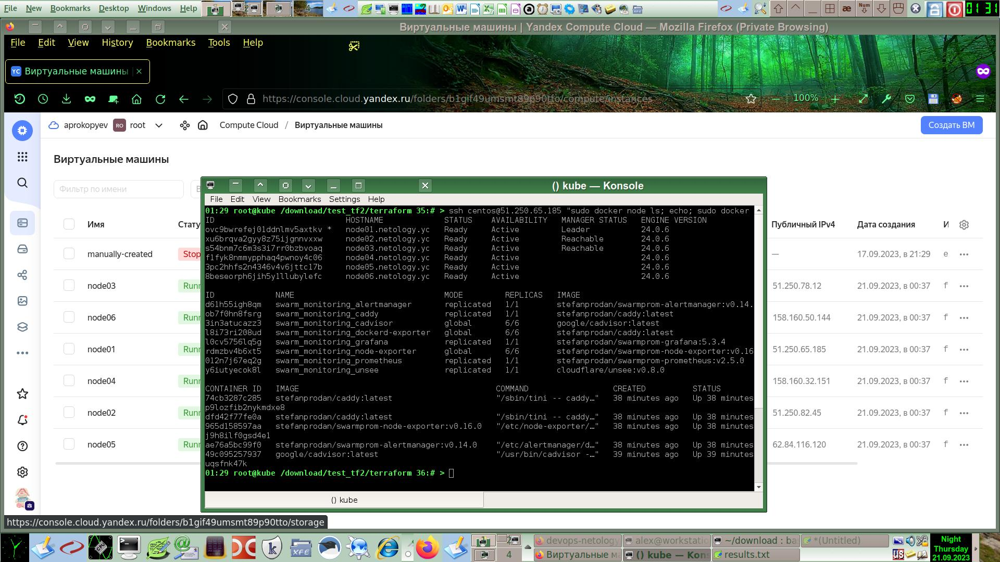

# [Домашнее задание](https://github.com/a-prokopyev-resume/virt-homeworks/tree/virt-11/05-virt-05-docker-swarm) к занятию 5. [«Оркестрация кластером Docker контейнеров на примере Docker Swarm»](https://netology.ru/profile/program/virtd-27/lessons/274659/lesson_items/1471815)

---

## Задача 1

Полезные линки в целом по теме Docker Swarm:
* [Описание на Хабре](https://habr.com/ru/companies/redmadrobot/articles/318866/)
* [Docker Swarm: знакомство](https://rebrainme.com/blog/docker/docker-swarm-znakomstvo/)
* [Docker Swarm для самых маленьких](https://habr.com/ru/articles/659813/)

- Gloval vs Replication
  - Судя по [описанию](https://stackoverflow.com/questions/60904020/docker-swarm-difference-between-replicated-and-global-services),
в `global` режиме создается ровно по одной реплике сервиса на каждом узле кластера, удовлетворяющему условиям constraints, если они заданы.
`Global` режим удобен для деплоя сервисных для каждого узла контейнеров типа антивирусов и т.п.
  - А в режиме `replication` сервисы создаются только в указанном количестве и распределяются по свободным узлам. 
Причем на один узел могут попасть даже несколько реплик одного и того же сервиса, что может быть плохо для обеспечения HA в случае сбоя узла.
В то же время на некоторых других узлах может и вовсе не оказаться реплики. 

- [Docker Swarm использует алгоритм Raft](https://raft.github.io/) для  выбора лидера кластера.

Особенности алгоритма Raft:
  - Предназначен для обеспечения согласованности управляющих узлов кластера (обеспечение консенсуса и взаимопонимания таких узлов)
  - Такая согласованность гарантирует лидер, который выбирается автоматически алгоритмом Raft среди управляющих узлов. Лидер отправляет keepalive-пакеты и если пакеты не пришли, остальные управляющие узлы начинают выборы нового лидера.
  - Для отказоустойчивой работы количество управляющих узлов обязательно должно быть нечётным, не менее трех.
  - Если в кластере произошло разделение, нечётное количество узлов гарантирует, что кластер останется консистентным за счет выбора правильного лидера большинством узлов. 

Полезные линки по теме алгоритма Raft:
* [Повышаем живучесть Raft в реальных условиях](https://habr.com/ru/companies/vk/articles/713634/)
* [Наглядная онлайн демонстрация работы Raft](http://thesecretlivesofdata.com/raft/)

- Overlay Network
```
Overlay-сеть создает подсеть, которую могут использовать контейнеры в разных хостах swarm-кластера. 
Контейнеры на разных физических хостах могут обмениваться данными по overlay-сети (если все они прикреплены к одной сети).
Overlay-сеть использует технологию vxlan, которая инкапсулирует layer 2 фреймы в layer 4 пакеты (UDP/IP). 
При помощи этого действия Docker создает виртуальные сети поверх существующих связей между хостами, 
которые могут оказаться внутри одной подсети. Любые точки, которые являются частью этой виртуальной сети, 
выглядят друг для друга так, будто они связаны поверх свича и не заботятся об устройстве основной физической сети.
```
Обобщенно можно сказать, что Docker Overlay Network - это VPN сеть на основе vxlan для связи узлов Docker между собой.
Такая сеть позволяет направить трафик на определённый контейнер на определённом узле по имени этого контейнера.

Полезные линки по сетям Docker:
* [Как Docker использует iptables и интерфейсы Linux](https://habr.com/ru/articles/333874/)
* [Связь между контейнерами в Docker Swarm и Overlay-сети](https://habr.com/ru/articles/334004/)


## Задача 2
Осмотрел предложенные скрипты для IaC, они походят на https://github.com/stefanprodan/swarmprom 

Создал Docker Swarm-кластер в Яндекс Облаке:
```
null_resource.monitoring (local-exec): PLAY RECAP *********************************************************************
null_resource.monitoring (local-exec): node01.netology.yc         : ok=3    changed=1    unreachable=0    failed=0    skipped=0    rescued=0    ignored=0
null_resource.monitoring (local-exec): node02.netology.yc         : ok=2    changed=0    unreachable=0    failed=0    skipped=1    rescued=0    ignored=0
null_resource.monitoring (local-exec): node03.netology.yc         : ok=2    changed=0    unreachable=0    failed=0    skipped=1    rescued=0    ignored=0

null_resource.monitoring: Creation complete after 43s [id=3619288549564896370]

Apply complete! Resources: 13 added, 0 changed, 0 destroyed.

Outputs:

external_ip_address_node01 = "51.250.65.185"
external_ip_address_node02 = "51.250.82.45"
external_ip_address_node03 = "51.250.78.12"
external_ip_address_node04 = "158.160.32.151"
external_ip_address_node05 = "62.84.116.120"
external_ip_address_node06 = "158.160.50.144"
internal_ip_address_node01 = "192.168.101.11"
internal_ip_address_node02 = "192.168.101.12"
internal_ip_address_node03 = "192.168.101.13"
internal_ip_address_node04 = "192.168.101.14"
internal_ip_address_node05 = "192.168.101.15"
internal_ip_address_node06 = "192.168.101.16"
```

## Задача 3

Осматриваю созданный кластер: `ssh centos@51.250.65.185 "sudo docker node ls; echo; sudo docker service ls; echo;  sudo docker ps"`
```
ID                            HOSTNAME             STATUS    AVAILABILITY   MANAGER STATUS   ENGINE VERSION
ovc9bwrefej01ddnlmv5axtkv *   node01.netology.yc   Ready     Active         Leader           24.0.6
xu6brqva2gyy8z75ijgnnvxxw     node02.netology.yc   Ready     Active         Reachable        24.0.6
s54bnm7c6m3s3i7rr0bzbvoaq     node03.netology.yc   Ready     Active         Reachable        24.0.6
f1fyk8nmmypphaq4pwnoy4c06     node04.netology.yc   Ready     Active                          24.0.6
3pc2hhfs2n4346v4v6jttc17b     node05.netology.yc   Ready     Active                          24.0.6
8beseorph6jih5y1llubylefc     node06.netology.yc   Ready     Active                          24.0.6

ID             NAME                                MODE         REPLICAS   IMAGE                                          PORTS
d61h55igh8qm   swarm_monitoring_alertmanager       replicated   1/1        stefanprodan/swarmprom-alertmanager:v0.14.0    
ob7f0hn8fsrg   swarm_monitoring_caddy              replicated   1/1        stefanprodan/caddy:latest                      *:3000->3000/tcp, *:9090->9090/tcp, *:9093-9094->9093-9094/tcp
3in3atucazz3   swarm_monitoring_cadvisor           global       6/6        google/cadvisor:latest                         
l8i73ri208ud   swarm_monitoring_dockerd-exporter   global       6/6        stefanprodan/caddy:latest                      
l0cv5756lq5g   swarm_monitoring_grafana            replicated   1/1        stefanprodan/swarmprom-grafana:5.3.4           
rdmzbv4b6xt5   swarm_monitoring_node-exporter      global       6/6        stefanprodan/swarmprom-node-exporter:v0.16.0   
012n7j67eq2g   swarm_monitoring_prometheus         replicated   1/1        stefanprodan/swarmprom-prometheus:v2.5.0       
y6iutyecok8l   swarm_monitoring_unsee              replicated   1/1        cloudflare/unsee:v0.8.0     

CONTAINER ID   IMAGE                                          COMMAND                  CREATED          STATUS                    PORTS      NAMES
74cb3287c285   stefanprodan/caddy:latest                      "/sbin/tini -- caddy…"   18 minutes ago   Up 18 minutes                        swarm_monitoring_dockerd-exporter.ovc9bwrefej01ddnlmv5axtkv.hr6q0amop9lozfib2nykmdxe8
dfd42f77fe0a   stefanprodan/caddy:latest                      "/sbin/tini -- caddy…"   18 minutes ago   Up 18 minutes (healthy)              swarm_monitoring_caddy.1.4a4t41m5fneksjrtsbltfxedo
965d158597aa   stefanprodan/swarmprom-node-exporter:v0.16.0   "/etc/node-exporter/…"   18 minutes ago   Up 18 minutes             9100/tcp   swarm_monitoring_node-exporter.ovc9bwrefej01ddnlmv5axtkv.wr66iqcpxmyj9h8ilf0gsd4e1
ae76a5bc99f0   stefanprodan/swarmprom-alertmanager:v0.14.0    "/etc/alertmanager/d…"   18 minutes ago   Up 18 minutes             9093/tcp   swarm_monitoring_alertmanager.1.kqdruvzvh8txpw5zhim5wj1xi
49c095257937   google/cadvisor:latest                         "/usr/bin/cadvisor -…"   18 minutes ago   Up 18 minutes             8080/tcp   swarm_monitoring_cadvisor.ovc9bwrefej01ddnlmv5axtkv.hw2viigsxy08e7sbuqsfnk47k
```



Памятка по командам Docker Swarm:
```
  config      Manage Swarm configs
  node        Manage Swarm nodes
  secret      Manage Swarm secrets
  service     Manage Swarm services
  stack       Manage Swarm stacks
  swarm       Manage Swarm
```

## Задача 4 (*)
Команда `docker swarm update --autolock=true` включает блокировку важных данных (ключи шифрования и т.п.) для доступа к 
управлению роем. При разблокировке запрашивает пароль, который ранее был выдан рассматриваемой выше командой.   
Более подробное описание по [линку](https://runebook.dev/ru/docs/docker/engine/swarm/swarm_manager_locking/index).

Удаляю созданные ранее в этой работе облачные ресурсы:
```
yandex_compute_instance.node02: Destruction complete after 43s
yandex_compute_instance.node01: Destruction complete after 43s
yandex_compute_instance.node03: Destruction complete after 43s
yandex_compute_instance.node05: Destruction complete after 45s
yandex_compute_instance.node06: Still destroying... [id=fhmdk0ffh046fl67lank, 50s elapsed]
yandex_compute_instance.node06: Destruction complete after 51s
yandex_vpc_subnet.default: Destroying... [id=e9bneu6aud3lbra3ihre]
yandex_vpc_subnet.default: Destruction complete after 4s
yandex_vpc_network.default: Destroying... [id=enpprgb7n24u6c16mcjo]
yandex_vpc_network.default: Destruction complete after 1s

Destroy complete! Resources: 13 destroyed.
```

PS: IMHO задание было бы еще интереснее, если бы для создания узлов использовались циклы. 
А количество создаваемых узлов, а так же объем RAM и дисков каждого узла указывались бы в переменных, 
чтобы можно было экспериментировать с меньшими затратами и на большем количестве узлов. 
Еще было бы интересно познакомиться с применением Terragrunt и Teraformer для реверсинга в HCL описания уже существующих ранее облачных ресурсов.  