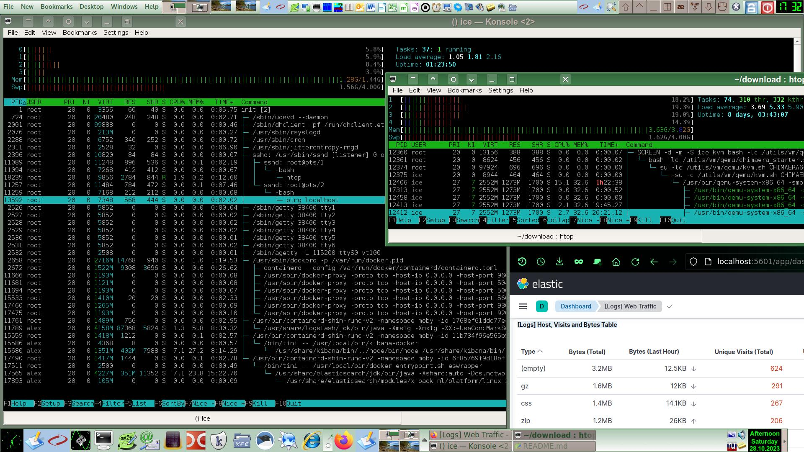
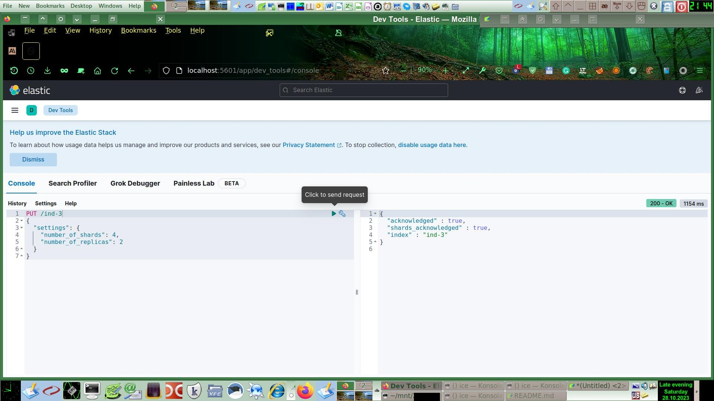

# [Домашнее задание](https://github.com/a-prokopyev-resume/virt-homeworks/tree/virt-11/06-db-05-elasticsearch) к [занятию 5. «Elasticsearch»](https://netology.ru/profile/program/bd-dev-27/lessons/275715/lesson_items/1477618)

Описания примеров развёртывания ELK с помощью docker-compose, в т.ч. как однонодовые, так и варианты в SWARM кластере:
* [Как попробовать ELK-стек за один вечер](https://habr.com/ru/articles/671344/)
* [Используем Elasticsearch вместе со Spring Boot](https://habr.com/ru/articles/766674/)
* [Getting started with the Elastic Stack and Docker Compose: Part 1](https://www.elastic.co/blog/getting-started-with-the-elastic-stack-and-docker-compose)
* [Getting started with the Elastic Stack and Docker Compose: Part 2](https://www.elastic.co/blog/getting-started-with-the-elastic-stack-and-docker-compose-part-2)
* [Deploy Elasticsearch 8.8.0 in Docker Swarm, Behind Caddy v2.6.4](https://tuneit.me/docker/deploy-elasticsearch-8-8-0-in-docker-swarm-behind-caddy-v2-6-4/)
* [Deploy an ELK stack as Docker services to a Docker Swarm on AWS- Part 1](https://amlanscloud.com/elk_stack_1/)

Для того, чтобы обучение было более полным и наглядным, я установил все три сервиса стека ELK: Elasticsearch, Logstash и Kibana. Для этого я добавил соответствующие сервисы в манифест docker-compose.yml, взятый из предыдущих работ этого модуля.
Причём, развёртывал я это на относительно слабой виртуальной машине с объёмом RAM всего 1.5GB, запущенной на рабочей станции с 4GB RAM, включая и память виртуалки. :) ELK стартанул с потреблением примерно 1.5GB RAM на почти пустой виртуалке, где было изначально занято всего 75Mb памяти по сути только под сервис Docker, ядро Linux и самый минимум сервисов типа SSH. После загрузки демо данных в Elasticsearch потребление RAM выросло в 2 раза до 3GB, при этом половина ELK была перемещена в SWAP, что можно увидеть на скриншоте: .
Любопытно, что LA оказался терпимым (всего на 1-2 единицы выше предельной нормы для четырёх ядер и то, скорее всего, из-за тяжелого браузера с плагинами) даже на таком относительно слабом оборудовании с процессором Core2 Quad + 4GB RAM (Devuan Linux + ZFS + Trinity DE + KVM виртуалка):

К сожалению, на проверку работы ELK в SWARM кластере пока нет времени, поэтому использую однонодовый конфиг, чтобы успеть до закрытия учебного модуля. Лучше бы конечно попробовать развернуть кластер SWARM в Yandex Cloud аналогично тому, как в одной из прошлых работ был пример с Terraform + Ansible + Docker SWARM + Prometheus + Grafana.

## Задача 1

Соответствие путей на хосте, в конфиге ES и внутри контейнера решается с помощью настроек docker-compose volumes следующим образом (это фрагментарно выбранные строки, влияющие на решение данной задачи):
```
configs:
  es:
    file: ./configs/elasticsearch/config.yml
sservices
  elasticsearch:
    image: aprokopyev/devops-netology-06-db-05-elasticsearch:v1
    build:
      context: ./build
    configs:
      - source: es
        target: /usr/share/elasticsearch/config/elasticsearch.yml
    volumes:
       - ./dbms_data/elasticsearch:/var/lib/elasticsearch
       - ./dbms_logs/elasticsearch:/var/log/elasticsearch
       - ./dbms_backup/elasticsearch:/usr/share/elasticsearch/snapshots
    networks:
      default:
        aliases:
          - netology_test
```
Образ контейнера: https://hub.docker.com/r/aprokopyev/devops-netology-06-db-05-elasticsearch

## Задача 2

Проверяем работоспособность DNS алиаса `netology_test` контейнера `elasticsearch`:
```
13:35 root@chimaera /download/netology 87:# > /utils/docker/shell.sh dbms-kibana-1

[kibana@0345af34ff89 ~]$ ping elasticsearch
PING elasticsearch (172.22.0.2) 56(84) bytes of data.
64 bytes from dbms-elasticsearch-1.dbms_default (172.22.0.2): icmp_seq=1 ttl=64 time=0.927 ms
^C
--- elasticsearch ping statistics ---
1 packets transmitted, 1 received, 0% packet loss, time 0ms
rtt min/avg/max/mdev = 0.927/0.927/0.927/0.000 ms

[kibana@0345af34ff89 ~]$ ping netology_test
PING netology_test (172.22.0.2) 56(84) bytes of data.
64 bytes from dbms-elasticsearch-1.dbms_default (172.22.0.2): icmp_seq=1 ttl=64 time=0.170 ms
64 bytes from dbms-elasticsearch-1.dbms_default (172.22.0.2): icmp_seq=2 ttl=64 time=0.094 ms
^C
--- netology_test ping statistics ---
2 packets transmitted, 2 received, 0% packet loss, time 1002ms
rtt min/avg/max/mdev = 0.094/0.132/0.170/0.038 ms

```
Видим, что узел сервиса `elasticsearch` доступен также и по имени `netology_test` (как и требовалось в задании) за счёт указания алиаса в манифесте docker-compose.

Проверяю состояние экземпляра СУБД Elasticsearch:
```
[kibana@0345af34ff89 ~]$ curl --request GET -sL      --url 'http://netology_test:9200/'      -H "Content-Type: application/json"      -H "Accept: application/json"
{
  "name" : "netology_test",
  "cluster_name" : "elk",
  "cluster_uuid" : "wYY4XPHTSjylAhy00CRBPg",
  "version" : {
    "number" : "7.16.1",
    "build_flavor" : "default",
    "build_type" : "docker",
    "build_hash" : "5b38441b16b1ebb16a27c107a4c3865776e20c53",
    "build_date" : "2021-12-11T00:29:38.865893768Z",
    "build_snapshot" : false,
    "lucene_version" : "8.10.1",
    "minimum_wire_compatibility_version" : "6.8.0",
    "minimum_index_compatibility_version" : "6.0.0-beta1"
  },
  "tagline" : "You Know, for Search"
}
```

Смотрю список индексов:
```
[kibana@0345af34ff89 ~]$ curl --request GET -sL      --url 'http://netology_test:9200/_cat/indices'      -H "Content-Type: application/json"
green open .geoip_databases                rKimIoysQmKPJfk2k55QZA 1 0 40   0 37.8mb 37.8mb
green open .apm-custom-link                UnXoGgJURouRgDpIDs6Cow 1 0  0   0   226b   226b
green open .kibana_7.16.1_001              Pn6Bg1kYSUS2iFmc1lHh6Q 1 0 12   0  2.3mb  2.3mb
green open .kibana_task_manager_7.16.1_001 dPVlS01GQa6QXUNpGotu9g 1 0 15 187   88kb   88kb
green open .apm-agent-configuration        zDu3rw5-T5Cl1Re3KOVTcw 1 0  0   0   226b   226b
```

Создаю три индекса из консоли Kibana:



Проверяю список индексов:
```
[kibana@0345af34ff89 ~]$ curl --request GET -sL      --url 'http://netology_test:9200/_cat/indices'      -H "Content-Type: application/json"
green  open .geoip_databases                rKimIoysQmKPJfk2k55QZA 1 0 40   0  37.8mb  37.8mb
green  open .apm-custom-link                UnXoGgJURouRgDpIDs6Cow 1 0  0   0    226b    226b
green  open .kibana_7.16.1_001              Pn6Bg1kYSUS2iFmc1lHh6Q 1 0 24  11   2.9mb   2.9mb
green  open .apm-agent-configuration        zDu3rw5-T5Cl1Re3KOVTcw 1 0  0   0    226b    226b
green  open .kibana_task_manager_7.16.1_001 dPVlS01GQa6QXUNpGotu9g 1 0 15 878 542.8kb 542.8kb
green  open ind-1                           ByOQKb6gQauAAprqNL3EoA 1 0  0   0    226b    226b
yellow open ind-3                           pNbeh0CmQeSFt0zWjnma0Q 4 2  0   0    904b    904b
yellow open ind-2                           H40SmD4iTwyhEPLDOwbX4g 2 1  0   0    452b    452b
```
Видим только что созданные индексы. Жёлтыми стали те индексы, для которых недостаточно других хостов для размещения их реплик.

Удаляю только что созданные индексы следующими командами в Dev консоли Kibana: 
```
DELETE /ind-1
DELETE /ind-2
DELETE /ind-3
```

Проверяю список оставшихся индексов:
```
[kibana@0345af34ff89 ~]$ curl --request GET -sL      --url 'http://netology_test:9200/_cat/indices'      -H "Content-Type: application/json"
green open .geoip_databases                rKimIoysQmKPJfk2k55QZA 1 0 40    0  37.8mb  37.8mb
green open .apm-custom-link                UnXoGgJURouRgDpIDs6Cow 1 0  0    0    226b    226b
green open .kibana_7.16.1_001              Pn6Bg1kYSUS2iFmc1lHh6Q 1 0 26   15   2.9mb   2.9mb
green open .apm-agent-configuration        zDu3rw5-T5Cl1Re3KOVTcw 1 0  0    0    226b    226b
green open .kibana_task_manager_7.16.1_001 dPVlS01GQa6QXUNpGotu9g 1 0 15 1157 559.4kb 559.4kb
```

## Задача 3

Создаю репозиторий для бэкапов Elasticsearch:
```
PUT _snapshot/netology_backup
{
  "type": "fs",
  "settings": {
    "location": "/usr/share/elasticsearch/snapshots"
  }
}
```
Ответ Elasticsearch:
```
{
  "acknowledged" : true
}
```

Создаю тестовый индекс:
```
PUT /test
{
  "settings": {
    "index": {
      "number_of_shards": 1,  
      "number_of_replicas": 0 
    }
  }
}
```
Ответ Elasticsearch:
```
{
  "acknowledged" : true,
  "shards_acknowledged" : true,
  "index" : "test"
}
```

Проверяю список индексов:
```
GET _cat/indices
```
Ответ Elasticsearch:
```
green  open .geoip_databases                rKimIoysQmKPJfk2k55QZA 1 0 40   0  37.8mb  37.8mb
green  open test                            6NEgBBNUQqqLXRy-EEWSPQ 1 0  0   0    226b    226b
green  open .apm-custom-link                UnXoGgJURouRgDpIDs6Cow 1 0  0   0    226b    226b
green  open .kibana_7.16.1_001              Pn6Bg1kYSUS2iFmc1lHh6Q 1 0 28   8   2.3mb   2.3mb
green  open .apm-agent-configuration        zDu3rw5-T5Cl1Re3KOVTcw 1 0  0   0    226b    226b
green  open .kibana_task_manager_7.16.1_001 dPVlS01GQa6QXUNpGotu9g 1 0 15 160 322.3kb 322.3kb
```
Даю команду бэкапа:
```
PUT /_snapshot/netology_backup/backup1?wait_for_completion=true
{
  "indices": "test",
  "ignore_unavailable": "true",
  "include_global_state": false
}
```
Ответ Elasticsearch:
```
{
  "snapshot" : {
    "snapshot" : "backup1",
    "uuid" : "Uw72Sz15QNWm3z7mPtZuTQ",
    "repository" : "netology_backup",
    "version_id" : 7160199,
    "version" : "7.16.1",
    "indices" : [
      "test"
    ],
    "data_streams" : [ ],
    "include_global_state" : false,
    "state" : "SUCCESS",
    "start_time" : "2023-10-28T17:28:18.622Z",
    "start_time_in_millis" : 1698514098622,
    "end_time" : "2023-10-28T17:28:18.822Z",
    "end_time_in_millis" : 1698514098822,
    "duration_in_millis" : 200,
    "failures" : [ ],
    "shards" : {
      "total" : 1,
      "failed" : 0,
      "successful" : 1
    },
    "feature_states" : [ ]
  }
}
```

Смотрю список созданных снэпшотов:
```
GET _snapshot/netology_backup/_all
```
Ответ Elasticsearch:
```
{
  "snapshots" : [
    {
      "snapshot" : "backup1",
      "uuid" : "Uw72Sz15QNWm3z7mPtZuTQ",
      "repository" : "netology_backup",
      "version_id" : 7160199,
      "version" : "7.16.1",
      "indices" : [
        "test"
      ],
      "data_streams" : [ ],
      "include_global_state" : false,
      "state" : "SUCCESS",
      "start_time" : "2023-10-28T17:28:18.622Z",
      "start_time_in_millis" : 1698514098622,
      "end_time" : "2023-10-28T17:28:18.822Z",
      "end_time_in_millis" : 1698514098822,
      "duration_in_millis" : 200,
      "failures" : [ ],
      "shards" : {
        "total" : 1,
        "failed" : 0,
        "successful" : 1
      },
      "feature_states" : [ ]
    }
  ],
  "total" : 1,
  "remaining" : 0
}

```

Проверяю в соответствующем каталоге хоста:
```
root@chimaera /download/netology 135:# > ls  dbms_backup/elasticsearch/
index-6  index.latest  indices  meta-Uw72Sz15QNWm3z7mPtZuTQ.dat  snap-Uw72Sz15QNWm3z7mPtZuTQ.dat
```

Удаляю первый тестовый индекс:
```
DELETE test
```
Ответ Elasticsearch:
```
{
  "acknowledged" : true
}
```

Создаю второй тестовый индекс:
```
PUT /test-2
{
  "settings": {
    "index": {
      "number_of_shards": 1,  
      "number_of_replicas": 0 
    }
  }
}
```
Ответ Elasticsearch:
```
{
  "acknowledged" : true,
  "shards_acknowledged" : true,
  "index" : "test-2"
}
```

Смотрю список индексов:
```
GET _cat/indices
```
Ответ Elasticsearch:
```
green open test-2                          OPuZkYzsQ3OdlOixQxmYuw 1 0  0   0   226b   226b
green open .geoip_databases                rKimIoysQmKPJfk2k55QZA 1 0 40   0 37.8mb 37.8mb
green open .apm-custom-link                UnXoGgJURouRgDpIDs6Cow 1 0  0   0   226b   226b
green open .kibana_7.16.1_001              Pn6Bg1kYSUS2iFmc1lHh6Q 1 0 36  20  4.7mb  4.7mb
green open .apm-agent-configuration        zDu3rw5-T5Cl1Re3KOVTcw 1 0  0   0   226b   226b
green open .kibana_task_manager_7.16.1_001 dPVlS01GQa6QXUNpGotu9g 1 0 15 843  305kb  305kb
```

Восстанавливаю снэпшот:
```
POST /_snapshot/netology_backup/backup1/_restore?wait_for_completion=true
```
Ответ Elasticsearch:
```
{
  "snapshot" : {
    "snapshot" : "backup1",
    "indices" : [
      "test"
    ],
    "shards" : {
      "total" : 1,
      "failed" : 0,
      "successful" : 1
    }
  }
}
```
Восстановление прошло успешно, судя по сообщению от СУБД. Опять проверяю список индексов:
```
GET _cat/indices
```
Ответ Elasticsearch:
```
green  open .geoip_databases                rKimIoysQmKPJfk2k55QZA 1 0 40    0  37.8mb  37.8mb
green  open test-2                          OPuZkYzsQ3OdlOixQxmYuw 1 0  0    0    226b    226b
green  open test                            P2BHq1jURhq-H3IGClw5ig 1 0  0    0    226b    226b
green  open .apm-custom-link                UnXoGgJURouRgDpIDs6Cow 1 0  0    0    226b    226b
green  open .kibana_7.16.1_001              Pn6Bg1kYSUS2iFmc1lHh6Q 1 0 38    2   4.7mb   4.7mb
green  open .kibana_task_manager_7.16.1_001 dPVlS01GQa6QXUNpGotu9g 1 0 15 1373 401.3kb 401.3kb
green  open .apm-agent-configuration        zDu3rw5-T5Cl1Re3KOVTcw 1 0  0    0    226b    226b
```
Удалённый ранее индекс test успешно восстановлен.
