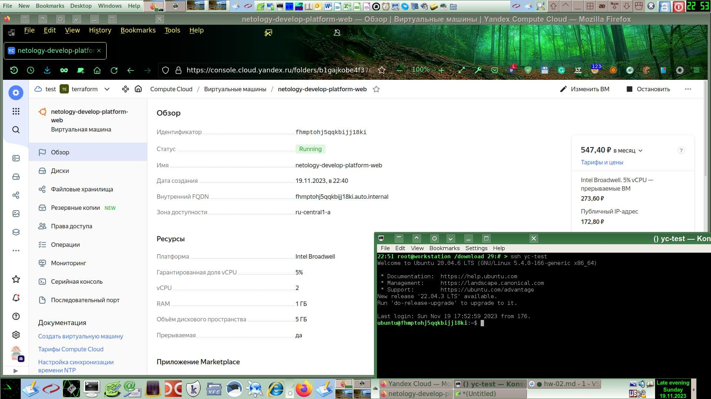

# Домашнее задание к занятию «Основы Terraform. Yandex Cloud»

### Задание 0

1. Создал группу безопасности:
```
Идентификатор
    enpspvfng545keph5pf8
Имя
    MySG
Статус
    Active
```

### Задание 1

1. Изучил все файлы проекта.
2. Заполнил значения файла personal.auto.tfvars.
3. Записал открытую часть ssh-ключа в переменную `vms_ssh_root_key`.
4. Сделал следующие исправления:
```
platform_id = "standard-v1"
cores         = 2
```
Изначально было указано неверное значение platform_id, я поменял его на "standard-v1".
Виртуалки такого типа не поддерживают количество ядер меньше двух, поэтому пришлось заменить одно ядра на два.

1. Параметры `preemptible = true` и `core_fraction=5` в параметрах ВМ позволяют сэкономить расход средств за счёт меньшей нагрузки на процессор и возможность отключения виртуалки.



### Задание 2

Изменения в `main.tf`:
```
data "yandex_compute_image" "ubuntu" {
  family = var.vm_web_image_family
}

resource "yandex_compute_instance" "platform" {
  name        = var.vm_web_name
  platform_id = var.vm_web_platform_id
  resources {
    cores         = var.vm_web_cores
    memory        = var.vm_web_memory
    core_fraction = var.vm_web_core_fraction
  }
  boot_disk {
    initialize_params {
      image_id = data.yandex_compute_image.ubuntu.image_id
    }
  }
  scheduling_policy {
    preemptible = var.vm_web_preemptible
  }
  network_interface {
    subnet_id = yandex_vpc_subnet.develop.id
    nat       = var.vm_web_nat
  }

  metadata = {
    serial-port-enable = var.vm_web_serial_port_enable
    ssh-keys           = "${var.vm_web_ssh_user}:${var.vms_ssh_root_key}"
  }

```
Дополнительные строки в `variables.tf`:
```
variable "vm_web_image_family" {
  type        = string
  default     = "ubuntu-2004-lts"
  description = "YC Image"
}

variable "vm_web_name" {
  type        = string
  default     = "netology-develop-platform-web"
  description = "VM Name"
}

variable "vm_web_platform_id" {
  type        = string
  default     = "standard-v1"
  description = "Type of VM virtual hardware"
}

variable "vm_web_cores" {
  type        = number
  default     = 2
  description = "Amount of CPU cores for the VM"
}

variable "vm_web_memory" {
  type        = number
  default     = 1
  description = "RAM capacity"
}

variable "vm_web_core_fraction" {
  type        = number
  default     = 5
  description = "Percent of CPU load allowed"
}

variable "vm_web_preemptible" {
  type        = bool
  default     = true
  description = "Is it interruptable type of VM?"
}

variable "vm_web_nat" {
  type        = bool
  default     = true
  description = "Shall provision NAT?"
}

variable "vm_web_serial_port_enable" {
  type        = number
  default     = 1
  description = "Shall enable serial console for the VM?"
}

variable "vm_web_ssh_user" {
  type        = string
  default     = "ubuntu"
  description = "User part of metadata for SSH public key"
}
```
Результат применения:
```
root@workstation:/mnt/xxx/Homework/07-terraform-new/02/src# terraform plan
data.yandex_compute_image.ubuntu: Reading...
yandex_vpc_network.develop: Refreshing state... [id=enpthhbpjmfd3a5filb0]
data.yandex_compute_image.ubuntu: Read complete after 1s [id=fd853sqaosrb2anl1uve]
yandex_vpc_subnet.develop: Refreshing state... [id=e9bd96sh91vrr4rglqd2]
yandex_compute_instance.platform: Refreshing state... [id=fhmptohj5qqkbijj18ki]

No changes. Your infrastructure matches the configuration.

Terraform has compared your real infrastructure against your configuration and found no differences, so no changes are needed.
```


### Задание 3

Новый файл (показан частично, только новые переменные для DB) `vms_platform.tf`:
```shell
02:09 root@workstation /mnt/xxx/Homework/07-terraform-new/02/src 11:# > cat vms_platform.tf
#New variables
variable "vm_db_image_family" {
  type        = string
  default     = "ubuntu-2004-lts"
  description = "YC Image"
}

variable "vm_db_name" {
  type        = string
  default     = "netology-develop-platform-db"
  description = "VM Name"
}

variable "vm_db_platform_id" {
  type        = string
  default     = "standard-v1"
  description = "Type of VM virtual hardware"
}

variable "vm_db_cores" {
  type        = number
  default     = 2
  description = "Amount of CPU cores for the VM"
}

variable "vm_db_memory" {
  type        = number
  default     = 2
  description = "RAM capacity"
}

variable "vm_db_core_fraction" {
  type        = number
  default     = 20
  description = "Percent of CPU load allowed"
}

variable "vm_db_preemptible" {
  type        = bool
  default     = true
  description = "Is it interruptable type of VM?"
}

variable "vm_db_nat" {
  type        = bool
  default     = true
  description = "Shall provision NAT?"
}

variable "vm_db_serial_port_enable" {
  type        = number
  default     = 1
  description = "Shall enable serial console for the VM?"
}

variable "vm_db_ssh_user" {
  type        = string
  default     = "ubuntu"
  description = "User part of metadata for SSH public key"
}
```

Дополнения в файле `main.tf`:
```shell
resource "yandex_compute_instance" "platform_db" {
  name        = var.vm_db_name
  platform_id = var.vm_db_platform_id
  resources {
    cores         = var.vm_db_cores
    memory        = var.vm_db_memory
    core_fraction = var.vm_db_core_fraction
  }
  boot_disk {
    initialize_params {
      image_id = data.yandex_compute_image.ubuntu.image_id
    }
  }
  scheduling_policy {
    preemptible = var.vm_db_preemptible
  }
  network_interface {
    subnet_id = yandex_vpc_subnet.develop.id
    nat       = var.vm_db_nat
  }

  metadata = {
    serial-port-enable = var.vm_web_serial_port_enable
    ssh-keys           = "${var.vms_ssh_user}:${var.vms_ssh_key}"
  }
```
Результат применения:
```shell
root@workstation:/mnt/xxx/Homework/07-terraform-new/02/src# terraform apply
data.yandex_compute_image.ubuntu: Reading...
yandex_vpc_network.develop: Refreshing state... [id=enpthhbpjmfd3a5filb0]
data.yandex_compute_image.ubuntu: Read complete after 2s [id=fd853sqaosrb2anl1uve]
yandex_vpc_subnet.develop: Refreshing state... [id=e9bd96sh91vrr4rglqd2]
yandex_compute_instance.platform: Refreshing state... [id=fhmptohj5qqkbijj18ki]

Terraform used the selected providers to generate the following execution plan. Resource actions are indicated with the following symbols:
  + create

Terraform will perform the following actions:

  # yandex_compute_instance.platform_db will be created
  + resource "yandex_compute_instance" "platform_db" {
      + created_at                = (known after apply)
      + folder_id                 = (known after apply)
      + fqdn                      = (known after apply)
      + gpu_cluster_id            = (known after apply)
      + hostname                  = (known after apply)
      + id                        = (known after apply)
      + metadata                  = {
          + "serial-port-enable" = "1"
          + "ssh-keys"           = "ubuntu:ssh-rsa AAAAB3NzaC1yc2EAAAADAQABAAABAQDBYAbng9Yef+LiKnjdi/9kSNhN2Nwvtrqf85GwWNVvgNoZbASh4BL5UEUBCZ61BDR7pPGjg+uNrzdCqjzU23ZKL7BIsmt2kALpaUM8d33UOS5URaVCrM7JHNKGHWxBK4ADbKC4A9FzuYGzu6VOp8muaXE44P99WMu3gqrTvNLcvtO7kk3/gbrHHliFV934A1XmVF6wsatb3KNez1F4bii6PviuFvDZj8x2Y5PBVuwJZzg5ZnTGQN6b8xhhLQLI/C4FWpq7Vqjj093YHmtYuN3VpNP4wOG1BXff6MWFskXNn+Ro3FIcO8ziB1NwHJRcYbOE6fhIz6BtxH/a7kqE9Vwb root@workstation"
        }
      + name                      = "netology-develop-platform-db"
      + network_acceleration_type = "standard"
      + platform_id               = "standard-v1"
      + service_account_id        = (known after apply)
      + status                    = (known after apply)
      + zone                      = (known after apply)

      + boot_disk {
          + auto_delete = true
          + device_name = (known after apply)
          + disk_id     = (known after apply)
          + mode        = (known after apply)

          + initialize_params {
              + block_size  = (known after apply)
              + description = (known after apply)
              + image_id    = "fd853sqaosrb2anl1uve"
              + name        = (known after apply)
              + size        = (known after apply)
              + snapshot_id = (known after apply)
              + type        = "network-hdd"
            }
        }

      + network_interface {
          + index              = (known after apply)
          + ip_address         = (known after apply)
          + ipv4               = true
          + ipv6               = (known after apply)
          + ipv6_address       = (known after apply)
          + mac_address        = (known after apply)
          + nat                = true
          + nat_ip_address     = (known after apply)
          + nat_ip_version     = (known after apply)
          + security_group_ids = (known after apply)
          + subnet_id          = "e9bd96sh91vrr4rglqd2"
        }

      + resources {
          + core_fraction = 20
          + cores         = 2
          + memory        = 2
        }

      + scheduling_policy {
          + preemptible = true
        }
    }

Plan: 1 to add, 0 to change, 0 to destroy.

Do you want to perform these actions?
  Terraform will perform the actions described above.
  Only 'yes' will be accepted to approve.

  Enter a value: yes

yandex_compute_instance.platform_db: Creating...
yandex_compute_instance.platform_db: Still creating... [10s elapsed]
yandex_compute_instance.platform_db: Still creating... [20s elapsed]
yandex_compute_instance.platform_db: Still creating... [30s elapsed]
yandex_compute_instance.platform_db: Creation complete after 31s [id=fhmie72t6cjtsnu8n6fm]

Apply complete! Resources: 1 added, 0 changed, 0 destroyed.
root@workstation:/mnt/xxx/Homework/07-terraform-new/02/src# yc compute  instance list --format text
+----------------------+-------------------------------+---------------+---------+---------------+-------------+
|          ID          |             NAME              |    ZONE ID    | STATUS  |  EXTERNAL IP  | INTERNAL IP |
+----------------------+-------------------------------+---------------+---------+---------------+-------------+
| fhmie72t6cjtsnu8n6fm | netology-develop-platform-db  | ru-central1-a | RUNNING | 84.201.128.27 | 10.0.1.29   |
| fhmptohj5qqkbijj18ki | netology-develop-platform-web | ru-central1-a | RUNNING | 158.160.96.76 | 10.0.1.9    |
+----------------------+-------------------------------+---------------+---------+---------------+-------------+
```


### Задание 4
```shell
root@workstation:/mnt/xxx/Homework/07-terraform-new/02/src# terraform apply 
data.yandex_compute_image.ubuntu: Reading...
yandex_vpc_network.develop: Refreshing state... [id=enpthhbpjmfd3a5filb0]
data.yandex_compute_image.ubuntu: Read complete after 0s [id=fd853sqaosrb2anl1uve]
yandex_vpc_subnet.develop: Refreshing state... [id=e9bd96sh91vrr4rglqd2]
yandex_compute_instance.platform: Refreshing state... [id=fhmptohj5qqkbijj18ki]
yandex_compute_instance.platform_db: Refreshing state... [id=fhmie72t6cjtsnu8n6fm]

Changes to Outputs:
  + db  = "84.201.128.27"
  + web = "158.160.96.76"

You can apply this plan to save these new output values to the Terraform state, without changing any real infrastructure.

Do you want to perform these actions?
  Terraform will perform the actions described above.
  Only 'yes' will be accepted to approve.

  Enter a value: yes 


Apply complete! Resources: 0 added, 0 changed, 0 destroyed.

Outputs:

db = "84.201.128.27"
web = "158.160.96.76"
```

### Задание 5
Создал файл `locals.tf`:
```
locals {
  project = "netology-develop-platform"
  env_web = "web"
  env_db  = "db"
  vm_web_name = "${local.project}-${local.env_web}"
  vm_db_name = "${local.project}-${local.env_db}"
}
```
Обновил соответствующие строки в файле `main.tf`

### Задание 6
Поместил определение ресурсов в общий блок:
```
variable "vms_resources" {
  description = "Common resource parameters"
  type        = map(map(number))
  default     = {
    vm_web_resources = {
      cores         = 2
      memory        = 1
      core_fraction = 5
    }
    vm_db_resources = {
      cores         = 2
      memory        = 2
      core_fraction = 20
    }
  }
}

variable "generic_metadata" {
  description = "Generic metadata"
  type        = map(string)
  default     = {
    serial-port-enable = "1"
    ssh-keys          = "ubuntu:ssh-rsa AAAAB3NzaC1yc2EAAAADAQABAAABAQDBYAbng9Yef+LiKnjdi/9kSNhN2Nwvtrqf85GwWNVvgNoZbASh4BL5UEUBCZ61BDR7pPGjg+uNrzdCqjzU23ZKL7BIsmt2kALpaUM8d33UOS5URaVCrM7JHNKGHWxBK4ADbKC4A9FzuYGzu6VOp8muaXE44P99WMu3gqrTvNLcvtO7kk3/gbrHHliFV934A1XmVF6wsatb3KNez1F4bii6PviuFvDZj8x2Y5PBVuwJZzg5ZnTGQN6b8xhhLQLI/C4FWpq7Vqjj093YHmtYuN3VpNP4wOG1BXff6MWFskXNn+Ro3FIcO8ziB1NwHJRcYbOE6fhIz6BtxH/a7kqE9Vwb root@workstation"
  }
}
```

Неиспользуемые переменные закомментировал.

### Задание 7*

Изучите содержимое файла console.tf. Откройте terraform console, выполните следующие задания: 

```shell
root@workstation:/mnt/xxx/Homework/07-terraform-new/02/src# terraform console

> local.test_list[1]
"staging"

> length(local.test_list)
3

> local.test_map["admin"]
"John"

> "${local.test_map.admin} is admin for ${local.test_list[2]} server based on OS ${local.servers.production.image} with ${local.servers.production.cpu} vcpu, ${local.servers.production.ram} ram and ${length(local.servers.production.disks)} virtual disks."
"John is admin for production server based on OS ubuntu-20-04 with 10 vcpu, 40 ram and 4 virtual disks."


"John is admin for production server based on OS ubuntu-20-04 with 10 vcpu, 40 ram, and vda, vdb, vdc, vdd virtual disks."
```
