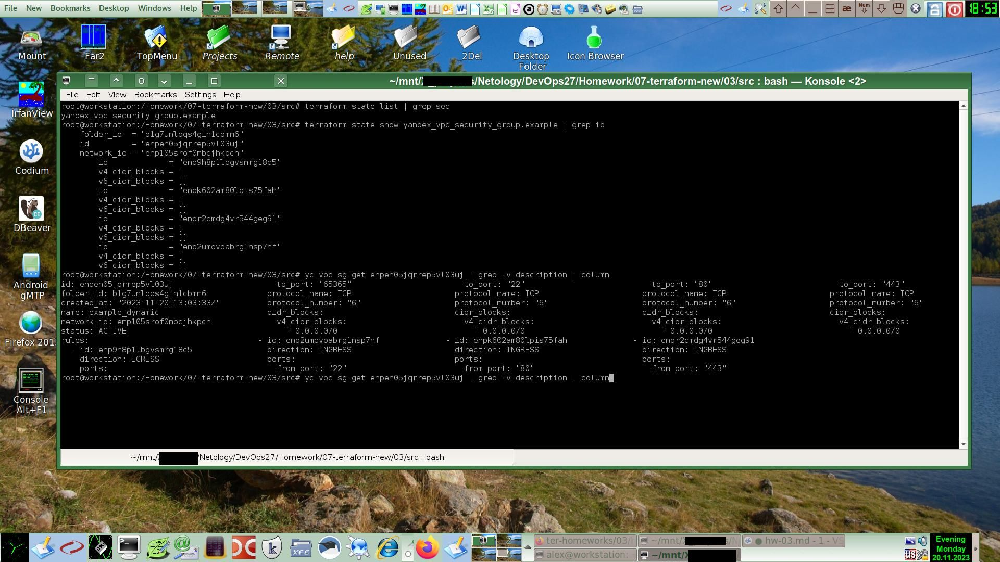
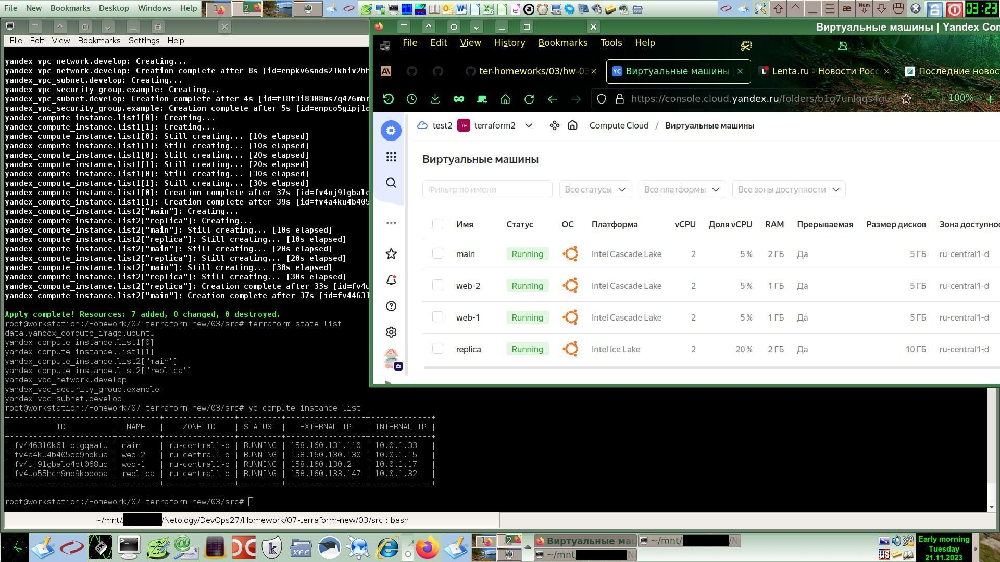
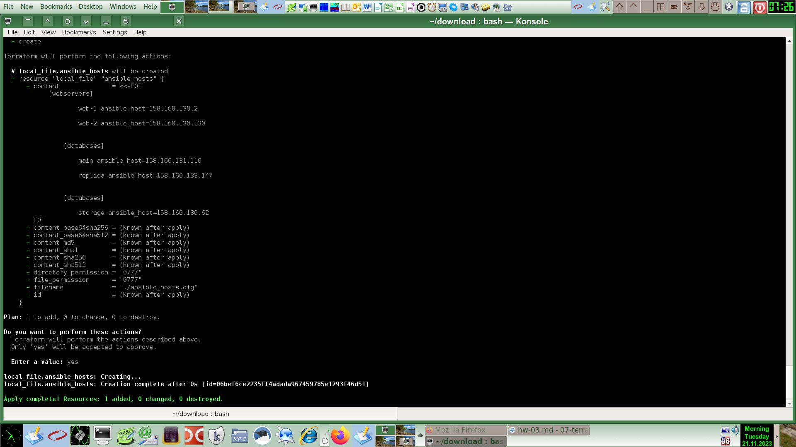

# Домашнее задание к занятию «Управляющие конструкции в коде Terraform»

### Задание 1

Сегодня сильно глючит YC :(
Инцидент: https://status.cloud.yandex.ru/incidents/823

Удалось создать новое облако и в нём уже работало более менее нормально, но с переменным успехом (иногда в ЛК появлялась ошибка о недоступности и "Too many requests"). В целом походит на DDOS атаку на Yandex Cloud.

Потом ещё поменял зону доступности на `ru-central1-d`.

Скриншот всех правил созданной security group:



Каталог точки монтирования проектов на скриншоте спрятан (затёрт) для безопасности (как и в других моих работах).

### Задание 2

#### 2.1

Написал `count-vm.tf`
```
data "yandex_compute_image" "ubuntu" {
  family = "ubuntu-2004-lts"
}

resource "yandex_compute_instance" "list" {
  count = 2 # Amount of cycles
  name        = "web-${count.index+1}" # index is counted from 0
  platform_id = var.vm_platform_id
  resources {
    cores         = 2
    memory        = 1
    core_fraction = 5
  }
  boot_disk {
    initialize_params {
      image_id = data.yandex_compute_image.ubuntu.image_id
    }
  }
  scheduling_policy {
    preemptible = true
  }
  network_interface {
    subnet_id = yandex_vpc_subnet.develop.id
    nat       = true
    security_group_ids = [yandex_vpc_security_group.example.id]
  }

  metadata = {
    serial-port-enable = 1
    ssh-keys           = local.ssh_metadata
  }

}
```

Результат выполнения:
```
Plan: 5 to add, 0 to change, 0 to destroy.

Do you want to perform these actions?
  Terraform will perform the actions described above.
  Only 'yes' will be accepted to approve.

  Enter a value: yes

yandex_vpc_network.develop: Creating...
yandex_vpc_network.develop: Creation complete after 3s [id=enpg36ms126f0l7h900k]
yandex_vpc_subnet.develop: Creating...
yandex_vpc_security_group.example: Creating...
yandex_vpc_subnet.develop: Creation complete after 1s [id=fl89gatt3nfm46mtmoc6]
yandex_vpc_security_group.example: Creation complete after 2s [id=enpcdobecck7gi943te6]
yandex_compute_instance.list[0]: Creating...
yandex_compute_instance.list[1]: Creating...
yandex_compute_instance.list[1]: Still creating... [10s elapsed]
yandex_compute_instance.list[0]: Still creating... [10s elapsed]
yandex_compute_instance.list[1]: Still creating... [20s elapsed]
yandex_compute_instance.list[0]: Still creating... [20s elapsed]
yandex_compute_instance.list[0]: Still creating... [30s elapsed]
yandex_compute_instance.list[1]: Still creating... [30s elapsed]
yandex_compute_instance.list[0]: Creation complete after 36s [id=fv4h7dm237v5hhdg7nkv]
yandex_compute_instance.list[1]: Creation complete after 38s [id=fv4cirf7mk56hjpq0nul]

Apply complete! Resources: 5 added, 0 changed, 0 destroyed.

root@workstation:/Homework/07-terraform-new/03/src# yc compute instance list
+----------------------+-------+---------------+---------+-----------------+-------------+
|          ID          | NAME  |    ZONE ID    | STATUS  |   EXTERNAL IP   | INTERNAL IP |
+----------------------+-------+---------------+---------+-----------------+-------------+
| fv4cirf7mk56hjpq0nul | web-2 | ru-central1-d | RUNNING | 158.160.132.170 | 10.0.1.10   |
| fv4h7dm237v5hhdg7nkv | web-1 | ru-central1-d | RUNNING | 158.160.134.13  | 10.0.1.14   |
+----------------------+-------+---------------+---------+-----------------+-------------+

root@workstation:/Homework/07-terraform-new/03/src# ssh -i .ssh/ed25519 ubuntu@158.160.132.170
Welcome to Ubuntu 20.04.6 LTS (GNU/Linux 5.4.0-166-generic x86_64)

 * Documentation:  https://help.ubuntu.com
 * Management:     https://landscape.canonical.com
 * Support:        https://ubuntu.com/advantage

The programs included with the Ubuntu system are free software;
the exact distribution terms for each program are described in the
individual files in /usr/share/doc/*/copyright.

Ubuntu comes with ABSOLUTELY NO WARRANTY, to the extent permitted by
applicable law.

To run a command as administrator (user "root"), use "sudo <command>".
See "man sudo_root" for details.

ubuntu@fv4cirf7mk56hjpq0nul:~$ 
```

### 2.2 

Написал `for_each-vm.tf`:
```
resource "yandex_compute_instance" "list2" {
  for_each = { for iterator in var.vm_resources : iterator.name => iterator }
  name = each.value.name

  depends_on = [yandex_compute_instance.list1]

  platform_id = each.value.platform_id
  resources {
    cores         = each.value.cores
    memory        = each.value.ram
    core_fraction = each.value.core_fraction
  }
  boot_disk {
    initialize_params {
      image_id = data.yandex_compute_image.ubuntu.image_id
      type = "network-hdd"
      size = each.value.disk
    }
  }
  scheduling_policy {
    preemptible = true
  }
  network_interface {
    subnet_id = yandex_vpc_subnet.develop.id
    nat       = true
    security_group_ids = [yandex_vpc_security_group.example.id]
  }

  metadata = {
    serial-port-enable = 1
    ssh-keys           = local.ssh_metadata
  }
}
```
Рузультат запуска на скриншоте:


-----

### Задание 3

`disk_vm.tf`:
```
resource "yandex_compute_disk" "disks" {
  count = 3
  size = 1
  // auto_delete = true // does not exist, but present in the plan?
}

resource "yandex_compute_instance" "storage" {
    name        = "storage"
    depends_on = [yandex_compute_disk.disks]
    platform_id = "standard-v2"
    resources {
        cores         = 2
        memory        = 1
        core_fraction = 5
    }
    boot_disk {
        initialize_params {
        image_id = data.yandex_compute_image.ubuntu.image_id
        }
    }
    dynamic "secondary_disk" {
        for_each = yandex_compute_disk.disks.*.id // yandex_compute_disk.disks[*].id
        content {
            disk_id = secondary_disk.value
        }
    }
    scheduling_policy {
        preemptible = true
    }
    network_interface {
        subnet_id = yandex_vpc_subnet.develop.id
        nat       = true
        security_group_ids = [yandex_vpc_security_group.example.id]
    }
    metadata = {
        serial-port-enable = 1
        ssh-keys = local.ssh_metadata
    }
}
```

Результат применения:
```
Plan: 4 to add, 0 to change, 0 to destroy.
yandex_compute_disk.disks[0]: Creating...
yandex_compute_disk.disks[2]: Creating...
yandex_compute_disk.disks[1]: Creating...
yandex_compute_disk.disks[1]: Still creating... [10s elapsed]
yandex_compute_disk.disks[2]: Still creating... [10s elapsed]
yandex_compute_disk.disks[0]: Still creating... [10s elapsed]
yandex_compute_disk.disks[1]: Creation complete after 12s [id=fv4jkv7nkbtaguqhnm0f]
yandex_compute_disk.disks[0]: Creation complete after 12s [id=fv4k32si26uii3gaul32]
yandex_compute_disk.disks[2]: Creation complete after 13s [id=fv4f4606pemjr7nts27h]
yandex_compute_instance.storage: Creating...
yandex_compute_instance.storage: Still creating... [10s elapsed]
yandex_compute_instance.storage: Still creating... [20s elapsed]
yandex_compute_instance.storage: Still creating... [30s elapsed]
yandex_compute_instance.storage: Creation complete after 36s [id=fv4jqmo0knco174jsdg5]

Apply complete! Resources: 4 added, 0 changed, 0 destroyed.
```


### Задание 4

Для решения задачи в файле `ansible_hosts.tf` я сделал локальный динамический список объектов даже без объявления в `locals` просто константным выражением [{},{},{}]:
```
resource "local_file" "ansible_hosts" {
  filename = "./ansible_hosts.cfg"
  content = templatefile("ansible_hosts.tftpl", {
      ansible_host_groups = [
        {
          group_name = "webservers"
          compute_instance_list = yandex_compute_instance.list1
        },
        {
          group_name = "databases"
          compute_instance_list = yandex_compute_instance.list2
        },
        {
          group_name = "databases"
          compute_instance_list = [ yandex_compute_instance.storage ]
        }
      ]
      
  })
}
```
Причём `yandex_compute_instance.storage` согласно требованиям задачи 3(`Создайте в том же файле одиночную(использовать count или for_each запрещено`) всегда представлен списком только из одного элемента:

Далее в файле шаблона я сделал вложенные циклы, которые генерируют соответствующие участки файла `ansible_hosts.cfg`:
```
%{ for g in ansible_host_groups }
    [${g.group_name}]
    %{ for i in g.compute_instance_list }
        ${i.name} ansible_host=${i["network_interface"][0]["nat_ip_address"]}
    %{ endfor }            
%{ endfor }
```
Результат применения:

