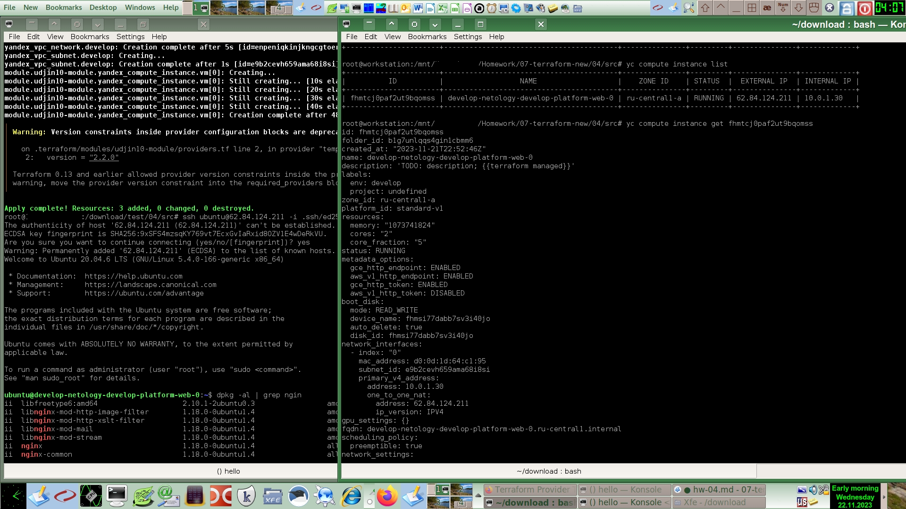
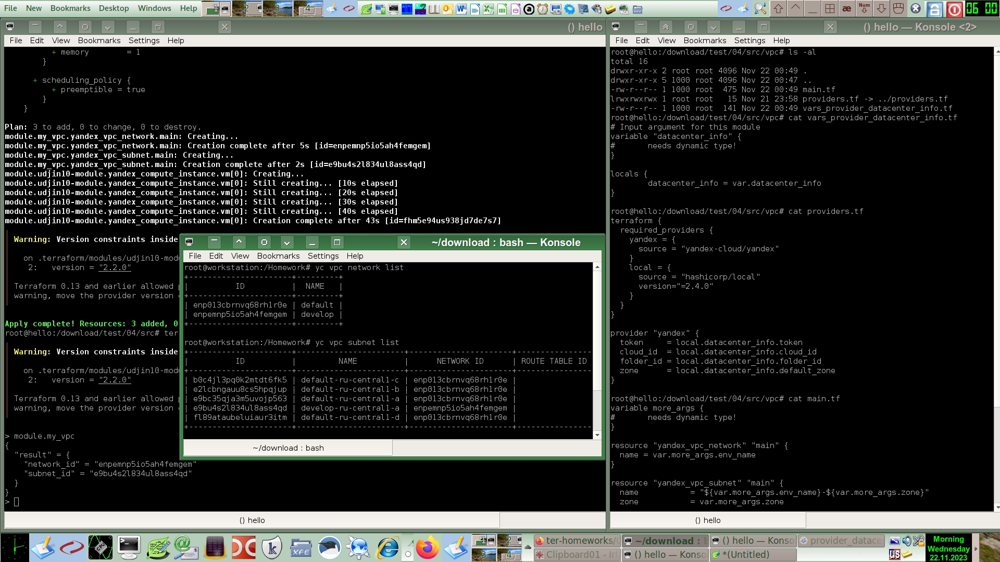

# Домашнее задание к занятию «Продвинутые методы работы с Terraform»

Провайдер `hashicorp/template` не удалось поставить в РФ даже офлайн через копирование. Выдаёт ошибку.
Разбираться с причиной буду потом, пока некогда.
Пришлось тестировать на зарубежной виртуалке, Terraform отказывается работать из РФ даже через зарубежный прокси.
Потом ещё попробую через полный VPN и наверно нужно создавать офлайновый образ контейнера, наполненный популярными плагинами, потому что все эти упражнения с обходом блокировок Terraform отнимают больше времени, чем собственно решения задач, я так задержался именно поэтому, иначе бы всё сдал по этому модулю ещё до 17 ноября. Если можно, пожалуйста, продлите срок проверки для следующей пятой работы, боюсь, не успеть её сдать до 23 ноября. Хотел попробовать Drone CI для необязательной задачи.

Вопрос по следующей ПЯТОЙ работе:
Пожалуйста, обратите внимание, в этом параграфе речь о следующем (НЕ этом) домашнем задании по [командной работе с Terraform](https://github.com/a-prokopyev-resume/devops-netology/blob/main/07-terraform-new/05/hw-05.md). Если не ошибаюсь, вроде бы проверяющие могут проверить работу уже даже после технического закрытия модуля 23 ноября?
Может быть, тогда можно предоставить следующую пятую работу на проверку пока недоделанную, но чтобы вы её не отправляли на доработку до тех пор пока я нё не доделаю, что можно обсудить в чате? :)
Т.е. я доделываю пятую, сообщаю в чате, и тогда, если считаете, что работа зачётная, то ставите зачёт, или отправляете сообщение в чате, что нужно ещё доработать? Можно ли так?

### Задание 1

Добавил переменные:

```
variable "vm_image_family" {
  type        = string
  default     = "ubuntu-2004-lts"
  description = "YC disk image name"
}

variable "ssh_user" {
  type        = string
  default     = "ubuntu"
  description = "ssh-keygen -t ed25519"
}

locals {
  ssh_public_key = "${file(".ssh/ed25519.pub")}"
}
```

Создал файл `cloud-init.yml`:
```
#cloud-config
users:
  - name: ${ssh_user}
    groups: sudo
    shell: /bin/bash
    sudo: ['ALL=(ALL) NOPASSWD:ALL']
    ssh_authorized_keys:
      - ${ssh_public_key}
package_update: true
package_upgrade: false
packages:
 - joe
 - mc
 - htop
 - nginx
runcmd:
  - systemctl enable nginx
  - systemctl start nginx
```

Запуск `nginx``:
```
ubuntu@develop-netology-develop-platform-web-0:~$ sudo nginx -t
nginx: the configuration file /etc/nginx/nginx.conf syntax is ok
nginx: configuration file /etc/nginx/nginx.conf test is successful
```

### Задание 2

Переделал файл определения провайдера `providers.tf`, чтобы он был общим для корневого модуля и для локальных child модулей:

```terraform
terraform {
  required_providers {
    yandex = {
      source = "yandex-cloud/yandex"
    }
    local = {
      source = "hashicorp/local"
      version="=2.4.0"
    }
  }
}

provider "yandex" {
  token     = local.datacenter_info.token
  cloud_id  = local.datacenter_info.cloud_id
  folder_id = local.datacenter_info.folder_id
  zone      = local.datacenter_info.default_zone
}
```
В каталог child модуля этот файл добавляется через символическую ссылку на оригинальный родительский файл, что вероятно улучшает соответствие проекта паттерну DRY. Для работоспособности такого определения провайдеров программно задаются значения объекта `local.datacenter_info`.

В файле `variables.tf` корневого модуля:
```
locals { 
  # Datacenter information
  datacenter_info  =  {
    token=var.token
    cloud_id=var.cloud_id
    folder_id=var.folder_id
    default_zone=var.default_zone
  }
}
```

Для единообразного (в корневом и child модулях) написания переменной `datacenter_info` эта переменная дублируется в секции `locals` в файле `vpc/vars_provider_datacenter_info.tf`, там же она описана в качестве входного параметра модуля:
```
variable "datacenter_info" { 
#       needs dynamic type!
}
locals {
        datacenter_info = var.datacenter_info
}
```
`main.tf` модуля выглядит следующим образом:
```
variable more_args {
#       needs dynamic type!
}

resource "yandex_vpc_network" "main" {
  name = var.more_args.env_name
}

resource "yandex_vpc_subnet" "main" {
  name           = "${var.more_args.env_name}-${local.datacenter_info.default_zone}" // -${var.more_args.zone}
  zone           = local.datacenter_info.default_zone # var.more_args.zone
  network_id     = yandex_vpc_network.main.id
  v4_cidr_blocks = var.more_args.cidr
}

output result {
  value = {
    network_id = yandex_vpc_network.main.id,
    subnet_id = yandex_vpc_subnet.main.id
  }
}
```
Он содержит входные параметры кроме `datacenter_info` (вынесенный в отдельный файл, описанный ранее) и выходные параметры тоже в виде объекта `result` как и входные параметры `more_args`.

Вызов child модуля из корневого модуля выглядит следующим образом:
```
module "my_vpc" {
  source       = "./vpc"
  datacenter_info = local.datacenter_info
  more_args = {
    env_name     = "develop",
//  zone = var.default_zone,
    cidr = var.default_cidr
  }
}
```
Значение `zone` не передается отдельным аргументом, потому что это значение уже присутствует в поле объекта `datacenter_info`, тоже передаваемого из корневого модуля в child модуль.

Определение сетей из первой задачи этой работы я закомментировал.

Результат выполнения (удаление и создание заново):


По идее можно раскомментировать старый вариант сети и потом попробовать закомментировать его обратно,
чтобы было без изменений. Но я делал слишком много правок поэтому перезапустил создание ресурсов (`recreate.sh`):
```
terraform destroy -auto-approve && terraform apply -auto-approve 
```
Для тестового использования опция `-auto-approve` допустима и даже удобна.

Генерация документации: `/utils/iac/bin/terraform-docs markdown ./vpc > ./vpc/docs.md`
Результат находится в файле [vpc/docs.md](src/vpc/docs.md)

### Задание 3

Сначала запоминаем идентификаторы ресурсов, для чего я написал такой однострочник Bash:
```bash
root@hello:/download/test/04/src# for Resource in $(terraform state list); do echo -e "$Resource : \t"$(terraform state show $Resource | grep -P '\sid'); done

data.template_file.cloudinit :   id = "6e6f9130a6de7f30b42913486b36cd936905a1719a03d7ed28e5066e880537c4"
module.my_vpc.yandex_vpc_network.main :          id = "enpc0r91m8agfrsdh43j"
module.my_vpc.yandex_vpc_subnet.main :   id = "e9bhrdb7e65pv0v88sik"
module.udjin10-module.data.yandex_compute_image.my_image :       id = "fd8tir33idvbn40d00nm"
module.udjin10-module.yandex_compute_instance.vm[0] :    id = "fhmfj66bjle949n0qoqf"
```

Удаляю информацию о ресурсах из файла состояния terraform:
```
root@hello:/download/test/04/src# terraform state rm module.my_vpc
Removed module.my_vpc.yandex_vpc_network.main
Removed module.my_vpc.yandex_vpc_subnet.main
Successfully removed 2 resource instance(s).

root@hello:/download/test/04/src# terraform state rm module.udjin10-module.yandex_compute_instance.vm[0]
Removed module.udjin10-module.yandex_compute_instance.vm[0]
Successfully removed 1 resource instance(s).

root@hello:/download/test/04/src# terraform state list
data.template_file.cloudinit
module.udjin10-module.data.yandex_compute_image.my_image
```

Проверяю наличие ресурсов в облаке:
```
root@workstation:/Homework# yc vpc subnet list
+----------------------+-----------------------+----------------------+----------------+---------------+-----------------+
|          ID          |         NAME          |      NETWORK ID      | ROUTE TABLE ID |     ZONE      |      RANGE      |
+----------------------+-----------------------+----------------------+----------------+---------------+-----------------+
| b0c4jl3pq0k2mtdt6fk5 | default-ru-central1-c | enp013cbrnvq68rh1r0e |                | ru-central1-c | [10.130.0.0/24] |                                                                                       
| e2lcbngauu8cs5hpqjup | default-ru-central1-b | enp013cbrnvq68rh1r0e |                | ru-central1-b | [10.129.0.0/24] |                                                                                       
| e9bc35qja3m5uvojp563 | default-ru-central1-a | enp013cbrnvq68rh1r0e |                | ru-central1-a | [10.128.0.0/24] |                                                                                       
| e9bhrdb7e65pv0v88sik | develop-ru-central1-a | enpc0r91m8agfrsdh43j |                | ru-central1-a | [10.0.1.0/24]   |                                                                                       
| fl89ataubeluiaur3itm | default-ru-central1-d | enp013cbrnvq68rh1r0e |                | ru-central1-d | [10.131.0.0/24] |                                                                                       
+----------------------+-----------------------+----------------------+----------------+---------------+-----------------+                                                                                       
                                                                                                                                                                                
root@workstation:/Homework# yc compute instance list                                                                                                                                                         
+----------------------+-----------------------------------------+---------------+---------+--------------+-------------+                                                                                        
|          ID          |                  NAME                   |    ZONE ID    | STATUS  | EXTERNAL IP  | INTERNAL IP |                                                                                        
+----------------------+-----------------------------------------+---------------+---------+--------------+-------------+                                                                                        
| fhmfj66bjle949n0qoqf | develop-netology-develop-platform-web-0 | ru-central1-a | RUNNING | 84.201.132.5 | 10.0.1.23   |                                                                                        
+----------------------+-----------------------------------------+---------------+---------+--------------+-------------+    
```

Подготавливаю команды для импорта ресурсов в файл состояния terraform:
```
terraform import module.my_vpc.yandex_vpc_network.main  "enpc0r91m8agfrsdh43j";
terraform import module.my_vpc.yandex_vpc_subnet.main "e9bhrdb7e65pv0v88sik";
terraform import module.udjin10-module.yandex_compute_instance.vm[0] "fhmfj66bjle949n0qoqf";
```
Фрагмент вывода последней команды:
```
data.template_file.cloudinit: Reading...
data.template_file.cloudinit: Read complete after 0s [id=6e6f9130a6de7f30b42913486b36cd936905a1719a03d7ed28e5066e880537c4]
module.udjin10-module.data.yandex_compute_image.my_image: Reading...
module.udjin10-module.data.yandex_compute_image.my_image: Read complete after 3s [id=fd8tir33idvbn40d00nm]
module.udjin10-module.yandex_compute_instance.vm[0]: Importing from ID "fhmfj66bjle949n0qoqf"...
module.udjin10-module.yandex_compute_instance.vm[0]: Import prepared!
  Prepared yandex_compute_instance for import
module.udjin10-module.yandex_compute_instance.vm[0]: Refreshing state... [id=fhmfj66bjle949n0qoqf]

Import successful!

The resources that were imported are shown above. These resources are now in
your Terraform state and will henceforth be managed by Terraform.
```
Все три команды аналогично отработали успешно.

`terraform plan` выдает пустой план изменений.
