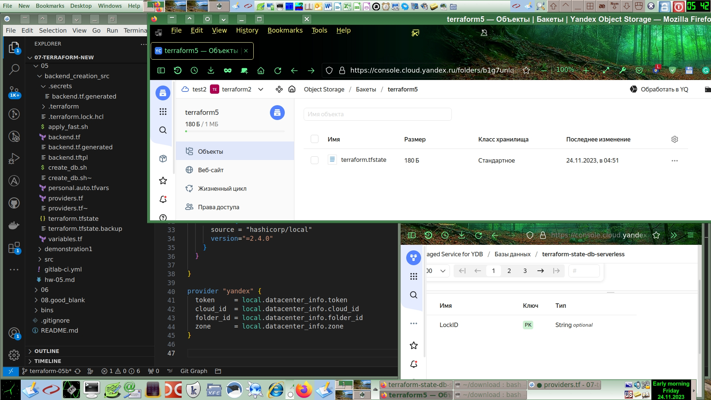

# Домашнее задание к занятию «Использование Terraform в команде»

### Задание 1

Скопировал оригинальный код из [ДЗ к лекции 4](https://github.com/netology-code/ter-homeworks/tree/main/04/src) и [демо к лекции 4](https://github.com/netology-code/ter-homeworks/tree/main/04/demonstration1) в каталог данной работы.

Создал скрипт `/utils/iac/lint_terraform.sh` для удобного запуска статических анализаторов кода Terraform:
```
#!/bin/bash
#set -x;

TFProjectDir="$(realpath ${1:-$(pwd)})";
docker run --rm -v "$TFProjectDir":/data -t ghcr.io/terraform-linters/tflint;
docker run --tty --volume "$TFProjectDir":/tf --workdir /tf bridgecrew/checkov --directory /tf

#===More related popular container images:
#schaefj/linter
#wata727/tflint
#megabytelabs/tflint

``` 

Находясь в топовом каталоге ДЗ, запускаю  проверку: `/utils/iac/lint_terraform.sh src`:
```
4 issue(s) found:

Warning: Missing version constraint for provider "yandex" in `required_providers` (terraform_required_providers)

  on providers.tf line 3:
   3:     yandex = {
   4:       source = "yandex-cloud/yandex"
   5:     }

Reference: https://github.com/terraform-linters/tflint-ruleset-terraform/blob/v0.5.0/docs/rules/terraform_required_providers.md

Warning: [Fixable] variable "vms_ssh_root_key" is declared but not used (terraform_unused_declarations)

  on variables.tf line 36:
  36: variable "vms_ssh_root_key" {

Reference: https://github.com/terraform-linters/tflint-ruleset-terraform/blob/v0.5.0/docs/rules/terraform_unused_declarations.md

Warning: [Fixable] variable "vm_web_name" is declared but not used (terraform_unused_declarations)

  on variables.tf line 43:
  43: variable "vm_web_name" {

Reference: https://github.com/terraform-linters/tflint-ruleset-terraform/blob/v0.5.0/docs/rules/terraform_unused_declarations.md

Warning: [Fixable] variable "vm_db_name" is declared but not used (terraform_unused_declarations)

  on variables.tf line 50:
  50: variable "vm_db_name" {

Reference: https://github.com/terraform-linters/tflint-ruleset-terraform/blob/v0.5.0/docs/rules/terraform_unused_declarations.md


       _               _              
   ___| |__   ___  ___| | _______   __
  / __| '_ \ / _ \/ __| |/ / _ \ \ / /
 | (__| | | |  __/ (__|   < (_) \ V / 
  \___|_| |_|\___|\___|_|\_\___/ \_/  
                                      
By Prisma Cloud | version: 3.1.9 
```

Выданы предупреждения таких видов:
* Warning: Missing version constraint for provider "yandex" in `required_providers` (terraform_required_providers)  
Не указана версия провайдера "yandex"
* Warning: [Fixable] variable "xxx" is declared but not used (terraform_unused_declarations)
Неиспользованная переменная

Теперь запускаю проверку ещё одного корневого модуля Terraform: `/utils/iac/lint_terraform.sh demonstration1`:
```
05:36 root@workstation /Homework/07-terraform-new/05 79:# > /utils/iac/lint_terraform.sh demonstration1
6 issue(s) found:

Warning: Missing version constraint for provider "yandex" in `required_providers` (terraform_required_providers)

  on main.tf line 3:
   3:     yandex = {
   4:       source = "yandex-cloud/yandex"
   5:     }

Reference: https://github.com/terraform-linters/tflint-ruleset-terraform/blob/v0.5.0/docs/rules/terraform_required_providers.md

Warning: Module source "git::https://github.com/udjin10/yandex_compute_instance.git?ref=main" uses a default branch as ref (main) (terraform_module_pinned_source)

  on main.tf line 33:
  33:   source          = "git::https://github.com/udjin10/yandex_compute_instance.git?ref=main"

Reference: https://github.com/terraform-linters/tflint-ruleset-terraform/blob/v0.5.0/docs/rules/terraform_module_pinned_source.md

Warning: Missing version constraint for provider "template" in `required_providers` (terraform_required_providers)

  on main.tf line 51:
  51: data "template_file" "cloudinit" {

Reference: https://github.com/terraform-linters/tflint-ruleset-terraform/blob/v0.5.0/docs/rules/terraform_required_providers.md

Warning: [Fixable] variable "default_cidr" is declared but not used (terraform_unused_declarations)

  on variables.tf line 22:
  22: variable "default_cidr" {

Reference: https://github.com/terraform-linters/tflint-ruleset-terraform/blob/v0.5.0/docs/rules/terraform_unused_declarations.md

Warning: [Fixable] variable "vpc_name" is declared but not used (terraform_unused_declarations)

  on variables.tf line 28:
  28: variable "vpc_name" {

Reference: https://github.com/terraform-linters/tflint-ruleset-terraform/blob/v0.5.0/docs/rules/terraform_unused_declarations.md

Warning: [Fixable] variable "public_key" is declared but not used (terraform_unused_declarations)

  on variables.tf line 34:
  34: variable "public_key" {

Reference: https://github.com/terraform-linters/tflint-ruleset-terraform/blob/v0.5.0/docs/rules/terraform_unused_declarations.md

2023-11-23 00:37:49,125 [MainThread  ] [WARNI]  Failed to download module git::https://github.com/udjin10/yandex_compute_instance.git?ref=main:None (for external modules, the --download-external-modules flag is required)

       _               _              
   ___| |__   ___  ___| | _______   __
  / __| '_ \ / _ \/ __| |/ / _ \ \ / /
 | (__| | | |  __/ (__|   < (_) \ V / 
  \___|_| |_|\___|\___|_|\_\___/ \_/  
                                      
By Prisma Cloud | version: 3.1.9 

terraform scan results:

Passed checks: 0, Failed checks: 1, Skipped checks: 0

Check: CKV_TF_1: "Ensure Terraform module sources use a commit hash"
        FAILED for resource: test-vm
        File: /main.tf:32-48
        Guide: https://docs.prismacloud.io/en/enterprise-edition/policy-reference/supply-chain-policies/terraform-policies/ensure-terraform-module-sources-use-git-url-with-commit-hash-revision

                32 | module "test-vm" {
                33 |   source          = "git::https://github.com/udjin10/yandex_compute_instance.git?ref=main"
                34 |   env_name        = "develop"
                35 |   network_id      = yandex_vpc_network.develop.id
                36 |   subnet_zones    = ["ru-central1-a"]
                37 |   subnet_ids      = [ yandex_vpc_subnet.develop.id ]
                38 |   instance_name   = "web"
                39 |   instance_count  = 2
                40 |   image_family    = "ubuntu-2004-lts"
                41 |   public_ip       = true
                42 |   
                43 |   metadata = {
                44 |       user-data          = data.template_file.cloudinit.rendered #Для демонстрации №3
                45 |       serial-port-enable = 1
                46 |   }
                47 | 
                48 | }


```
Выданы предупреждения таких видов:
* Warning: Module source "git::https://github.com/udjin10/yandex_compute_instance.git?ref=main" uses a default branch as ref (main) (terraform_module_pinned_source)
Тоже самое утилитой checkov: CKV_TF_1: "Ensure Terraform module sources use a commit hash".  
 => Нужно явно указать версию (в виде его хэш кода) remote модуля.
* Warning: Missing version constraint for provider "template" in `required_providers` (terraform_required_providers)  
 => Не указана версия провайдера
* Warning: [Fixable] variable "xxx" is declared but not used (terraform_unused_declarations)  
 => Переменная указана, но не используется.
* [WARNI]  Failed to download module git::https://github.com/udjin10/yandex_compute_instance.git?ref=main:None (for external modules, the --download-external-modules flag is required)  
 => Это техническое сообщение о способе запуска линтера говорит о том, что для проверки внешних модулей нужно указывать опцию `--download-external-modules`.

### Задание 2

Полезные материалы по использованию Git:
* [Topic Branching](https://alvinalexander.com/git/git-topic-branch-workflow-pattern-pro-git/).
* [Git topic branches](https://imagej.net/develop/git/topic-branches)

Вместо настройки backend вручную я определил нужные для создания backend ресурсы с помощью Terraform в файле `backend.tf` в новом корневом модуле данной работы N5 `create_backend`:
```
#=== Service account
resource "yandex_iam_service_account" "tf_backend" {
  name = "tf-backend"
  folder_id = local.datacenter_info.folder_id
}

#=== Service account static key
resource "yandex_iam_service_account_static_access_key" "tf_backend" {
  service_account_id = yandex_iam_service_account.tf_backend.id
  description        = "Static access key."
}

#=== Storage editor role
resource "yandex_resourcemanager_folder_iam_member" "storage_editor_role" {
  folder_id = local.datacenter_info.folder_id
  role      = "storage.editor"
  member    = "serviceAccount:${yandex_iam_service_account.tf_backend.id}"
}

#=== Storage uploader role
resource "yandex_resourcemanager_folder_iam_member" "storage_uploader_role" {
  folder_id = local.datacenter_info.folder_id
  role      = "storage.uploader"
  member    = "serviceAccount:${yandex_iam_service_account.tf_backend.id}"
}

#=== Storage bucket for Terraform backend
resource "yandex_storage_bucket" "tf_backend" {
  bucket     = "terraform5"
  access_key = yandex_iam_service_account_static_access_key.tf_backend.access_key
  secret_key = yandex_iam_service_account_static_access_key.tf_backend.secret_key
  max_size   = 1048576 # Specified in bytes
  depends_on = [ yandex_resourcemanager_folder_iam_member.storage_editor_role ]
}

#=== YDB admin role
resource "yandex_resourcemanager_folder_iam_member" "ydb_admin_role" {
  folder_id = local.datacenter_info.folder_id
  role      = "ydb.admin"
  member    = "serviceAccount:${yandex_iam_service_account.tf_backend.id}"
}

#=== YDB database for Terraform backend
resource "yandex_ydb_database_serverless" "tf_backend" {
  name = "terraform-state-db-serverless"
  serverless_database {
    storage_size_limit          = 1 # Specified in gigabytes
  }
  depends_on = [ yandex_resourcemanager_folder_iam_member.ydb_admin_role ]
}

# shell: yc ydb database add-access-binding --service-account-name "tf-backend" --role "ydb.admin" --name terraform-state-db-serverless

resource "yandex_ydb_table" "tf_backend" {
    path = "terraform_locks"
    connection_string = yandex_ydb_database_serverless.tf_backend.ydb_full_endpoint
    primary_key = [ "LockID" ]
    column {
        name = "LockID"
        type = "String"
    }
}

resource "local_file" "tf_backend" {
  filename = ".secrets/backend.tf.generated"
  content = templatefile("backend.tftpl", { 
    static_access_key=yandex_iam_service_account_static_access_key.tf_backend
    bucket=yandex_storage_bucket.tf_backend.bucket
    datacenter_info = local.datacenter_info
    ydb = yandex_ydb_database_serverless.tf_backend
  })
}

output "tf_backend_secret_keys" {
	value = {
		sa_id = yandex_iam_service_account.tf_backend.id,
		access_key = yandex_iam_service_account_static_access_key.tf_backend.access_key
    secret_key = yandex_iam_service_account_static_access_key.tf_backend.secret_key
	}
	sensitive = true
}
```
Сделал шаблон генерации блока `backend.tftpl`:
```
#=== Terraform backend (S3+YDB) generated automatically

terraform {

  backend "s3" {
    access_key = "${static_access_key.access_key}"
    secret_key = "${static_access_key.secret_key}"

// The same as:   terraform init -backend-config="access_key=$ACCESS_KEY" -backend-config="secret_key=$SECRET_KEY"
// On secure prod command line method is preferred

    endpoint = "storage.yandexcloud.net"
    bucket   = "${bucket}" 
    
    region   = "${datacenter_info.zone}"
    key      = "terraform.tfstate" # remote file name

    skip_region_validation      = true
    skip_credentials_validation = true

    dynamodb_endpoint = "${ydb.document_api_endpoint}"
    dynamodb_table    = "terraform_locks"

// Following is for ydb CLI:
// ydb_full_endpoint = "${ydb.ydb_full_endpoint}"
}
```

После запуска получаем такие ресурсы:
```
root@workstation:/Homework/07-terraform-new/05/backend_creation_src# terraform state list

local_file.tf_backend
yandex_iam_service_account.tf_backend
yandex_iam_service_account_static_access_key.tf_backend
yandex_resourcemanager_folder_iam_member.storage_editor_role
yandex_resourcemanager_folder_iam_member.storage_uploader_role
yandex_resourcemanager_folder_iam_member.ydb_admin_role
yandex_storage_bucket.tf_backend
yandex_ydb_database_serverless.tf_backend
yandex_ydb_table.tf_backend

```
После `terraform destroy`:



Кроме того в качестве эксперимента я также сделал bash файл `create_db.sh` для автоматического создания базы и таблицы,
а также для поиска идентификаторов созданных объектов YDB:
```bash
#!/bin/bash
#set -x;

DB_ID=$(yc ydb database list | grep terraform | awk '{ print $2 }');
yc ydb database get $DB_ID > /tmp/db_info.yml;
GRPC_API=$(cat /tmp/db_info.yml | yq -r .endpoint /tmp/db_info.yml);
DocAPI=$(cat /tmp/db_info.yml | yq -r .document_api_endpoint /tmp/db_info.yml);
Database=$(echo $DocAPI | grep -P '/ru-central1/.*' -o);

yc iam create-token > /tmp/iam_12h_token;

yql()
{
	QueryText="$1";
	proxychains ydb --database $Database --endpoint $GRPC_API --iam-token-file /tmp/iam_12h_token yql --script "$QueryText";
}

#yql "CREATE TABLE locks (LockID String, PRIMARY KEY (LockID))";
yql "select count(*) from locks";
yql "select * from locks";

#aws dynamodb create-table \
#  --table-name terraform_locks \
#  --attribute-definitions AttributeName=LockID,AttributeType=S \
#  --key-schema AttributeName=LockID,KeyType=HASH \
#  --endpoint $DocAPI;

# Wiping temporary token and yml
echo > /tmp/iam_12h_token; 
echo > /tmp/db_info.yml;
```

Пример создания таблицы с помощью AWS CLI из описаний на других Интернет сайтах:`
```
aws dynamodb create-table \
  --table-name terraform_locks \
  --attribute-definitions AttributeName=LockID,AttributeType=S \
  --key-schema AttributeName=LockID,KeyType=HASH \
  --endpoint $DocAPI;
```

------
### Задание 3  

Создал новую ветку `terraform-hotfix`.

Запустил линтеры `06:55 root@workstation /Homework/07-terraform-new/04 6:# > /utils/iac/lint_terraform.sh ./src`:
```
06:55 root@workstation /Homework/07-terraform-new/04 6:# > /utils/iac/lint_terraform.sh ./src
6 issue(s) found:

Warning: Module source "git::https://github.com/udjin10/yandex_compute_instance.git?ref=main" uses a default branch as ref (main) (terraform_module_pinned_source)

  on main.tf line 14:
  14:   source          = "git::https://github.com/udjin10/yandex_compute_instance.git?ref=main"

Reference: https://github.com/terraform-linters/tflint-ruleset-terraform/blob/v0.5.0/docs/rules/terraform_module_pinned_source.md

Warning: Missing version constraint for provider "template" in `required_providers` (terraform_required_providers)

  on main.tf line 42:
  42: data "template_file" "cloudinit" {

Reference: https://github.com/terraform-linters/tflint-ruleset-terraform/blob/v0.5.0/docs/rules/terraform_required_providers.md

Warning: [Fixable] variable "vpc_name" is declared but not used (terraform_unused_declarations)

  on variables.tf line 28:
  28: variable "vpc_name" {

Reference: https://github.com/terraform-linters/tflint-ruleset-terraform/blob/v0.5.0/docs/rules/terraform_unused_declarations.md

Warning: [Fixable] variable "vm_db_name" is declared but not used (terraform_unused_declarations)

  on variables.tf line 44:
  44: variable "vm_db_name" {

Reference: https://github.com/terraform-linters/tflint-ruleset-terraform/blob/v0.5.0/docs/rules/terraform_unused_declarations.md

Warning: [Fixable] local.ssh_user is declared but not used (terraform_unused_declarations)

  on variables.tf line 63:
  63:   ssh_user="ubuntu"

Reference: https://github.com/terraform-linters/tflint-ruleset-terraform/blob/v0.5.0/docs/rules/terraform_unused_declarations.md

Warning: [Fixable] Interpolation-only expressions are deprecated in Terraform v0.12.14 (terraform_deprecated_interpolation)

  on variables.tf line 64:
  64:   ssh_public_key = "${file(".ssh/ed25519.pub")}"

Reference: https://github.com/terraform-linters/tflint-ruleset-terraform/blob/v0.5.0/docs/rules/terraform_deprecated_interpolation.md

2023-11-24 01:55:47,452 [MainThread  ] [WARNI]  Failed to download module git::https://github.com/udjin10/yandex_compute_instance.git?ref=main:None (for external modules, the --download-external-modules flag is required)


       _               _              
   ___| |__   ___  ___| | _______   __
  / __| '_ \ / _ \/ __| |/ / _ \ \ / /
 | (__| | | |  __/ (__|   < (_) \ V / 
  \___|_| |_|\___|\___|_|\_\___/ \_/  
                                      

Check: CKV_TF_1: "Ensure Terraform module sources use a commit hash"
        FAILED for resource: udjin10-module
        File: /main.tf:13-30
        Guide: https://docs.prismacloud.io/en/enterprise-edition/policy-reference/supply-chain-policies/terraform-policies/ensure-terraform-module-sources-use-git-url-with-commit-hash-revision

                13 | module "udjin10-module" {
                14 |   source          = "git::https://github.com/udjin10/yandex_compute_instance.git?ref=main"
                15 |   env_name        = "develop"
                16 |   network_id      = module.my_vpc.result.network_id
                17 |   subnet_zones    = [ var.default_zone ]
                18 |   subnet_ids      = [ module.my_vpc.result.subnet_id ]
                19 |   instance_name   = var.vm_web_name
                20 |   instance_count  = 1
                21 |   image_family    = var.vm_image_family 
                22 |   platform        = "standard-v2"
                23 |   public_ip       = true
                24 | 
                25 |   metadata = {
                26 |       user-data          = data.template_file.cloudinit.rendered
                27 |       serial-port-enable = 1
                28 |   }
                29 | 
                30 | }
```

Сделал следующие исправления:
* Добавил хэш код последнего коммита remote модуля: `?ref=95c286e`
* Удалил неиспользуемые переменные
* Зафиксировал версии используемых провайдеров:
```
    yandex = {
      source = "yandex-cloud/yandex"
      version = "~>0.44.0"
    }
    local = {
      source = "hashicorp/local"
      version = "~> 2.0"
    }
    template = {
      source = "hashicorp/local"
      version = "~> 2.2"
    }
```

Линк на [Pull Request](https://github.com/a-prokopyev-resume/devops-netology/pull/2)

### Задание 4

```
root@workstation:/Homework/07-terraform-new/05/backend_creation_src# cat test_vars.tf
variable "ip_address" {
    type          = string
    description   = "Validate IP address."
    default = "1.2.3.4"
    validation {
        condition = can(regex("^(25[0-5]|2[0-4][0-9]|[01]?[0-9][0-9]?)\\.(25[0-5]|2[0-4][0-9]|[01]?[0-9][0-9]?)\\.(25[0-5]|2[0-4][0-9]|[01]?[0-9][0-9]?)\\.(25[0-5]|2[0-4][0-9]|[01]?[0-9][0-9]?)$",var.ip_address))
        error_message = "Incorrect IP address."
    }
}

variable "ip_addresses" {
    type          = list(string)
    description   = "Validate list of IP addresses."
    default = ["1.2.3.4", "2.3.4.5.6"]
    validation {
        condition = can([for ip in var.ip_addresses: regex("^(25[0-5]|2[0-4][0-9]|[01]?[0-9][0-9]?)\\.(25[0-5]|2[0-4][0-9]|[01]?[0-9][0-9]?)\\.(25[0-5]|2[0-4][0-9]|[01]?[0-9][0-9]?)\\.(25[0-5]|2[0-4][0-9]|[01]?[0-9][0-9]?)$", ip)])
        error_message = "Incorrect IP address."
    }
}
```

Запускаем консоль:
```
terraform console 
╷
│ Error: Invalid value for variable
│ 
│   on test_vars.tf line 11:
│   11: variable "ip_addresses" {
│     ├────────────────
│     │ var.ip_addresses is list of string with 2 elements
│ 
│ Incorrect IP address.
│ 
│ This was checked by the validation rule at test_vars.tf:15,5-15.
╵
```

Если исправить значение в списке на `default = ["1.2.3.4", "2.3.4.5"]`, то ошибка исчезнет.