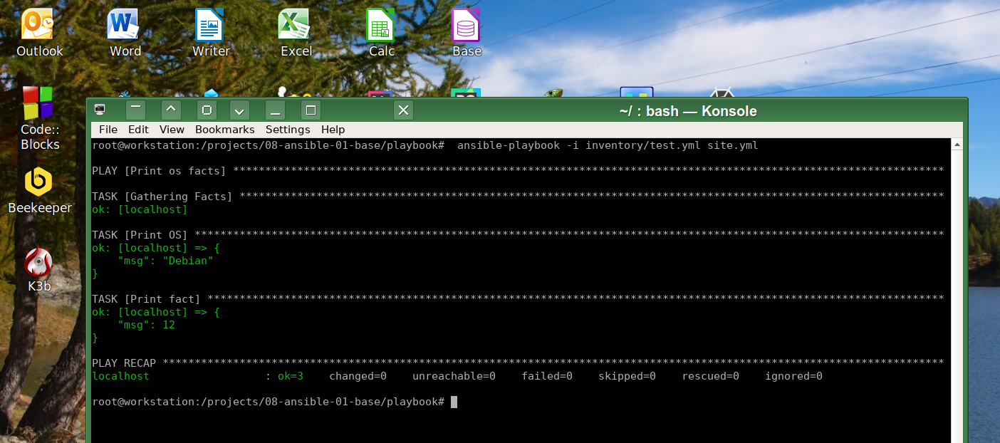
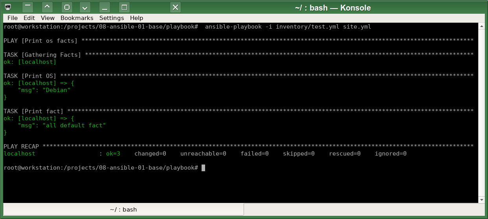
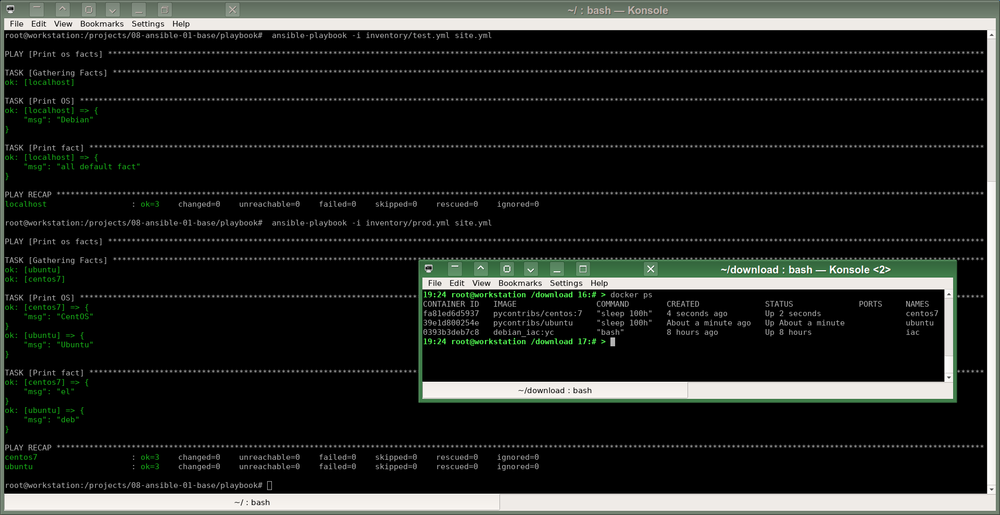
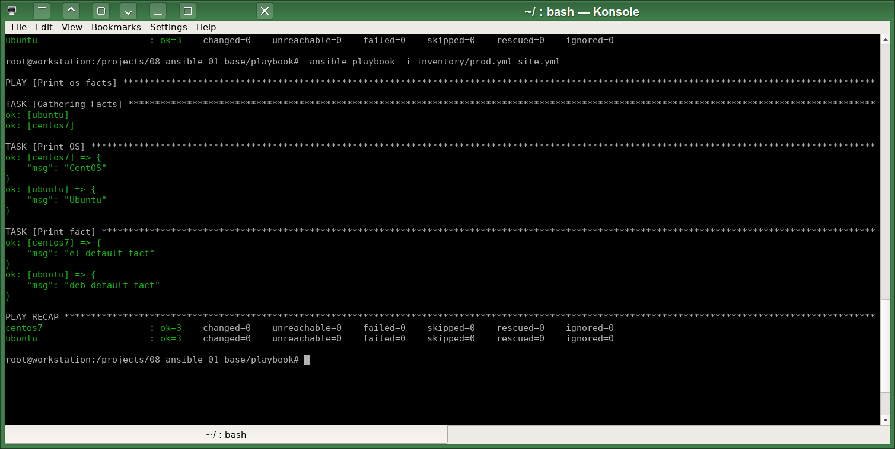
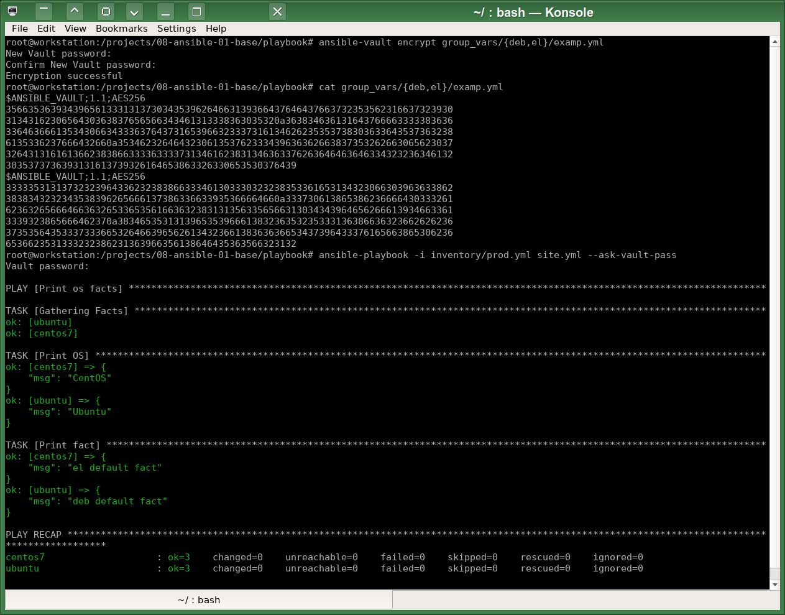
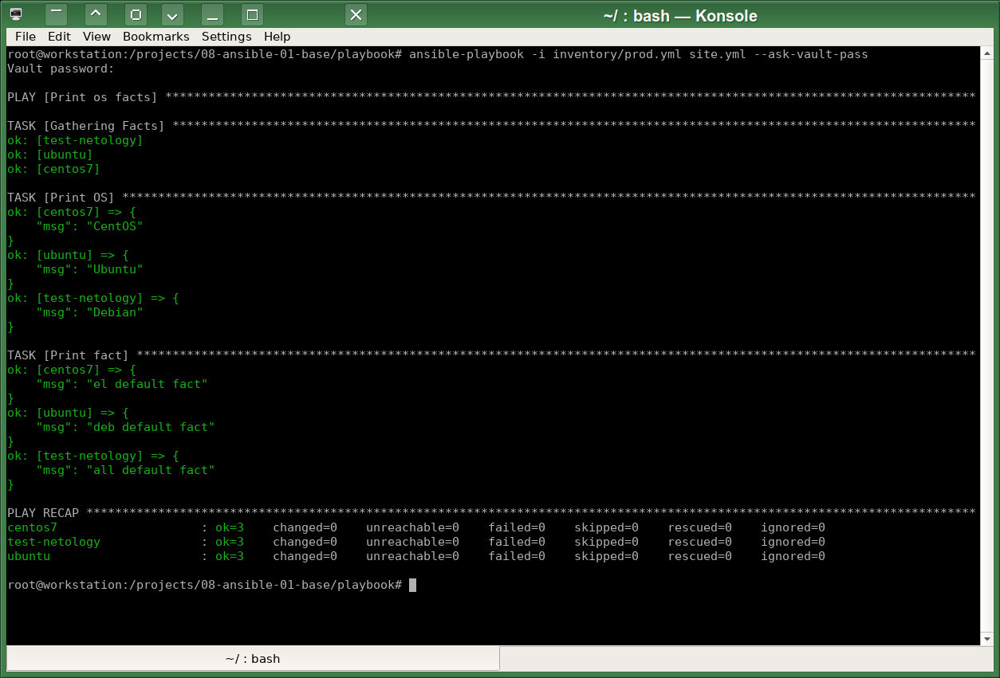
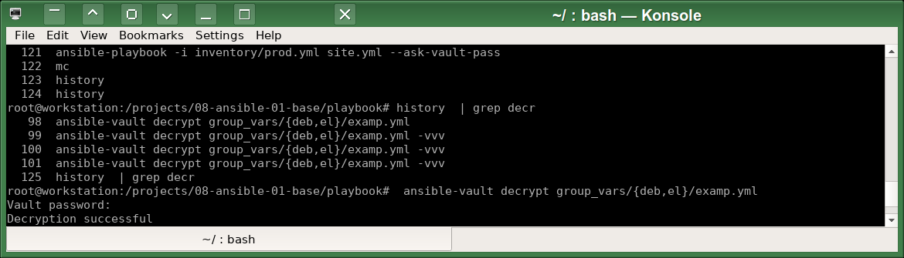
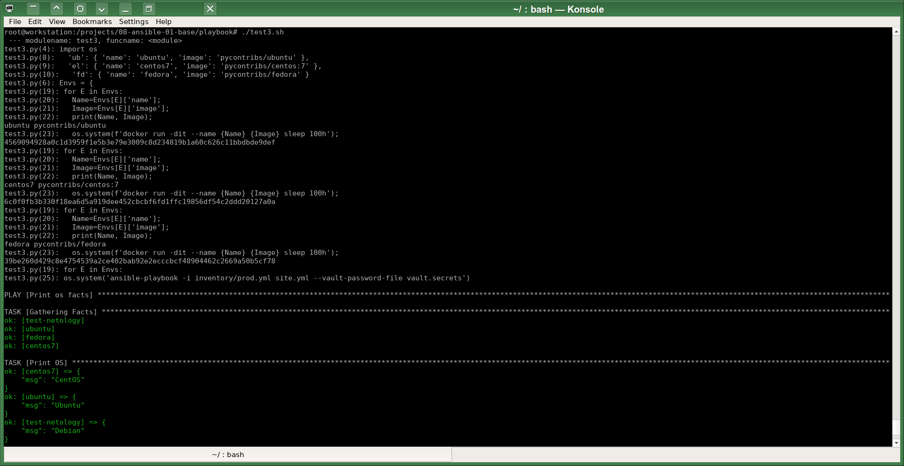

# Домашнее задание к занятию 1 «Введение в Ansible»

## Подготовка к выполнению

Использую Ansible в самодельном инструментальном контейнере:
```
01:31 root@workstation /download 5:# > /utils/iac/tool.sh ansible playbook --version
                                         
++ docker exec -ti iac ansible-playbook --version                                                                                                                                                                
ansible-playbook [core 2.15.6]
  config file = None
  configured module search path = ['/root/.ansible/plugins/modules', '/usr/share/ansible/plugins/modules']
  ansible python module location = /usr/local/lib/python3.11/dist-packages/ansible
  ansible collection location = /root/.ansible/collections:/usr/share/ansible/collections
  executable location = /usr/local/bin/ansible-playbook
  python version = 3.11.2 (main, Mar 13 2023, 12:18:29) [GCC 12.2.0] (/usr/bin/python3)
  jinja version = 3.1.2
  libyaml = True
++ Result=0
++ return 0
```

## Основная часть

1. Запуск на окружении из `test.yml`:

значение `some_fact`:  12
2. Замена значения переменной `some_fact` в файле `group_vars/all/examp.yml` на `all default fact`:

3. Создал необходимые окружения:
```
docker run -d --name ubuntu pycontribs/ubuntu sleep 100h
docker run -d --name centos7 pycontribs/centos:7 sleep 100h
```
4. Запуск playbook на окружении из `prod.yml`:

5. Поменял значения `some_fact` для соответствующих `managed host`:
6. Проверяю повторным запуском на окружении `prod.yml`:

7. Шифрование YAML файлов в каталогах `group_vars/deb` и `group_vars/el` с помощью `ansible-vault` с паролем `netology` следующей командой: `ansible-vault encrypt group_vars/{deb,el}/examp.yml`
8. Проверяю шифрование запуском playbook на окружении `prod.yml` командой: `ansible-playbook -i inventory/prod.yml site.yml --ask-vault-pass`. Важно указать опцию `--ask-vault-pass`:

Но, вероятно, лучше шифровать с помощью PKCS11, это надёжнее.
9.  Смотрю список всех доступных плагинов командой `ansible-doc -l`. Буду использовать плагин `ansible.builtin.local`.
10.  Добавил новую группу хостов с именем  `local` в `prod.yml`:
```
  local:
      hosts:
        test-netology:
          ansible_connection: local
```  
11. Проверяю запуском playbook на окружении `prod.yml`:


## Необязательная часть

1. Расшифровываю ранее зашифрованные YAML файлы: 

2. Шифрую отдельное значение `PaSSw0rd` для переменной `some_fact` паролем `netology`:
`(echo ---; echo -n "  some_fact: "; ansible-vault encrypt_string PaSSw0rd ) > group_vars/all/examp.yml`
3. Проверил запуском playbook:

4. Добавление новой группы хостов `fd`:
```
  fd:
    hosts:
      fedora:
        ansible_connection: docker       
```        
1. Скрипт для автоматизации поднятия необходимых контейнеров, запуск ansible-playbook и остановку контейнеров.

В связи с тем, что задание необязательное, немного изменил условия задачи и написал скрипт на `python3` вместо `bash`, потому что мне там больше (чем в bash) нравится работа с массивами:
```python3
#!/usr/bin/env python3

import os

Envs = {
#  'deb': { 'name': 'debian', 'image': 'pycontribs/debian' },
  'ub': { 'name': 'ubuntu', 'image': 'pycontribs/ubuntu' },
  'el': { 'name': 'centos7', 'image': 'pycontribs/centos:7' },
  'fd': { 'name': 'fedora', 'image': 'pycontribs/fedora' }
}

for E in Envs:
  Name=Envs[E]['name'];
  Image=Envs[E]['image'];
#  print(Name, Image);
  os.system(f'docker run -d --rm --name {Name} {Image} sleep 100h');

os.system('ansible-playbook -i inventory/prod.yml site.yml --vault-password-file vault.secrets')

for E in Envs:
  Name=Envs[E]['name'];
  Image=Envs[E]['image'];
#  print(Name, Image);
  os.system(f'docker stop {Name}');
```


Второй вариант с использованием массива записей вместо вложенных ассоциативных массивов:
```
#!/usr/bin/env python3

import os
from dataclasses import dataclass

@dataclass
class Container:
    name: str
    image: str

Envs = {
  "ub": Container("ubuntu", "pycontribs/ubuntu"),
  "el": Container("centos7", "pycontribs/centos:7"),
  "fd": Container( "fedora", "pycontribs/fedora")
}

for E in Envs:
  Name=Envs[E].name;
  Image=Envs[E].image;
  print(Name, Image);
  os.system(f"docker run -dit --name {Envs[E].name} {Envs[E].image} sleep 100h");

os.system("ansible-playbook -i inventory/prod.yml site.yml --vault-password-file .secrets")

for E in Envs:
  print(Name, Image);
  os.system(f"docker stop {Envs[E].name}");
```
