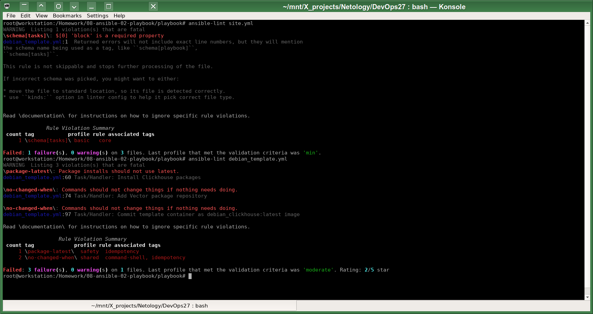
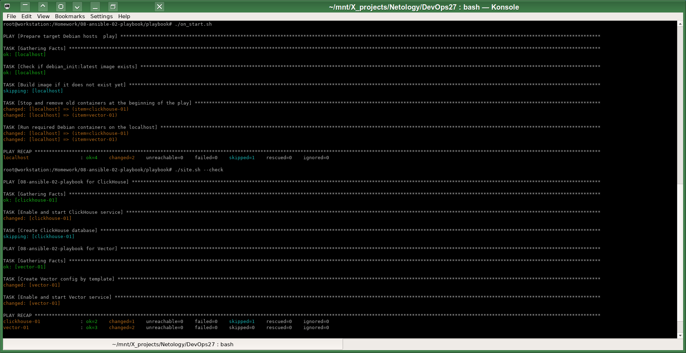
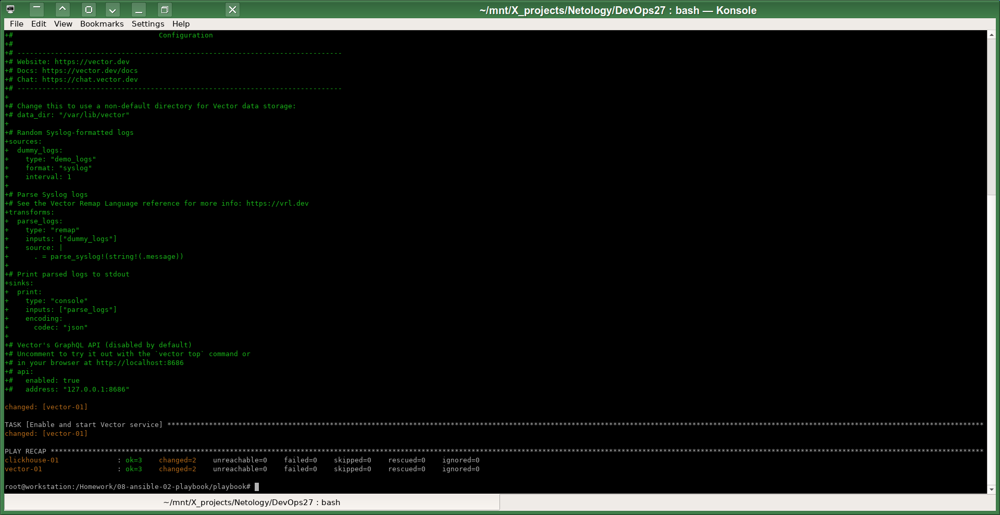
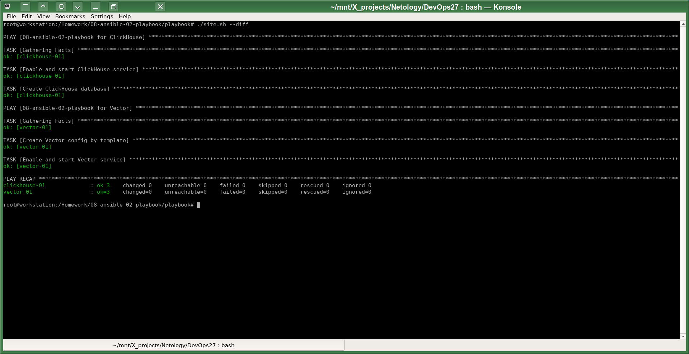

# Домашнее задание к занятию 2 «Работа с Playbook»

1. Подготовил inventory файл `prod.yml`.

2. Полностью переделал playbook в т.ч. и для ClickHouse.
В целом у меня получилось несколько playbooks:
* [debian_template.yml](playbook/debian_template.yml) - создание с помощью Ansible образа контейнера `debian_clickhouse` со всем используемым далее софтом.
* [on_start.yml](playbook/on_start.yml) - пересоздание виртуальных хостов в контейнерах в соответствии с описанием в inventory.
* [site.yml](playbook/site.yml) - конфигурирование, включение и запуск нужных сервисов.
* [at_end.yml](playbook/at_end.yml) - очистка виртуальной инфраструктуры (использованных ранее контейнеров).

3. Вместо RHEL/RPM based я использую базовый дистрибутив Debian внутри образа контейнера `python:3.9.18-slim-bullseye`. Установка пакетов ClickHouse и Vector происходит напрямую из соответствующих репозиториев (закачка пакетов происходит только пакетным менеджером), которые автоматически добавляются к моему самодельному образу контейнера, который я потом использую для развёртывания на соответствующих виртуальных хостах - контейнерах.

4. Образ контейнера `debian_clickhouse` создаётся с помощью Ansible playbook `debian_template.yml`, что в случае создания более сложных предустановленных конфигураций мне показалось намного удобнее использования файла Dockerfile, который предоставляет меньше возможностей кастомизации и шаблонизации без вызова других внешних инструментов. После настройки шаблонного контейнера `debian_template` он сохраняется в образ `debian_clickhouse` с помощью модуля `shell` и команды `docker commit` (не нашел рабочего варианта, как закоммитить состояние контейнера специальным Docker модулем Ansible без использования модуля `shell`).

5. Исправил десятки ошибок форматирования, найденных с помощью `ansible-lint`. Несколько "ошибок" пока осталось в выводе этой команды, устранять их не хочу, потому что с моей точки зрения у меня сделано правильно:

6. Отключил пересоздание контейнеров в начале `site.yml`, чтобы проверить индемпотентность скрипта.
Запустил playbook с флагом `--check` (аналог "dry run" без изменений):

7. После первого прохода с опцией `--diff`:

8. После второго прохода с опцией `--diff`:

9. [README.md](playbook/README.md)
