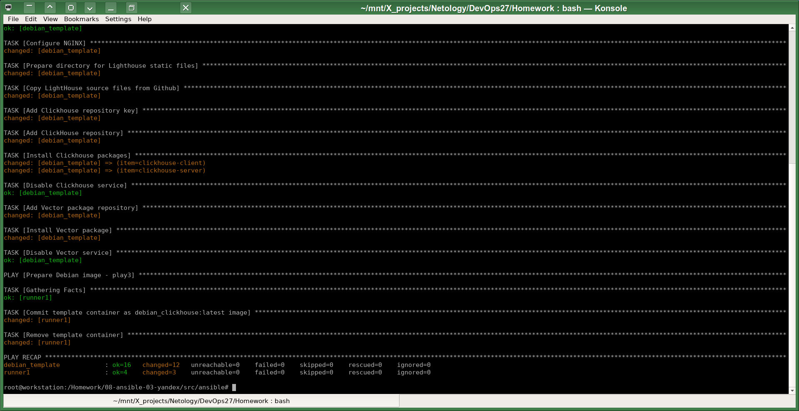
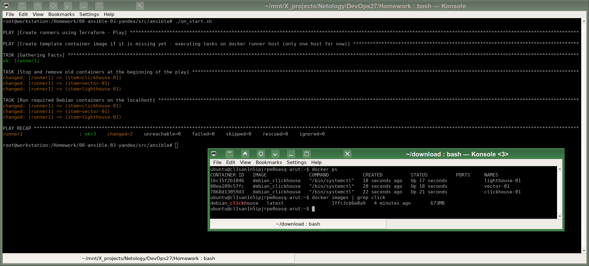
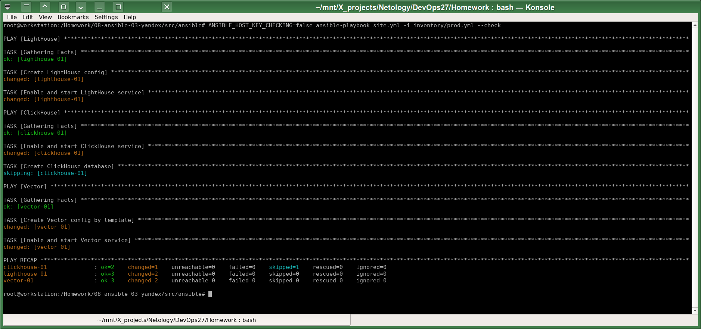
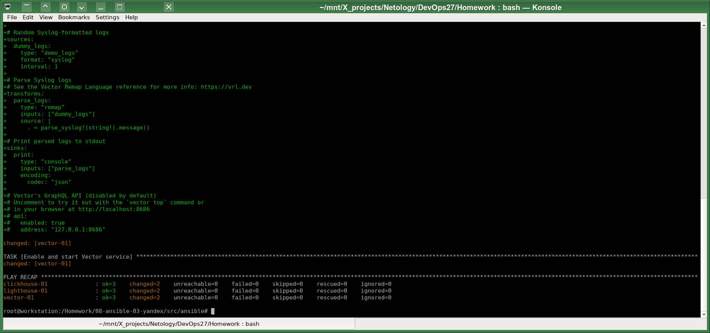
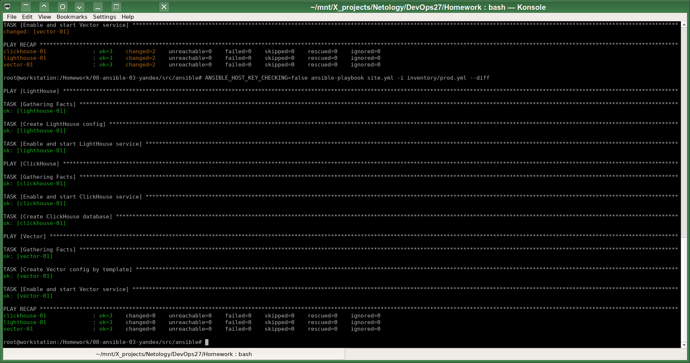

# Домашнее задание к занятию 3 «Использование Ansible»

## Подготовка к выполнению

1. Разработал [модуль Terraform](src/terraform/yandex.tf), который создаёт виртуальную машину из образа Yandex COI (Container Optimized .Image). Описание: https://cloud.yandex.com/en/docs/cos/tutorials/coi-with-terraform

2. Написал playbook [on_start.yml](src/ansible/on_start.yml), который запускает модуль Terraform, и получает из него IP адрес, созданной виртуальной машины. Далее этот playbook проверяет наличие на виртуалке моего самодельного универсального образа `debian_clickhouse` для решения задач этого учебного модуля, и при его отсутствии собирает новый образ такого контейнера с помощью моего другого playbook: [debian_template.yml](src/ansible/debian_template.yml):

Далее `on_start.yml`, перебирая inventory, создаёт виртуальные хосты: `clickhouse-01`, `vector-01` и  `lighthouse-01`:

Соединение до remote docker в Yandex Cloud туннелируется через SSH:
`ssh ubuntu@xxx -i .ssh/id_ed25519 -L /tmp/docker.sock:/run/docker.sock`
что описано в inventory для всех контейнерных "хостов" следующим образом:
`ansible_docker_extra_args: "-H unix:///tmp/docker.sock"`

## Основная часть

1-3. Добавил необходимые tasks для установки LightHouse образ контейнера `debian_clickhouse` и для настройки и запуска сервисов NGINX.
4. Подготовил inventory-файл `prod.yml`.
5. Исправил ошибки с помощью `ansible-lint`.
6. Запуск playbook с флагом `--check`:

7. Запуск playbook с флагом `--diff`:

8. Повторный запуск playbook с флагом `--diff`:

9. [README.md](src/ansible/README.md)