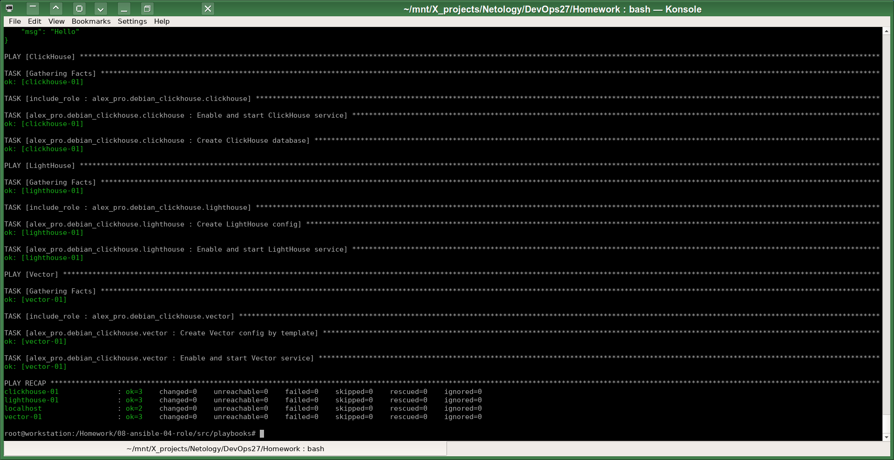

# Домашнее задание к занятию 4 «Работа с roles»

В связи с тем, что устанавливаемые через `ansible-galaxy` роли - это несколько устаревший подход,
я оформил работу более современно с использованием Ansible коллекции, которую назвал `alex_pro/debian_clickhouse` (имя_фамилия/дистрибутив_приложение). Поэтому установочный линк у меня получился только на один репозиторий с этой коллекцией. 

1-2. Ознакомился со следующей ролью Ansible:

   ```yaml
   ---
     - src: git@github.com:AlexeySetevoi/ansible-clickhouse.git
       scm: git
       version: "1.13"
       name: clickhouse 
   ```
Очень функциональная роль для ClickHouse.

3. Для создания коллеции я использовал команды `ansible-galaxy collection init alex_pro.debian_clickhouse` и для  каждой роли внутри этой коллекции команду `ansible-galaxy role init имя_роли`.
   
4-7. Разложил файлы по соответствующим каталогам.
[Описание коллеции с ролями](src/collections/alex_pro/debian_clickhouse/README.md)

8. Пока добавил только ссылку на локальный каталог коллекции в `requirements.yml`. Потом после `git commit` можно заменить на ссылку в репозитории.

9. Переписал [site.yml](src/playbooks/site.yml) с использованием ролей. 

Сборку и установку роли удобно делать с помощью скрипта `build_collection.sh`:
```
CollectionDir="../collections/alex_pro/debian_clickhouse";
( 
        cd $CollectionDir;
        ansible-galaxy collection build --force;
);

#ansible-galaxy collection install $CollectionDir/alex_pro-debian_clickhouse-1.0.0.tar.gz;
ansible-galaxy collection install -r requirements.yml --force;
```
Содержимое `requirements.yml` пока такое (указан локальный репозиторий с исходным кодом):
```
collections:
  - name: alex_pro.debian_clickhouse
    source: ../collections/alex_pro/debian_clickhouse/ # Single local collection    
    type: dir
```
Пример запуска с использованием моей коллекции с ролями:


10.  Запушил на Github. 

11.  Теперь, [судя по описанию](https://cn-ansibledoc.readthedocs.io/zh-cn/latest/galaxy/user_guide.html#install-multiple-collections-with-a-requirements-file), в `requirements.yml` можно добавить линк на коллекцию в моём общем Github репозитории:
```
collections:
  - name: alex_pro.debian_clickhouse
    url: https://github.com/a-prokopyev-resume/devops-netology/tree/main/08-ansible-04-role/src/collections/alex_pro/debian_clickhouse/alex_pro-debian_clickhouse-1.0.0.tar.gz
```
