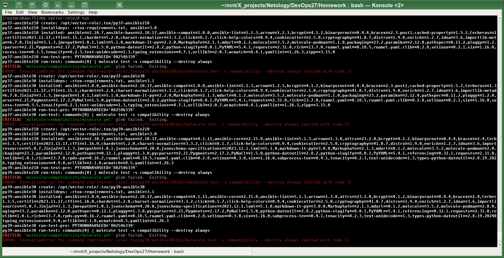

# Домашнее задание к занятию 5 «Тестирование roles»

## Подготовка к выполнению

1. Для установки нужной версии Ansible Molecule на новой виртуалке мне пришлось использовать такую команду:  
`pip3 install "molecule==3.5.2" "molecule-docker<2" molecule-podman`
Иначе ставятся более новые major версии. 
Ещё установил линтеры `pip3 install yamllint "ansible-lint<6" flake8` и коллекцию `ansible-galaxy collection install community.docker`.

2. Скачал требуемый для решения задач этой работы образ контейнера:  
`docker pull aragast/netology:latest`
Довольно большой образ, занимает более 2 GB дискового пространства.

<span style="background-color: green; color: light"> Предварительно ознакомился с Ansible Molecule и Tox с помощью Claude.AI: </span>


Ansible Molecule is used to test Ansible roles and playbooks by creating and provisioning test instances (usually Docker containers), executing the playbook on the test instance, and then performing verification checks to ensure the playbook did what it was supposed to. Molecule supports testing on multiple OS distributions by using different Docker images or cloud instances.

Tox is a generic test automation tool for Python. It is commonly used to test Python packages and scripts across multiple Python versions and environments.

For Ansible collections and modules written in Python, Tox can be used to execute tests on the Python code across different Python versions and virtualenv environments. This helps ensure compatibility across environments.

Molecule is focused on end-to-end playbook testing - executing on real/mocked instances and checking system state. Tox is lower level - focused on exercising Python code in different interpreters and environments.

They are complementary tools used for different purposes in Ansible testing. Molecule operates at the playbook/role level while Tox operates at the Python code level. Using both allows comprehensive testing of Ansible code and playbooks.

So in summary:
*  Molecule is for testing Ansible playbooks/roles by deploying to test instances
*  Tox is for testing Python code (including Ansible collections/modules written in Python) across Python environments


| Feature | Molecule | Tox |
|---|---|---|
| Test environment provisioning | Yes | No |
| Infrastructure configuration | Yes | No | 
| OS/platform matrix testing | Yes | No |
| Idempotence testing | Yes | No |
| Functional validation testing | Yes | No |     
| Multiple Ansible versions | Manual | Yes |   
| Multiple Python versions | Manual | Yes |
| Environment isolation | Manual | Yes |
| Dependency management | Manual | Yes |  
| Custom ENV variables | Yes | Yes |
| Command execution | Single | Matrix |
| Report generation | Yes | Yes |
| CI/CD integration | Yes | Yes |

**Summary**

- Molecule handles setting up and managing test environments as well as executing tests
- Tox specializes in managing testing environments and dependencies  
- Molecule does some version testing, Tox specializes in automated test matrix
- Using both provides infrastructure management, exec testing, isolation and matrix building

## Основная часть

### Molecule

1. Запустил  `molecule test -s centos_7` внутри корневой директории clickhouse-role:


2. Командой `molecule init scenario --driver-name docker` создал сценарий тестирования в каталоге с ролью `vector`.

3. Добавил три дистрибутива в раздел `platforms`:
cat molecule/default/molecule.yml                                                        
```
---                                                                                                                                       
dependency:                                                                                                                               
  name: galaxy                                                                                                                            
role_name_check: 1                                                                                                                        
driver:                                                                                                                                   
  name: docker                                                                                                                            
lint: |                                                                                                                                   
  ansible-lint .                                                                                                                          
  yamllint .                                                                                                                              
platforms:                                                                                                                                
  - name: molecule_ubuntu                                                                                                                 
    image: docker.io/pycontribs/ubuntu:latest                                                                                             
    pre_build_image: true                                                                                                                 
  - name: molecule_fedora                                                                                                                 
    image: docker.io/pycontribs/fedora:latest                                                                                             
    pre_build_image: true                                                                                                                 
  - name: molecule_debian                                                                                                                 
    image: docker.io/pycontribs/debian:latest                                                                                             
    pre_build_image: true                                                                                                                 
provisioner:                                                                                                                              
  name: ansible                                                                                                                           
verifier:                                                                                                                                 
  name: ansible
```
4. Assert в verify.yml-файл:
```
---
- name: Verify
  hosts: all
  gather_facts: false
  tasks:
  - name: Example assertion
    assert:
      that: true
```````

5. Запускаю тестирование:

   


### Tox

1. Добавляю требуемые файлы в директорию с ролью `vector`:
```
wget https://raw.githubusercontent.com/netology-code/mnt-homeworks/MNT-video/08-ansible-05-testing/example/tox.ini
wget https://raw.githubusercontent.com/netology-code/mnt-homeworks/MNT-video/08-ansible-05-testing/example/tox-requirements.txt
```

2. Запустил 

`docker run --privileged=True -v /download/vector:/opt/vector-role -w /opt/vector-role -it aragast/netology:latest /bin/bash`.

3. 

4. Создаю облегчённый сценарий для `molecule` с драйвером `molecule_podman` в файле `molecule/default/molecule.yml`:
```
---
dependency:
  name: galaxy
#role_name_check: 1
driver:
  name: podman
#lint: |
#  ansible-lint .
#  yamllint .
platforms:
#  - name: molecule_ubuntu
#    image: docker.io/pycontribs/ubuntu:latest
#    pre_build_image: true
#  - name: molecule_fedora
#    image: docker.io/pycontribs/fedora:latest
#    pre_build_image: true
  - name: molecule_debian
    image: docker.io/pycontribs/debian:latest
    pre_build_image: true
provisioner:
  name: ansible
verifier:
  name: ansible
scenario:
  test_sequence:
    - destroy
    - create
    - converge
    - destroy 
```

5. Заменяю сценарий в tox.ini на облегчённый:
```
[tox]
minversion = 1.8
basepython = python3.6
envlist = py{37}-ansible{210,30}
skipsdist = true

[testenv]
passenv = *
deps =
    -r tox-requirements.txt
    ansible210: ansible<3.0
    ansible30: ansible<3.1
commands =
    {posargs:molecule test -s tox --destroy always}
```
