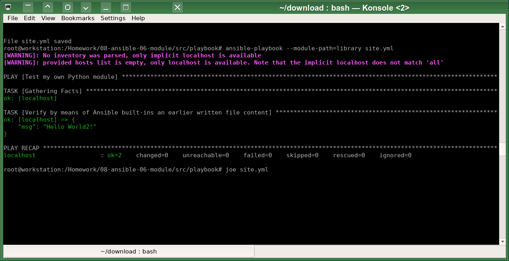
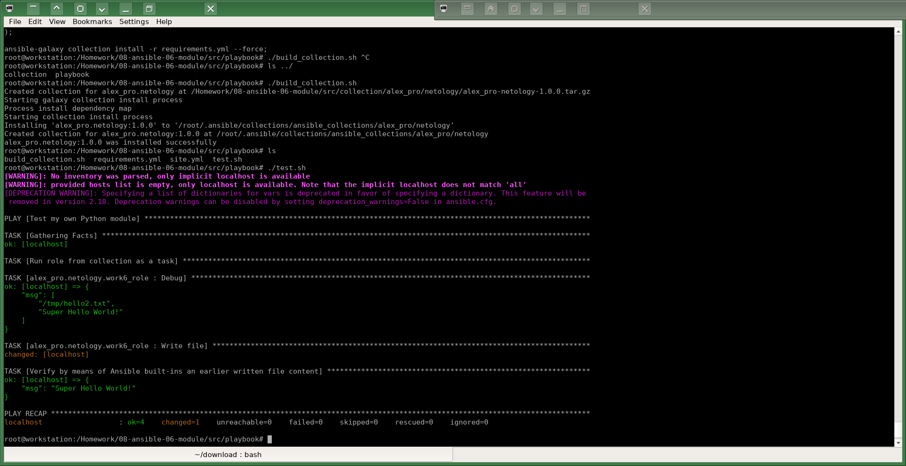

# Домашнее задание к занятию 6 «Создание собственных модулей»

## Подготовка к выполнению

Склонировал репозиторий Ansible в каталог моей домашней работы:
`git clone https://github.com/ansible/ansible.git`. Каталог довольно большой, весит около 300 Мбайт.
Добавил каталог `ansible` в файл `.gitignore`, чтобы  не захламлять свой учебный git репозиторий.
Создал необходимые виртуальное окружение для Python и установил зависимости.

## Основная часть

1-3.
Написал [исходный код модуля](src/collection/alex_pro/netology/plugins/modules/work6.py) для записи файла с указанным в параметре содержимым.

4-7. Проверил локальную работу модуля:



8. Создал свою коллекцию: `ansible-galaxy collection init alex_pro.netology`.

9. Перенёс модуль в эту коллекцию.

10. Создал роль, перенёс в неё playbook, настроил default всех параметров module.

11. Переделал старый playbook для использования роли из коллекции.

12. Создал файл `requirements.yml`:
```
cat requirements.yml 
collections:
  - name: alex_pro.netology # Single local collection
    source: ../collection/alex_pro/netology/
    type: dir
```

13. Создал `build_collection.sh`:
```
CollectionDir="../collection/alex_pro/netology";
( 
        cd $CollectionDir;
        ansible-galaxy collection build --force;
);
ansible-galaxy collection install -r requirements.yml --force;
```
Который собирает требуемый .tar.gz для коллекции и автоматически его устанавливает.

14-17. Проверяем получившийся результат:
